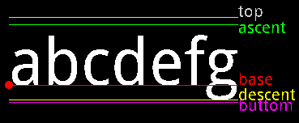
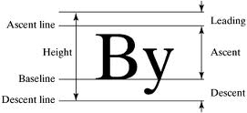
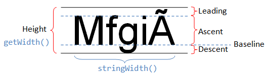
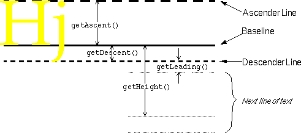
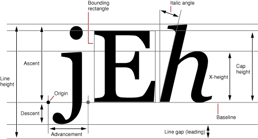

# 深入字体家族


## css 的 字体家族[ *font-family*]

CSS属性`font-family`的作用是**设置一组按优先级排序的字体列表，如果该列表中的第一个字体未在访问者计算机上安装，那么就尝试列表中的下一个字体**，依此类推，直到列表中的某个字体是已安装的。

有两种类型的名称可用于分类字体：**字体族名称\族科名称（family-name）**和 **族类名称（generic family）**。下面来解释这两个术语。

**字体族名称（family-name）**

字体族名称（就是我们通常所说的“字体”）的例子包括“Arial”、“Times New Roman”、“宋体”、“黑体”等等。

**族类（generic family）**

一个族类是一组具有统一外观的字体族。sans-serif就是一例，它代表一组没有“脚”的字体。


## 族类

由于不是所有字体在所有终端设备上都可用（有几千种字体，而且大部分都不是免费的），CSS提供了一种**fallback**机制：先列出想要的字体族，再列出作为替补的字体族，最后以一般**族类结尾**

在最坏的情况下（指定的所有字体都不可用时），能通过这种方式保留一些样式表编写者的意图

一般字体族共有5个：**serif（衬线体），sans-serif（无衬线体），monospace（等宽体），cursive（手写体）和fantasy（梦幻体**），相对常用的是前3个（衬线，无衬线和等宽字体族）


### 族类特点

### serif  衬线字体族

特点：

- 具有修饰过的笔画，向外展开的或者尖细的末端，或者是带有实际衬线的末端
- 一笔一划末端（两头）都带点变化装饰，比如宋体笔画末端有毛笔字的感觉
- 文字末端有差异，在小字号下仍然容易辨认。但在大字号下笔画装饰部分可能会显得模糊或带有锯齿

示例：

- Times New Roman、MS Georgia
- 宋体、仿宋

衍生：

- petit-serif 小衬线字体族

  末端变化不明显，可以当做无衬线

- slab-serif 雕版衬线字体族

  末端变化非常明显


### sans-serif 无衬线字体族

sans-前缀是法语，发音为/san/，意为“无”

特点：

- 具有笔画清晰的末端–带有一点或者没有向外展开的，交错笔画，或者其它装饰
- 与“衬线字体”相比，如果字号比较小，看起来就会有些难以分辨，尤其段落阅读时容易串行

示例：

- MS Trebuchet、MS Arial、MS Verdana
- 黑体、幼圆、隶书、楷体


### monospace 等宽字体族

特点：

- 每个字形都等宽，主要用于英文，中文方块字本来就等宽

示例：

- Courier、MS Courier New、Prestige
- 大多数中文字体


### fantasy 梦幻字体族

特点：

- 艺术字，主要用于图片，页面上用的少

示例：

- WingDings、WingDings 2、WingDings 3、Symbol
- 萝卜体


### cursive 手写字体族

特点：

- 像手写的一样

示例：

- Caflisch Script、Adobe Poetica
- 徐静蕾手写体、迷你简黄草、华文行草、少女体


## 使用规范

常识：

- 一个页面上不要用3，4种甚至更多字体
- 如非必要，不要在句中改变字体
- sans-serif用于在线媒体，serif用于打印设备
- monospace用于打字机和代码
- 小字号场景不要用sans-serif，衬线字体更容易辨认

最佳实践：

- sans-serif是页面首选，无衬线

  因为在屏幕显示设备上，衬线会让文字变得难以辨认

- serif不适合在线阅读，但打印效果很好，适用于页面打印版

  衬线字体在打印的场景更容易阅读，让人更容易清楚区分不同字母。打印机对分辨率的要求更精细（355ppi），高分辨率下细节显示得很清楚，而不会像屏幕显示一样出现模糊

- monospace用作代码示例

  每个字符等宽，在页面上占据相同的空间，打字机就用这种字体

- 正文不要用fantasy和cursive

  可以用在图片或者标题栏里

### 参考资料

- [15.3.1 一般字体族](http://www.ayqy.net/doc/css2-1/fonts.html#generic-font-families)
- [CSS 中规定的五种一般字体家族（serif、sans-serif 等）](http://www.cftea.com/c/2009/02/1Y60JODHCZKWEC9I.asp)
- [CSS: fonts](https://www.w3.org/Style/Examples/007/fonts.en.html)：五种一般字体族英文示例
- [The Complete Beginner’s Guide to Chinese Fonts](https://webdesign.tutsplus.com/articles/the-complete-beginners-guide-to-chinese-fonts--cms-23444)：中文字体示例
- [MDN | font-family](https://developer.mozilla.org/en-US/docs/Web/CSS/font-family)
- [Five Font Families](https://openlab.citytech.cuny.edu/clarkeadv1227/type-history/five-font-families/)：英文字体字母A的演变
- [一起来发现Mac的内置字体库英文字体－完结～](https://www.douban.com/group/topic/55210544/)
- [Font Families – Serif, Sans-Serif, Monospace, Script, Fantasy](http://www.impressionwebstudio.com/en/news_articles/font_families.html) [Screen and Print Resolution](https://www.modernpostcard.com/knowledge/preparing-materials/resolution)


# 深入字体度量


## font-size 真的是字体大小吗

下面是一段简单的 HTML 代码，一个 p 标签包含了 3 个 span 标签，每个 span 各自有一个 font-family：

```html
<p>
    <span class="a">Ba</span>
    <span class="b">Ba</span>
    <span class="c">Ba</span>
</p>
```

```css
p  { font-size: 100px }
.a { font-family: Helvetica }
.b { font-family: Gruppo    }
.c { font-family: Catamaran }
```

font-size 相同，font-family 不同，得到的 span 元素的高度也不同：

**图片:**


**html演示:**

<div style="width:700px;margin:0 auto">
<iframe src="html\不同的字体相同的font-size.html">
renlink:当前不支持iframe    
</iframe>
</div>

> renlink: 为了验证上图的效果我亲自写了个html 花了挺大劲儿的，其中也遇到了幽灵空字节(strut)的问题下面会讲述到
>


**思考**

为什么 font-size: 100px 不能得到相同高度的元素呢？我测量了一下每个 span 的高度：Helvetica 115px，Gruppo 97px，Catamaran 164px。


乍看很奇怪，但是仔细想想，这么做又是很有道理的。原因在于字体本身，这就关乎于**字体度量**的原理


## 认识字体度量

在字体设计中一个字符所在的空间容器称为[EM Square](https://designwithfontforge.com/zh-CN/The_EM_Square.html)（也被称作“EM size”或者“UPM”）。

在传统的金属字模中，这个容器就是每个字符的实际金属块。每个字符的高度是统一的，这样每个字模可以整齐地放进行和块中（如下）。


[em-square](https://link.zhihu.com/?target=http%3A//designwithfontforge.com/zh-CN/The_EM_Square.html)，它是用来盛放字符的金属容器。这个 em-square 一般被设定为宽高均为 1000 相对单位，不过也可以是 1024、2048 相对单位


**em相对单位的计算公式**

```
假设font-size为40px，em-square单位为1000
那么em-square所占的空间大小为 font-size *（em/1000） = 40 * (1000/1000) = 40 * 1 => 40px

font-size 70px 则 em-square换算后为 70px
```

注意上图下面的两个字体是允许 em-square bleed outside 的，大概可以理解为超出 em-square，这也导致了实际的字体要比设置font-size要大


**字体的定义规则**

- 字母的高度被称为“`em`”，在数字化字体中 `em` 是空间的数字化定义总量。`em`的大小（以下均写为: **EM size**）通常是 **1000** 单位，在 TrueType 字体中，`EM size` 约定是2的幂，通常是1024或2048。
- 根据其实际使用的单位，字体的度量可以根据一些软件[设置](http://hiyangguo.com/in-depth-study-font-size-line-height-and-vertical-align/#字体的设置)来决定。注意，有些值是em-square之外的值。
- 在浏览器中，相对单位是用于**缩放**用来适应所需的 `font-size`


### 字体度量的各种属性

先来看一下各种参照图

<div style="background:#F2F2FF;overflow:hidden"><span style="color:black;font-weight:bold">baseline：字符基线<br>
ascent：字符最高点到baseline的推荐距离<br>
top：字符顶线/字符最高点到baseline的最大距离<br>
descent：字符最低点到baseline的推荐距离<br>
bottom：字符底线/字符最低点到baseline的最大距离<br>
</span>
</div>

<div style="background:#D8D8FF
;overflow:hidden"><span style="color:#3F3FFF;font-weight:bold">baseline：字符基线<br>
ascentline/ascent：字符最高点到baseline的推荐距离参考线/高度<br>
descentline/descent：字符最低点到baseline的推荐距离参考线/高度<br>
height：行高<br>
leading：行距<br>
</span>
</div>

<div style="background:#D8D8FF;overflow:hidden"><span style="color:#3F3FFF;font-weight:bold">baseline：字符基线<br>
ascent：字符最高点到baseline的高度<br>
descent：字符最低点到baseline的高度<br>
getWidth/height：行高<br>
leading：行距<br>
stringWidth：字符总体宽度
</span>
</div>

<div style="background:#D8D8FF
;overflow:hidden"><span style="color:#3F3FFF;font-weight:bold">baseline：字符基线<br>
ascentline/getAscent：字符最高点到baseline的推荐距离参考线/高度<br>
descentline/getDescent：字符最低点到baseline的推荐距离参考线/高度<br>
getHeight：行高<br>
getLeading：行距<br>
next line of text：下一行
</span>
</div>

<div style="background:#D8D8FF
;overflow:hidden"><span style="color:#3F3FFF;font-weight:bold">baseline：字符基线<br>
ascent：字符最高点到baseline的高度<br>
descent：字符最低点到baseline的高度<br>
line-height：行高<br>
line gap(leading)：行距<br>
advancement：单个字符宽度<br>
origin：字符起点<br>
italic angle：倾斜角度<br>
x-height：字符x高度<br>
cap-height：大写字母高度<br>
bounding rectangle：边界矩形
</span>
</div>


来张简要的总结图


**属性总结讲解**

- `baseline` (*基线*): 分隔 `ascent` 和 `descent` ，默认字符对齐 `baseline` 排列，如图中的P，x，Ё(为俄文字符)
- `ascent`: 基线的上部分，字符最高处与 `ascent` 顶端**可能有空白**，由 `font-family` 决定
- `descent`: 基线的下部分，字符最低处与 `descent` 底端**可能有空白**，由 `font-family` 决定
- `xHeight` (*X 字高*): 小写字符 **x** 的高度，由 `font-family` 决定
- `capHeight` (*大写高度*): 大些字符 **P** 的高度，由 `font-family` 决定
- `lineSpacing` (*行间距*): 在浏览器中一般 `lineSpacing = ascent + descent`
- `lineHeight` （*行高*）: 默认等于 `lineSpacing`，受 `line-height` 设置影响，如果设置 `line-height`，`lineHeight` 等于 `line-height`
- `half-leading` (*半行距*): 如果`lineHeight > lineSpacing`，则`lineHeight` 与 `lineSpacing` 之间会产生**上下相等**的空隙 (lineHeight - lineSpacing)/2 称为*半行距*（`half-leading`或 `half lead strips`）


## 深入剖析字体度量

字体度量都是基于这个相对单位设置的，包括 ascender、descender、capital height、x-height 等。

把 下载好的**Catamaran** 字体放到 [FontForge(字体设计软件中)](https://link.zhihu.com/?target=https%3A//fontforge.github.io/en-US/) 中，分析它的字体度量：


- em-square（Em-size） 是 1000
- ascender (win ascent)是 1100，descender(win desent) 是 540。通过测试发现，macOS 上的浏览器使用了 HHead Ascent 和 HHead Descent 值，Windows 上的浏览器使用了 Win Ascent 和 Win Descent（而且两个平台上的值不一样）。我们还看到 Capital Height 是 680，X height 是 485。

**这意味着 Catamaran 字体占据了 <span style="color:orange">1100 + 540</span> 个相对单位，**尽管它的 em-square 只有 1000 个相对单位，就是说 `font-size:100px`，其字体所占高度为<span style="color:orange"> `[(1110 + 540) * 100]/1000`</span>。所以当我们设置 font-size:100px 时，这个字体里的文字高度是 164px。**这个计算出来的高度决定了 HTML 元素的 content-area（内容区域）**，后面我会讲到 content-area。可以认为 content-area 就是 background 作用的区域。

我们还能看出大写字母的高度是 68px，小写字母的高度（x-height）是 49px。所以 font-size:1ex = 49px，font-size:1em = 100px，而不是 164px。（css的em单位 是基于 font-size，而不是基于计算出来的高度)


# 关于line-box

在继续深入之前，说点相关的知识。当 p 元素出现在屏幕上时，它可能包含了多行内容，每行内容由多个内联元素组成（内联标签或者是包含文本的匿名内联元素），每一行都叫做一个 line-box。**line-box 的高度是由它所有子元素的高度计算得出的**。浏览器会计算这一行里每个子元素的高度，再得出 line-box 的高度（`Line box` 的高度由 `Line Box` 中最⾼的 `Inline Box`（或`Replaced Element`[像伪元素一样的替换元素]）确定。），所以默认情况下，一个 line-box 总是有足够的高度来容纳它的子元素。

每个 HTML 元素实际上都是由多个 line-box 的容器，如果你知道每个 line-box 的高度，那么你就知道了整个元素的高度。

如果我们修改一下最初的 HTML 代码：

```html
<p>
    Good design will be better.
    <span class="a">Ba</span>
    <span class="b">Ba</span>
    <span class="c">Ba</span>
    We get to make a consequence.
</p>
```

那么就会得到 3 个 line-box（宽度固定）：


可以清楚地看到第二个 line-box 比其他两个要高一些。因为第二行里面的子元素因为有一个用到了 Catamaran 字体的 span。

line-box 的难点在于我们看不见它，而且不能用 CSS 控制它。即使我们用 ::first-line 给第一行加上背景色，我们也看不出第一个 line-box 的高度。


# 关于line-height

目前已经提到了两个概念：content-area 和 line-box。如果你仔细看了，会发现我说 line-box 的高度是根据子元素的高度计算出来的，而不是子元素的 content-area 的高度。这个区别大了。

接下来说句听起来很奇怪的话：一个内联元素有两个高度：content-area 高度和 virtual-area （实际区域？）高度（virtual-area 是个临时用来理解的单词，它表示实际有效的高度）。

- content-area 的高度是由字体度量定义的（见上文）
- vitual-area 的高度就是 line-height，这个高度用于计算 line-box 的高度


这么一来，有这么一个长久的传言：line-height 表示两个 baseline 之间的距离。在 CSS 里，可以理解为这样的：


virtual-area 和 content-area 高度的差异叫做 leading（行距）。leading 的一半会被加到 content-area 顶部，另一半会被加到底部。因此 content-area 总是处于 virtual-area 的中间。

计算出来的 line-height（也就是 virtual-area 的高度）可以等于、大于或小于 content-area。如果 virtual-area 小于 content-area，那么 leading 就是负的，因此 line-box 看起来就比内容还矮了。

还有一些其他种类的内联元素：

- 可替换的内联元素，如 img / input / svg 等
- inline-block 元素，以及所有 display 值以 inline- 开头的元素，如 inline-table / inline-flex
- 处于某种特殊格式化上下文的内联元素，例如 flexbox 元素中的子元素都处于 [flex formatting context（弹性格式化上下文）](https://link.zhihu.com/?target=https%3A//www.w3.org/TR/css-flexbox-1/%23flex-items)中，这些子元素的 display 值都是「blockified」

这类内联元素，其高度是基于 height、margin 和 border 属性 以及padding属性。如果你将其 height 设置为 auto 的话，那么其高度的取值就是 line-height，其 content-area 的取值也是 line-height。


## line-height 的 normal属性值

line-height 的值可以是一个长度（length）或者是一个数字，它的默认值是 normal。那么，normal 是什么呢？我们经常将 normal 理解为 1，或者 1.2，甚至连 CSS 规格文档都[没有提到这一问题](https://link.zhihu.com/?target=https%3A//www.w3.org/TR/CSS2/visudet.html%23propdef-line-height)。我们知道 line-height 的值为数字时，表示的相对于 font-size 的倍数，但问题在于，font-size:100px 对应的文字在不同字体里的高度是不一样的！那么 line-height 会随着文字大小的改变而改变吗？ normal 真的表示 1 或者 1.2 吗？

我们目前依然没有解释 line-height:normal 是什么意思。要解答这个问题，我们又得回到 content-area 高度的计算了，问题的答案就在字体度量里面。

回到 FontForge，Catamaran 的 em-square 高度是 1000，同时我们还看到很多其他的 ascender/descender 值：


- (type)常规的 Ascent/Descent：ascender 是 770，descender 是 230，用于渲染字符。
- (win)规格 Ascent/Descent：ascender 是 1100，descender 是 540。用于计算 content-area 的高度
- **规格 Line Gap：用于计算 line-height: normal。**

在 **Catamaran** 这款字体中，**Line Gap 的值是 0，那么 line-height: normal 的结果就跟 content-area 的高度一样，是 1640 相对单位。**

为了对比，下载过来再看看 **Arial** 字体，它的 em-square 是 2048，ascender 是 1854，descender 是 434，line gap 是 67。那么当 font-size: 100px 时，

- 其 content-area 的高度就是  [(1854+434) * 100] / 2048= 111.72，约为 112px；
- 其 line-height: normal 的结果就是 [(67+1854+434)]  / 2048约为 115px。

所有这些值都是由字体设计师设置的。

这么看来，line-height:1 就是一个很糟糕的实践。记得吗，当 line-height 的值是一个数字时，其实就是相对 font-size 的倍数，而不是相对于 content-area。所以 line-height:1 很有可能使得 virtual-area 比 content-area 矮，从而引发很多其他的问题。


line-box 计算的一些细节：

- 对于内联元素，padding 和 border 会增大 background 区域，但是不会增大 content-area（不是 line-box 的高度）。一般来说你无法再屏幕上看到 content-area。margin-top 和 margin-bottom 对两者都没有影响。
- 对于可替换内联元素（replaced inline elements）、inline-block 元素和 blockified 内联元素，padding、margin 和 border 会增大 height（注意 margin），因此会影响 content-area 和 line-box 的高度


# 关于vertical-align

还没提过 vertical-align 属性，它也是计算 line-box 高度的重要因素之一。我们甚至可以说 vertical-align 是内联格式化上下文（IFC）中最重要的属性。

它的默认值是 baseline。还记得字体度量里的 ascender 和 descender 吗？这两个值决定了 baseline 的位置。很少有

字体的 ascender 和 descender 的比例是一比一的，所以我们经常看到一些意想不到的现象，下面是例子。

```html
<style>
p {
    font-family: Catamaran;
    font-size: 100px;
    line-height: 200px;
}
</style>
<p>
    <span>Ba</span>
    <span>Ba</span>
</p>
```

一个 p 标签内有两个 span 标签，span 继承了 font-family、font-size 和 200px 的 line-height。这时两个 span 的 baseline 是等高的，line-box 的高度就是 span 的 line-height。


如果第二个 span 的 font-size 变小了呢？

```css
span:last-child {
    font-size: 50px;
}
```

会发现一个非常奇怪的现象，line-box 的高度变高了！如下图所示。提示你一下，line-box 的高度是从子元素的最高点到最低点的举例。


这个例子可以作为「[应该将 line-height 的值写成数字](https://link.zhihu.com/?target=http%3A//allthingssmitty.com/2017/01/30/nope-nope-nope-line-height-is-unitless/)」的论据，但是有时候我们为了做出好看的排版，必须把 line-height 写成一个固定值。

**不过实话告诉你，不管你把 line-height 写成什么，你都会在对齐内联元素的时候遇到麻烦。**

我们来看另一个例子。p 标签有 line-height:200px，内含一个 span，span 继承了 p 的 line-height。

```html
<p>
    <span>Ba</span>
</p>
<style>
p {
    line-height: 200px;
}
span {
    font-family: Catamaran;
    font-size: 100px;
}
</style>
```

此时 line-box 的高度是多少？貌似是 200px，但其实不是。这里你没有考虑到的问题是 p 有自己的 font-family，默认值是 serif。p 的 baseline 和 span 的 baseline 位置不一样，因此最终的 line-box 比我们预想的要高一些。出现这种问题是因为浏览器认为每个 line-box 的起始位置都有一个宽度为 0 的字符（CSS 文档将其称为 <mark>**strut**</mark>），并将其纳入 line-box 的高度的计算中。

> 看不见的字符，看得见的影响。

为了说明这个问题，看下图解释这个问题。


用 baseline 来对齐令人费解，如果我们用 vertical-align: middle 会不会好一点呢？读 CSS 文档你会发现，middle 的意思是「用父元素 baseline 高度加上父元素中 x-height 的一半的高度来对齐当前元素的垂直方向的中点」。baseline 所处的高度跟字体有关，x-height 的高度也跟字体有关，所以 middle 对齐也不靠谱。更糟糕的是，一般来说，middle 根本就不是居中对齐！内联元素的对齐受太多因素影响，因此不可能用 CSS 实现。


顺便一说，vertical-align 的其他 4 个值有可能有点用：

- vertical-align: top / bottom，表示与 line-box 的顶部或底部对齐
- vertical-align: text-top / text-bottom，表示与 content-area 的顶部或底部对齐


不过你依然要小心，大部分情况下，对齐的是 virtual-area，也就是一个不可见的高度。看看下面这个用 vertical-align:top 的例子：


最后，vertical-align 的值也可以是数字，表示根据 baseline 升高或降低，不到万不得已还是别用数字吧。