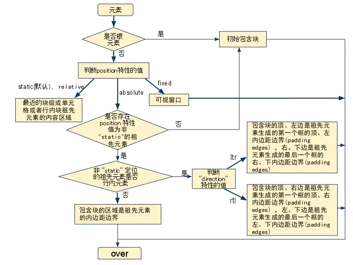
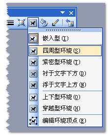

# 什么是css

- CSS 指层叠样式表 (**C**ascading **S**tyle **S**heets)
- 样式定义**如何显示** HTML 元素
- 样式通常存储在**样式表**中
- 把样式添加到 HTML 中，是为了**解决内容与表现分离的问题**
- **外部样式表**可以极大提高工作效率
- 外部样式表通常存储在 **CSS 文件**中
- 多个样式定义可**层叠**为一个

样式表定义如何显示 HTML 元素，就像 HTML 中的字体标签和颜色属性所起的作用那样。样式通常保存在外部的 **.css** 文件中。我们只需要编辑一个简单的 CSS 文件就可以改变所有页面的布局和外观。


# css 的基本结构

CSS 规则由两个主要的部分构成：**选择器**，以及一条或多条的**样式声明:**


选择器通常是您需要改变样式的 **HTML 元素。**

每条声明由**一个属性和一个属性值组成**（键值对）。

属性（property）是你希望设置的样式属性（style attribute）。每个属性有一个值。属性和值被冒号分开。


# css 注释

CSS注释以 **/\*** 开始, 以 ***/** 结束, 实例如下:

```css
/*这是个注释*/
p
{
    text-align:center;
    /*这是另一个注释*/
    color:black;
    font-family:arial;
}
```


# css id 选择器 和 class 选择器

如果你要在HTML元素中设置CSS样式，你需要在元素中设置"id" 和 "class" 属性以便css 选择器捕捉来获取样式。


**id选择器**

id 选择器可以为**标有特定 id 的 HTML 元素**指定特定的样式。

HTML元素以id属性来设置id选择器,CSS 中 id 选择器以 **"#"** 来定义。

```css
#para1
{
    text-align:center;
    color:red;
}
```

**<span style="color: red">ID属性不要以数字开头，数字开头的ID在 Mozilla/Firefox 浏览器中不起作用。</span>**


**class 选择器**

class 选择器用于描述一组元素的样式，class 选择器有别于id选择器，class可以在多个元素中使用(可复数应用样式)。

class 选择器在**HTML中以class属性表示**, 在 CSS 中，类选择器以一个点**"."**号显示：

```css
.center {text-align:center;}
```


# css 创建


## 定义样式的样式

插入样式表的方法有三种:

- 外部样式表(External style sheet)
- 内部样式表(Internal style sheet)
- 内联样式(Inline style)


## 外部样式表

```css
<head>
<link rel="stylesheet" type="text/css" href="mystyle.css">
</head>
```


## 内部样式表

```css
<head>
<style>
hr {color:sienna;}
p {margin-left:20px;}
body {background-image:url("images/back40.gif");}
</style>
</head>
```


## 内联样式

```html
<p style="color:sienna;margin-left:20px">这是一个段落。</p>
```


# 样式优先级


## 多次声明同个元素样式

如果某些属性在不同的样式表中被同样的选择器定义，那么属性值将从更具体的样式表中被继承过来。 新定义的样式属性会覆盖已经定义的样式属性

例如，外部样式表拥有针对 h3 选择器的三个属性

```css
h3
{
    color:red;
    text-align:left;
    font-size:8pt;
}
```

而内部样式表拥有针对 h3 选择器的两个属性

```css
h3
{
    text-align:right;
    font-size:20pt;
}
```

假如拥有内部样式表的这个页面同时与外部样式表链接，那么 h3 得到的样式是

```css
color:red;
text-align:right;
font-size:20pt;
/*只保留不重复的样式 前面定义的样式被后面重新定义的样式覆盖*/
```


## 多重样式优先级

**（内联样式） > （内部样式）>（外部样式） > 浏览器默认样式**

```html
<head>
    <!-- 外部样式 style.css -->
    <link rel="stylesheet" type="text/css" href="style.css"/>
    <!-- 设置：h3{color:blue;} -->
    <style type="text/css">
      /* 内部样式 */
      h3{color:green;}
    </style>
</head>
<body>
    <h3 style="color:blue">测试！</h3>
</body>

<!--h3的文字颜色最终为蓝色-->
```


## 浏览器的默认样式

CSS中存在样式层叠问题，而且不仅仅是只有在一个样式文件中存在层叠问题，因为CSS的样式有5种来源，程序员一般都接触前面三种。


当你不为html设置任何样式时，显示在浏览器上，b标签会显示粗体、p有纵向margin、h1字号比p大一倍……这是为什么呢？

因为浏览器自带一个默认的样式，如果html中没有为标签设置样式，则浏览器会按照自己的样式来显示。但是浏览器默认样式的级别是最低的，一旦有其他地方设置了标签样式，浏览器默认样式就会被冲掉。

注意，不同浏览器的默认样式有些地方是不一样的。例如，我们在写css时，都会首先设置 * {margin:0; padding:0;}，这是为何？就是因为有浏览器兼容性问题。干脆，全部弄成0，这样各个浏览器就都统一了。

我们先看下IE浏览器的默认样式


### **CSS Reset重置样式**

CSS Reset，意为重置默认样式。HTML中绝大部分标签元素在网页显示中都有一个默认属性值，通常为了避免重复定义元素样式，需要进行重置默认样式（CSS Reset）

为了保证页面在不同浏览器中显示的尽可能的一致，我们会重置不同浏览器默认的样式，称为重置样式表。

有很多别人整理的不错的重置样式表，例如CSS Reset ， strppd.css，normalize.css。比较推荐的是normalize.css。


###  **Normalize.css**

[normalize官网](http://necolas.github.io/normalize.css/)

[cssReset官网](https://meyerweb.com/eric/tools/css/reset/)

Normalize.css只是一个很小的css文件，但它在默认的HTML元素样式上提供了跨浏览器的高度一致性。相比于传统的css reset，Normalize.css是一种现代的，为HTML5准备的优质替代方案。Normalize.css现在已经被用于Twitter, Bootstrap，HTML5 Boilerplate，GOV.UK，Rdio，CSS Tricks以及许许多多其他的框架，工具和网站上。

**综述**

Normalize.css是一种CSS reset的替代方案。经过@necolas和@jon neal花了几百个小时来努力研究不同浏览器的默认样式的差异，这个项目终于变成了现在这样。

创造normalize.css有下几个目的：

- 保护有用的浏览器默认样式而不是完全去掉它们
- 一般化的样式：为大部分HTML元素提供
- 修复浏览器自身的bug并保证各浏览器的一致性
- 优化CSS可用性：用一些小技巧
- 解释代码：用注释和详细的文档来

Normalize.css支持包括手机浏览器在内的许多浏览器，同时对HTML元素，排版，列表，嵌入的内容，表单和表格都进行了一般化。尽管这个项目进行了一般化的原则，但还是在合适的地方使用了更实用的默认值。


**Normalize vs Reset**

知道Normalize.css和传统的区别是非常有价值的。

**1.Normalize.css保护了有价值的默认值**

Reset通过为几乎所有的元素施加默认样式，强行使得元素有相同的视觉效果。相比之下，Normalize.css保持了许多默认的浏览器样式。这就意味着你不用再为所有的公共排版元素重新设置样式。当一个元素在不同的浏览器中有不同的默认值时，Normalize.css会力求让这些样式保持一致并可能与现代标准相符合。

**2.Normalize.css修复了浏览器的bug**

它修复了常见的桌面段和移动端浏览器的bug。这往往超出了Reset所能做到的范畴。关于这一点，Normalize.css修复的问题包含了HTML5元素的显示设置，与格式化文字的font-size问题，在IE９中SVG的溢出，许多出现在各浏览器和操作系统中的与表单相关的bug。

可以看看以下的这个例子，看看对于HTML5中新出现的input类型search,Normalize.css是如何保证跨浏览器的一致性的。

```css
/* 1.Addresses appearance set to searchfield in ss,Chrome  
   2.Addresses box-size set to border-box in ss,Chrome(include -moz to future-proof)*/   input[type="search"]{
       -webkit-appearance:textfield;
       /* 1 */
       -moz-box-sizing:content-box;
       -webkit-box-sizing:content-box;
       /* 2 */
       box-sizing:content-box;}
/*Removes inner padding and search candle button in ss,Chrome on OS X */ 
input[type="search"]::-webkit-search-decoration, input[type="search"]::-webkit-search-cancel-button{         -webkit-appearance:none;}
```


**3.Normalize.css不会让你的调试工具变得杂乱**

使用Reset最让人困扰的地方莫过于在浏览器调试工具中使用大段的继承链。在Normalize.css中就不会有这样的问题，因为在我们的准则中对多选择器的使用是非常谨慎的，我们仅会有目的地对元素设置样式。

**4.Normalize.css是模块化的**

这个项目已经被拆分为多个相关却又独立的部分，这使得你能够很容易也很清楚地知道哪些元素被设置了特定的值。因此这能让你自己选择性地移除掉某些永远不会用到部分（比如表单的一般化）。

**5.Normalize.css拥有详细的文档**

Normalize.css的代码基于详细而全面的跨浏览器研究与测试。这个文件中拥有详细的代码说明并在Github Wiki中有进一步的说明。这意味着你可以知道到每一行代码具体实现了什么工作，为什么要写这句代码，浏览器之间的差异，并且你可以更容易地实现地进行自己的测试。

这个项目的目标是帮助人们了解浏览器默认是如何渲染元素的，同时也让人们很容易地明白如何改进浏览器渲染。

### 如何使用Normalize.css

首先，安装或从Github下载Normalize.css，接下来有两种主要途径去使用它。

-策略一：将Normalize.css作为你自己项目的基础CSS，自定义样式值以满足设计师的需求。
 -策略二：引入Normalize.css源码并在从基础上构建，在必要的时候用到你自己写的CSS覆盖默认值。


# 💥css 样式与概念参考


 ## ***🔲背景样式***

### background

```css
div{
    background: black url('renlink.jpg') no-repeat fixed center;
}
```


语法

> background:(bg-color) (bg-image) (position/bg-size) (bg-repeat) (bg-origin) (bg-clip) (bg-attachment) (initial|inherit);

可以设置的属性值分别对应的是

background-color、background-position、background-size、background-repeat、background-origin、background-clip、background-attachment 和 background-image 

**各值之间用空格分隔，不分先后顺序**

| 值                                                           | 说明                                             | css版本 |
| :----------------------------------------------------------- | :----------------------------------------------- | :------ |
| *[background-color](https://www.runoob.com/cssref/pr-background-color.html)* | 指定要使用的背景颜色                             | 1       |
| *[background-position](https://www.runoob.com/cssref/pr-background-position.html)* | 指定背景图像的位置                               | 1       |
| *[background-size](https://www.runoob.com/cssref/css3-pr-background-size.html)* | 指定背景图片的大小                               | 3       |
| *[background-repeat](https://www.runoob.com/cssref/pr-background-repeat.html)* | 指定如何重复\平铺背景图像                        | 1       |
| *[background-origin](https://www.runoob.com/cssref/css3-pr-background-origin.html)* | 指定背景图像的定位区域                           | 3       |
| *[background-clip](https://www.runoob.com/cssref/css3-pr-background-clip.html)* | 指定背景图像的绘画区域                           | 3       |
| *[background-attachment](https://www.runoob.com/cssref/pr-background-attachment.html)* | 设置背景图像是否固定或者随着页面的其余部分滚动。 | 1       |
| *[background-image](https://www.runoob.com/cssref/pr-background-image.html)* | 指定要使用的一个或多个背景图像                   | 1       |


### background-color

该属性定义元素的背景颜色

```css
h1 {background-color:#6495ed;}
p {background-color: red;}
div {background-color:rgba('0,0,0,50');}
```

CSS中，颜色值通常以以下方式定义:

- 十六进制 - 如："#ff0000"
- RGBA - 如："rgba(255,0,0,50)" 前三个参数为rgb的值，最后一个参数为透明度
- 颜色名称 - 如："red"


### background-iamge

该属性定义元素的背景图片

```css
body
{
    background-image:url('paper.gif');
    
    /*css3 支持定义多个图片*/
   background-image:url('paper.gif'),url('paper.gif');
}
```

**属性值参考**

| 值                                                           | 说明                                      |
| :----------------------------------------------------------- | :---------------------------------------- |
| url(*'URL'*)                                                 | 图像的URL                                 |
| none                                                         | 无图像背景会显示。这是默认                |
| [linear-gradient()](https://www.runoob.com/cssref/func-linear-gradient.html) | 创建一个线性渐变的 "图像"(从上到下)       |
| [radial-gradient()](https://www.runoob.com/cssref/func-radial-gradient.html) | 用径向渐变创建 "图像"。 (center to edges) |
| [repeating-linear-gradient()](https://www.runoob.com/cssref/func-repeating-linear-gradient.html) | 创建重复的线性渐变 "图像"。               |
| [repeating-radial-gradient()](https://www.runoob.com/cssref/func-repeating-radial-gradient.html) | 创建重复的径向渐变 "图像"                 |
| inherit                                                      | 指定背景图像应该从父元素继承              |


### background-size

该属性指定背景图片的大小

```css
div
{
    background:url(img_flwr.gif),(img_flwr.gif);
    background-size:80px 60px,80px 60px;
}
```


### background-repeat

该属性定义背景图像的平铺方式

```css
body
{
background-image:url('paper.gif');
background-repeat:repeat-y; /*垂直平铺*/
background-repeat:repeat-x; /*水平平铺*/
background-repeat:repeat; /*两个方向平铺*/
background-repeat:no-repeat; /*不进行平铺(默认)*/
}
```


### background-origin

该属性指定**background-position**属性应该是相对位置。

```css
div
{
background-image:url('smiley.gif');
background-repeat:no-repeat;
background-position:left;
background-origin:content-box;
}
```


**属性值参考**

| 值                    | 描述                       |
| :-------------------- | :------------------------- |
| padding-box（默认值） | 背景图像填充框的相对位置   |
| border-box            | 背景图像边界框的相对位置   |
| content-box           | 背景图像的相对位置的内容框 |


**示例**


### background-position 

该属性设置背景图像的起始位置。

**注意**对于这个工作在Firefox和Opera，background-attachment必须设置为 "fixed（固定）".

```css
body
{
background-image:url('smiley.gif');
background-repeat:no-repeat;
background-attachment:fixed;
background-position:center;
}
```

**属性值参考**

| 值                                                           | 描述                                                         |
| :----------------------------------------------------------- | :----------------------------------------------------------- |
| left top、left center、left bottom、right top、right center、right bottom、center、top、center、center、center、bottom | 如果仅指定一个关键字，其他值将会是"center"                   |
| *x% y%*                                                      | 第一个值是水平位置，第二个值是垂直。左上角是0％0％。右下角是100％100％。如果仅指定了一个值，其他值将是50％。 。默认值为：0％0％ |
| *xpos ypos*                                                  | 第一个值是水平位置，第二个值是垂直。左上角是0。单位可以是像素（0px0px）或任何其他 [CSS单位](https://www.runoob.com/try/css-units.html)。如果仅指定了一个值，其他值将是50％。你可以混合使用％和positions |
| inherit                                                      | 指定background-position属性设置应该从父元素继承              |


### background-attachment

设置背景图像是否固定或者随着页面的其余部分滚动。

```css
body
{ 
    background-image:url('smiley.gif');
    background-repeat:no-repeat;
    background-attachment:fixed;
}
```


**属性值参考**

| 值      | 描述                                                         |
| :------ | :----------------------------------------------------------- |
| scroll  | 背景图片随着页面的滚动而滚动，这是默认的。                   |
| fixed   | 背景图片不会随着页面的滚动而滚动。                           |
| local   | 背景图片会随着元素内容的滚动而滚动。                         |
| initial | 设置该属性的默认值。 [阅读关于 *initial* 内容](https://www.runoob.com/cssref/css-initial.html) |
| inherit | 指定 background-attachment 的设置应该从父元素继承。 [阅读关于 *inherit* 内容](https://www.runoob.com/cssref/css-inherit.html) |


### background-clip

该属性指定背景容器的裁剪区域。

```css
div
{
    background-color:yellow;
    background-clip:content-box;
}
```


**属性值参考**

| 值          | 说明                                             |
| :---------- | :----------------------------------------------- |
| border-box  | 默认值。背景绘制在边框方框内（剪切成边框方框）。 |
| padding-box | 背景绘制在衬距方框内（剪切成衬距方框）。         |
| content-box | 背景绘制在内容方框内（剪切成内容方框）。         |
| text        | 裁剪到文本区域                                   |


**background-clip: text的妙用**

实现文字渐变效果

```css
font-size: 30px;
        background: linear-gradient(to right, red, blue);
        -webkit-background-clip: text;
        color: transparent;
```

<div style="font-size: 30px;
        background: linear-gradient(to right, red, yellow);
        -webkit-background-clip: text;
        color: transparent;">welcome</div>


## ***🔲文本样式***

 ### color

设置文本颜色

```css
p{
    color: red;
}
```

**属性值参考**

| 值                                                  | 描述                                                         | 实例                                                         |
| :-------------------------------------------------- | :----------------------------------------------------------- | :----------------------------------------------------------- |
| *颜色的名称*                                        | 颜色的名称，比如red, blue, brown, lightseagreen等，不区分大小写。 | `color:red;    /* 红色 */ color:black;  /* 黑色 */ color:gray;   /* 灰色 */ color:white;  /* 白色 */ color:purple; /* 紫色 */` |
| *十六进制*                                          | 十六进制符号 #RRGGBB 和 #RGB（比如 #ff0000）。"#" 后跟 6 位或者 3 位十六进制字符（0-9, A-F）。 | `#f03 #F03 #ff0033 #FF0033 rgb(255,0,51) rgb(255, 0, 51)`    |
| *RGB，红-绿-蓝（red-green-blue (RGB)）*             | 规定颜色值为 rgb 代码的颜色，函数格式为 rgb(R,G,B)，取值可以是 0-255 的整数或百分比。 | `rgb(255,0,51) rgb(255, 0, 51) rgb(100%,0%,20%) rgb(100%, 0%, 20%)` |
| *RGBA，红-绿-蓝-阿尔法（RGBa）*                     | RGBa 扩展了 RGB 颜色模式，它包含了阿尔法通道，允许设定一个颜色的透明度。a 表示透明度：0=透明；1=不透明。 | `rgba(255,0,0,0.1)    /* 10% 不透明 */   rgba(255,0,0,0.4)    /* 40% 不透明 */   rgba(255,0,0,0.7)    /* 70% 不透明 */   rgba(255,0,0,  1)    /* 不透明，即红色 */ ` |
| *HSL，色相-饱和度-明度（Hue-saturation-lightness）* | 色相（Hue）表示色环（即代表彩虹的一个圆环）的一个角度。 饱和度和明度由百分数来表示。 100% 是满饱和度，而 0% 是一种灰度。 100% 明度是白色， 0% 明度是黑色，而 50% 明度是"一般的"。 | `hsl(120,100%,25%)    /* 深绿色 */   hsl(120,100%,50%)    /* 绿色 */        hsl(120,100%,75%)    /* 浅绿色 */    ` |
| *HSLA，色相-饱和度-明度-阿尔法（HSLa）*             | HSLa 扩展自 HSL 颜色模式，包含了阿尔法通道，可以规定一个颜色的透明度。 a 表示透明度：0=透明；1=不透明。 | `hsla(240,100%,50%,0.05)   /* 5% 不透明 */    hsla(240,100%,50%, 0.4)   /* 40% 不透明 */   hsla(240,100%,50%, 0.7)   /* 70% 不透明 */   hsla(240,100%,50%,   1)   /* 完全不透明 */` |


### derection

设置文字方向

```css
div{
    direction:rtl;
    /*rtl(right to left)为从左到右 ltr为从右到左*/
    unicode-bidi: bidi-override; 
}
```

**属性值参考**

| 值      | 描述                                      |
| :------ | :---------------------------------------- |
| ltr     | 默认。文本方向从左到右。                  |
| rtl     | 文本方向从右到左。                        |
| inherit | 规定应该从父元素继承 direction 属性的值。 |


### letter-spacing

设置文字间距

```css
h1 {letter-spacing:2px}
h2 {letter-spacing:-3px}
```

**注：**可以设置负值缩小间距


### line-height

设置文本的行高

```css
p.small {line-height:90%}
p.big {line-height:200%}
```

**属性值参考**

| 值       | 描述                                               |
| :------- | :------------------------------------------------- |
| normal   | 默认。设置合理的行高。                             |
| *number* | 设置数字，此数字会与当前的字体尺寸相乘来设置行高。 |
| *length* | 设置固定的行高。                                   |
| *%*      | 基于当前字体尺寸的百分比行高。                     |
| inherit  | 规定应该从父元素继承 line-height 属性的值。        |

**line-height可以在font属性中缩写。**line-height的值紧跟着font-size值使用斜杠分开，如：body{font:100%/25px "黑体";}


**属性值补充讲解**
① normal 默认值，与浏览器相关，
在同一浏览器中也和元素字体相关（font-family），所以考虑到兼容性，实际开发时，会对行高reset，保证各浏览器兼容性一致
② 根据当前的font-size计算

```
line-height：1.5;
```

实际行高=1.5*font-size（假设是20px）=30px
③ em,px,rem,pt
④ 根据font-size计算
⑤ inherit--行高继承（input默认的行高是normal）


### ***❗❗<span id="font-x">字母x在css中的 角色定位</span>***

#### 字母’x’与CSS中的基线

在各种内联相关模型中，凡是涉及到垂直方向的排版或者对齐的，都离不开最最基本的基线(`baseline`)。例如，`line-height`行高的定义就是两基线的间距；`vertical-align`的默认值就是基线；其他中线顶线一类的定义也离不开基线；基线甚至衍生出了：

1. “alphabetic” baseline: “字母”基线 – 英文
2. “hanging” baseline: “悬挂”基线 – 印度文
3. “ideographic” baseline: “表意”基线 – 中文


基线又是如何定义的？

基线的定义就离不开本节的男主角`'x'`.

**字母x的下边缘(线)就是我们的基线。**

对，是字母`x`, 不是字母`s`之类下面有尾巴的字母。


#### 字母’x’与CSS中的x-height

字母`'x'`与CSS的故事远不止基线这么简单。CSS中有一个概念叫做`"x-height"`, 指的是字母`'x'`的高度。

一个字母的高度跟我CSS布局排版有多大关系呢

实际上关系可大了。

首先，需要了解下`"x-height"`的含义，通俗讲，`"x-height"`就是指的小写字母`'x'`的高度；术语描述就是基线和等分线[mean line](也称作中线[midline])之间的距离。

维基上有这么个示意图：


`"x-height"`的示意范围一目了然，了然于心，于心不忍，不忍直视。

上面图中还出现了其他的名词，这里简单说下我的理解：

- **ascender height: 上下线高度**
- **cap height: 大写字母高度**
- **median: 中线**
- **descender height: 下行线高度**

然后，CSS中有些属性值的定义就和这个`"x-height"`的有关，最典型的代表就是：`vertical-align: middle`.

这里的`middle`是中间的意思，注意，跟上面的`median`中线不是一个意思。

**`middle`指的是基线往上至中线1/2 `"x-height"`高度**。我们可以近似脑补成字母**`x`交叉点那个位置**。

有此可见，`vertical-align: middle`并不是绝对的垂直居中对齐，我们平常看到的`middle`效果只是一种近似的效果。原因很简单，因为不同的字体，其在行内盒子中的位置是不一样的，比方说’微软雅黑’就是一个字符下沉比较明显的字体，所有字符的位置相比其他字体要偏下一点。要是`vertical-align: middle`是相对容器中分线对齐，呵呵，你会发现图标和文字不在一条线上，而相对于字符`x`的中心位置对齐，我们肉眼看上去就好像和文字居中对齐了。


#### 单位ex的价值与实用性

存在必有价值。我们细细思考字母`"x"`在CSS世界中扮演的角色，就会发现`ex`的价值所在。

首先，需要明确一点，虽然说尺寸单位的作用是限定元素的尺寸，但是，由于字母`"x"`受字体和环境影响大，参考性太低，因此`ex`显然不太适合做这个。那问题来了，`ex`连自己的本职工作都做不好，难道还指望其副业开挂？

没错，`ex`的价值就在其副业上——不受字体字号影响的内联元素的垂直居中对齐效果。

我们都知道，内联元素默认是基线对齐的，而基线就是`x`的底部，而`1ex`就是一个`x`的高度。设想下，假如我们图标高度就是`1ex`, 同时背景图片居中，岂不是图标和文字天然垂直居中，而且，完全不受字体和字号的影响。因为`ex`就是一个相对于字体字号的单位。

文字表述苍白，我们看个例子，下图所示的文字后面跟个小三角图标的效果是非常常见的：


现在，要让该图标和文字中间位置排整齐，你是如何实现？

尺寸设置好，然后`vertical-align: middle`?

这样虽然也有效果，但是可能并不理想，借助`ex`单位，我们直接借助默认的`baseline`对齐就可以实现我们的效果！

代码如下:

```html
<style>
.icon-arrow {
    display: inline-block;
    width: 20px;
    height: 1ex;
    background: url(arrow.png) no-repeat center;
}
</style>
<div>
renlink <i class="icon-arrow"></i>
</div>
```

<div style="background: black;color:white">renlink </img></div>


虽然使用`ex`做高度实现天然垂直对齐看上去很巧妙，但是，也是有局限的，就是如果图标背景的高度超过`1ex`，我们就只能再请`vertical-align`出马了……

还有一点。由于IE6-IE7对内联模型的解释有问题，因此，各类`vertical-align`在这些浏览器下都是有问题，包括这里的`ex`天然基线对齐，需要特别处理下。


### ***➕line-height 的 深入理解(1)***

参考：[深入理解css的行高](https://www.cnblogs.com/rainman/archive/2011/08/05/2128068.html)

#### 1.基线、底线、顶线、中线


**基线（base line）并不是汉字文字的下端沿，而是英文字母“x”的下端沿**

上图中两条红线之间的距离就是行高，上行的底线和下一行顶线之间的距离就是行距，而同一行顶线和底线之间的距离是font-size的大小，行距的一半是半行距。

`vertical-align`属性中有`top`,`middle`,`baseline`,`bottom`与其四线是有关联的


#### 2.行距和行高


- 行高指的是文本行的基线间的距离。
- 行距指的是上一行的底线到上一行顶线的距离
- **行距 等于 （行高 - 字体大小）**


#### 3.内容区域


**被文本撑开的内容，顶线和底线包裹的区域，实际中一定看到到但确实存在**

*内容区域的高度大小只与font-size的大小和font-family有关*


#### 4.行内框、半行距


- 行内框只是一个概念，它**无法显示出来**，但是它又确实存在
- 它的高度就是行高
- **在没有其他因素（padding）影响的时候，行内框等于内容区域**
- 半行距 等于（行高 - 字体大小）/2


#### 5.行框（line boxes）


- 行框（line box）。同行内框类似，行框是指本行的一个虚拟的矩形框
- 行框高度等于本行内所有元素中行高最大的值
- 行框由一个个行内盒子组成


#### + 行高(line-height)、行距与字体(font-size)大小的联系

从上方就可以看出，行距、font-size与line-height之间的关系了。接下来进一步来看看这三者关系


当font-size等于line-height时，行距 = line-height - font-size = 0；而当font-size大于line-height时，则会出现行距为负值，则两行重叠，如下图


### ***➕line-height的深入理解(2)***

#### line-height 与 height 的关系

如果一个标签没有定义`height`属性(包括百分比高度)，那么其最终表现的高度**一定是由`line-height`起作用**，即使是IE6下`11`像素左右默认高度bug也是如此。

先说一个熟知并且印象固化的现象，如果有一个空的`div`，**`<div></div>`**，如果没有设置至少大于`1`像素高度`height`值时，该`div`的高度就是个`0`。如果该`div`里面打入了一个空格或是文字，则此`div`就会有一个高度。那么您思考过没有，为什么`div`里面有文字后就会有高度呢？

这是个看上去很简单的问题，是**理解`line-height`非常重要的一个问题**。可能有人会跟认为是：文字撑开的！文字占据空间，自然将`div`撑开。很多人一开始是这样理解的，但是事实上，深入理解`inline`行内模型后，会发现，**<span style="color:orange">根本不是文字撑开了`div`的高度，而是`line-height`！</span>**要证明很简单(如下测试代码)：

```html
<style>
.test1{font-size:20px; line-height:0; border:1px solid #cccccc; background:#eeeeee;}
.test2{font-size:0; line-height:20px; border:1px solid #cccccc; background:#eeeeee;}
</style>

<div class="test1">测试</div>
<br>
<div class="test2">测试</div>
```


结果是如此的显而易见，test1 `div`有文字大小，但行高为`0`，结果`div`的高度就是个`0`；**test2 `div`文字大小为`0`，但是有行高，为`20`像素，结果`div`高度就是`20`像素。这就说明撑开`div`高度的是`line-height`不是文字内容。**


**为什么是line-height产生的高度**

到底这个`line-height`行高怎么就产生了高度呢？在`inline box`（行内盒）模型中，有个`line boxes`（行框），这玩意是看不见的，这个玩意的工作就是包裹每行文字。一行文字代表一个`line boxes`（行框）。例如“艾佛森退役”这5个字，如果它们在一行显示，你艾佛森再牛逼，对不起，只有一个`line boxes`（行框）罩着你；但“春哥纯爷们”这5个字，要是竖着写，一行一个字，那真是够爷们，一个字被一个`line boxes`（行框）罩着，于是总计五个`line boxes`（行框）。`line boxes`（行框）什么特性也没有，就高度。所以一个没有设置`height`属性的`div`的高度就是由一个一个`line boxes`（行框）的高度堆积而成的。


行高的垂直居中性

行高还有一个特性，叫做垂直居中性。`line-height`的最终表现是通过`line boxes`（行框）实现的，而无论`line boxes`（行框）所占据的高度是多少（无论比文字大还是比文字小），其占据的空间都是与文字内容共用水平中垂线的。还是拿上面的图来说明。


看test1的结果，此时line boxes的高度为0，但是它是以文字的水平中垂线对称分布的。这一重要的特性可以用来实现文字或图片的垂直居中对齐。


#### line-height 在单行与多行文字或图片垂直居中实现上的应用

先看一下demo：[行高实现单行和多行文字垂直居中demo](http://www.zhangxinxu.com/study/200911/line-height-text-v-center.html)

##### **1、单行文字的垂直居中对齐**

把`line-height`值设置为`height`一样大小的值可以实现**单行文字**的垂直居中。这句话确实是正确的，但其实也是有问题的。问题在于`height`，其实：“把line-height设置为您需要的box的大小可以实现单行文字的垂直居中”，差别就在于把`height`去掉了，这个`height`是多余的,只是line-height必须得都有文本内容才会生效。

##### **2、多行文字的垂直居中**

想要让多行文字垂直居中，得借用一些小手段

如果单纯想实现**高度不固定**文字垂直居中，直接使用padding就行

```html
<style>
div{
  border: 1px solid black;
  padding: 20px 0;
}
</style>

<div>welcome welcome welcome welcome welcome welcome welcome welcome welcome welcome welcome welcome welcome welcome welcome welcome welcome welcome welcome welcome welcome</div>
```

<div style="border: 1px solid pink;padding:20px">welcome welcome welcome welcome welcome welcome welcome welcome welcome welcome welcome welcome welcome welcome welcome welcome welcome welcome welcome welcome welcome</div>


但是对于高度固定的`div`，里面文字单行或多行显示，字体大小有大有小的情况怎么办呢？方法之一就是借助于`line-height`。

下图为demo页面的截图批注图：


正如上面所说，`line boxes`（行框）的高度取决于它的下属职员的**最高高度**。而这个高度由一个不占据任何空间的空格完成，方法即使设置`font-size`为`0`，`line-height`为所需要的高度。同时，我们为了分隔`line boxes`，同时要保持在一行上，需要设置`display`属性值为`inline-block`。如下代码，有别于demo：

**第一步**

```html
<style>
.mulit_line{line-height:150px; border:1px dashed silver;}
.mulit_line i{width:0;font-size:0;}
</style>
<p class="mulit_line">
  	  <i>&nbsp;</i>
</p>
```

<p style="line-height:150px; border:1px dashed silver;">
  	  <i style="width:0;font-size:0;">&nbsp;</i>
</p>

**原理：利用行框的特性撑出一个行高大小并且不占据空间的盒子**


**第二步**

```html
<style>
.mulit_line{line-height:150px; border:1px dashed silver;}
.mulit_line i{width:0;font-size:0;}
.mulit_line span{display:inline-block;line-height:20px; vertical-align:middle;font-size:20px;}

</style>
<p class="mulit_line">
    <span>
      这里是高度为150像素的标签内的多行文字，文字大小为12像素。
      <br />
      这里是第二行，用来测试多行的显示效果。
    </span>
  	  <i>&nbsp;</i>
</p>
```

<p style="line-height:150px; border:1px dashed silver;">
    <span style="display:inline-block;line-height:20px; vertical-align:middle;font-size:20px;">
      这里是高度为150像素的标签内的多行文字，文字大小为12像素。
      <br />
      这里是第二行，用来测试多行的显示效果。
    </span>
  	  <i style="width:0;font-size:0;">&nbsp;</i>
</p>

将多行文字填写进转换为行内块的span内，设置vertical-align:middle垂直居中于父元素（这个方法有个缺点就是当父元素宽度收缩时，整体的布局会被破坏，丢失垂直居中的效果）


**第三步**（保证布局）

以下为个人改进方法，不过也有缺陷

```html
<style>
.mulit_line{line-height:150px; border:1px dashed silver;width:600px}
.mulit_line span{display:inline-block;line-height:20px; vertical-align:middle;font-size:20px;width:500px;overflow:hidden;text-overflow:ellipsis;white-space:nowrap;}
.mulit_line i{width:0;font-size:0;}
</style>
<p class="mulit_line">
    <span>
      这里是高度为150像素的标签内的多行文字，文字大小为12像素。
      <br />
      这里是第二行，用来测试多行的显示效果。</span>
  	  <i>&nbsp;</i>
</p>
```

<p style="line-height:150px; border:1px dashed silver;width:600px">
    <span style="display:inline-block;line-height:20px; vertical-align:middle;font-size:20px;width:500px;overflow:hidden;text-overflow:ellipsis;white-space:nowrap;">
      这里是高度为150像素的标签内的多行文字，文字大小为12像素。
      <br />
      这里是第二行，用来测试多行的显示效果。
    </span>
  	  <i style="width:0;font-size:0;">&nbsp;</i>
</p>


##### **3、图片的垂直居中**

跟上面的方法大同小异

```html
<style>
.ul_image{overflow:hidden;list-style:none;}
.ul_image li{float:left; width:150px;text-align:center; line-height:150px;border:1px solid}
.ul_image li img{vertical-align:middle;}
img{
 	width:100px;
}
</style>
<ul class="ul_image">
    <li></li>
    <li></li>
    <li></li>
</ul>
```

<ul style="overflow:hidden;list-style:none;">
    <li style="float:left; width:150px;text-align:center; line-height:150px;border:1px solid"></li>
    <li style="float:left; width:150px;text-align:center; line-height:150px;border:1px solid"></li>
    <li style="float:left; width:150px;text-align:center; line-height:150px;border:1px solid"></li>
</ul>


#### <span id="haslayout_line-height" name="haslayout_line-height">使用line-height代替height</span>

在某些情形下，`line-height`可以和`height`互换，因为实现的效果一样。都能撑开一个高度，然而这两个CSS属性有一个较隐蔽的差异，就是使用`height`会使标签出现`haslayout`状态，而使用`line-height`则不会。以前只有IE6的时候曾流行使用`height`清除浮动，就是利用了IE下height使`haslayout`的属性。但有时候，`haslayout`并不需要，反而要避免。


上图中第一个标签使用`height`定高，结果宽度直接`100%`显示；第二个标签使用`line-height`定高，结果很规矩，自适应与内部文字大小。其代码(在ie7以下版本运行)如下：

```html
<style>
.out{display:inline-block; background:#a0b3d6; margin-top:20px;}
.in1{display:block; height:20px;}
.in2{display:block; line-height:20px;}
</style>
<span class="out">
    <span class="in1">height:20px;</span>
</span>
<span class="out">
    <span class="in2">line-height:20px;</span>
</span>
```

出现ibug的原因在于：IE6，IE7下，类似`inline-block`属性的元素里如果有`block`属性的元素，如果该`block`是 `haslayout`状态，则该标签会冲破外部`inline-block`的显示而宽度`100%`显示，从使按钮自适应文字大小的效果失效，解决方法就是使用`line-height`代替`height`。


#### line-height 在文章中的意义

关于自动调整行间距

一般社交型的网站都会有发博文或写日志的功能，其中发表后的文章显示也是有学问的，其中之一就是line-height行高。

首先要知道行高的几种表示方法：`px/em`，或`normal`，或百分值，或数值，或`inherit`继承。

在显示文章的盒子里，`px`的表示方法首先是要被淘汰的。因为文章里面的文字是有大有小的，使用`px`定值，由于继承性，无法实现根据文字大小自动调整间距，会出现大号文字重叠的现象。`normal`也是不行的，一般文章显示最好是`650`像素的宽度，`1.5`倍的行距较好。一般浏览器的`normal`值在`1~1.2`之间，使用`normal`必然文字间距过小，阅读吃力。

只需要下面CSS就可以解决上面的烦恼。

```css
.article_box{line-height:1.5;}
```


### text-align

文本水平对齐方向

```css
h1 {text-align:center}
h2 {text-align:left}
h3 {text-align:right}
```

**属性值参考**

| 值      | 描述                                       |
| :------ | :----------------------------------------- |
| left    | 把文本排列到左边。默认值：由浏览器决定。   |
| right   | 把文本排列到右边。                         |
| center  | 把文本排列到中间。                         |
| justify | 实现两端对齐文本效果。                     |
| inherit | 规定应该从父元素继承 text-align 属性的值。 |


### text-decoration 

增加文本修饰效果

text-decoration 属性是以下三种属性的简写：

- [text-decoration-line](https://www.runoob.com/cssref/css3-pr-text-decoration-line.html)
- [text-decoration-color](https://www.runoob.com/cssref/css3-pr-text-decoration-color.html)
- [text-decoration-style](https://www.runoob.com/cssref/css3-pr-text-decoration-style.html)

```css
h1 {text-decoration:overline}
h2 {text-decoration:line-through}
h3 {text-decoration:underline}
```

**属性值参考**

| 值           | 描述                                            |
| :----------- | :---------------------------------------------- |
| none         | 默认。定义标准的文本。（无修饰）                |
| underline    | 定义文本下的一条线。（下划线）                  |
| overline     | 定义文本上的一条线。（上划线）                  |
| line-through | 定义穿过文本下的一条线。（穿插线）              |
| blink        | 定义闪烁的文本。                                |
| inherit      | 规定应该从父元素继承 text-decoration 属性的值。 |


### text-decoration-style

**属性值参考**

| 值      | 描述                                                         |
| :------ | :----------------------------------------------------------- |
| solid   | 默认值。线条将显示为单线。                                   |
| double  | 线条将显示为双线。                                           |
| dotted  | 线条将显示为点状线。                                         |
| dashed  | 线条将显示为虚线。                                           |
| wavy    | 线条将显示为波浪线。                                         |
| initial | 设置该属性为它的默认值。请参阅 [*initial*](https://www.runoob.com/cssref/css-initial.html)。 |
| inherit | 从父元素继承该属性。请参阅 [*inherit*](https://www.runoob.com/cssref/css-inherit.html)。 |


### text-indent

规定文本块中首行文本的缩进

```css
p
{
text-indent:50px;
/*可以是具体度量单位 也可以是百分比*/
}
```


### text- transform

控制文本的大小写

```css
h1 {text-transform:uppercase;}
h2 {text-transform:capitalize;}
p {text-transform:lowercase;}
```

**属性值参考**

| 值         | 描述                                           |
| :--------- | :--------------------------------------------- |
| none       | 默认。定义带有小写字母和大写字母的标准的文本。 |
| capitalize | 文本中的每个单词以大写字母开头。               |
| uppercase  | 定义仅有大写字母。                             |
| lowercase  | 定义无大写字母，仅有小写字母。                 |
| inherit    | 规定应该从父元素继承 text-transform 属性的值。 |


### text-shadow

```css
h1
{
    text-shadow: 2px 2px #ff0000;
}
```

语法

> text-shadow: *h-shadow v-shadow blur color*;

**属性值参考**

| 值         | 描述                                                         |
| :--------- | :----------------------------------------------------------- |
| *h-shadow* | 必需，文本阴影的水平位置。允许负值。                         |
| *v-shadow* | 必需，文本阴影的垂直位置。允许负值。                         |
| *blur*     | 可选，阴影的模糊距离。                                       |
| *color*    | 可选，阴影的颜色。参阅 [CSS 颜色值](https://www.runoob.com/cssref/css-colors-legal.html)。 |


### text-overflow

指定当文本溢出包含它的元素，应该怎样省略超出的内容

```css
div.test
{
text-overflow:ellipsis;
}
```

**属性值参考**

| 值       | 描述                                 |
| :------- | :----------------------------------- |
| clip     | 裁剪掉溢出的文本。                   |
| ellipsis | 显示**省略符号**来代表被修剪的文本。 |
| *string* | 使用给定的字符串来代表被修剪的文本。 |


### vertical-align 

设置一个元素的垂直对齐方式

```css
img
{
    vertical-align:text-top;
}
```

**属性值参考**

|     值      |                             描述                             |
| :---------: | :----------------------------------------------------------: |
|    长度     | 通过距离升高（正值）或降低（负值）元素。`'0cm'`等同于`'baseline'` |
| 百分值 – %  | 通过距离（相对于`1line-height1`值的百分大小）升高（正值）或降低（负值）元素。`'0%'`等同于`'baseline'` |
|  baseline   |             默认。元素的基线与父元素的基线对齐。             |
|     sub     |            降低元素的基线到父元素合适的下标位置。            |
|    super    |            升高元素的基线到父元素合适的上标位置。            |
|     top     |           把对齐的子元素的顶端与line box顶端对齐。           |
|  text-top   |           把元素的顶端与父元素内容区域的顶端对齐。           |
|   middle    |  元素的中垂点与 父元素的基线加1/2父元素中字母x的高度 对齐。  |
|   bottom    |           把对齐的子元素的底端与line box底端对齐。           |
| text-bottom |           把元素的底端与父元素内容区域的底端对齐。           |
|   inherit   |              采用父元素相关属性的相同的指定值。              |


### ***➕vertical-align 垂直对齐 的深入理解***


#### 关于vertical-align失效的问题

知道了`vertical-align`是垂直对齐的意思，不少经验尚浅的同行会试着使用这个属性实现一些垂直方向上的对齐效果，会发现有时候可以，有时候又不起作用，不知道为什么？不急，慢慢来。

我们知道`display`也有很多属性值，其中以**`inline`/`inline-block`/`block`**三个最常见，这代表了页面上三种不同水平的元素。我常常会以液态/固液混合态/固态加以形象化思考，对应于现实中的事物就是：**牛奶/果冻/坚果**。

我们都知道，每个人都有不同的嗜好，有的人喜欢吃甜食，有的人喜欢吃辣的东西，有的人不喜欢吃芹菜，有的人不喜欢吃羊肉等等。CSS中的有些元素也是这样，他们有的只对牛奶感兴趣，有的只喜欢吃坚果和果冻，而讨厌牛奶。而`vertical-align`呢，是个比较挑食的家伙，它只喜欢吃果冻，从小吃果冻长大，没有了果冻，它就会闹脾气，对你不理不睬。也就是说，只有一个元素属于`inline`或是`inline-block`水平，其身上的`vertical-align`属性才会起作用。所以，类似下面的代码就不会起作用：

```css
span{vertical-align:middle;}
div{vertical-align:middle;}
```


***以下总结一下生效条件***

**作用环境：**父元素设置line-height。

**作用对象：**子元素中的inline-block和inline元素。

- 父元素（inline-block\block）必须含有line-height（inline元素有无皆可），子元素中的（inline-block/inline元素）vertical-align才能起作用。

- vertical-align不可继承，必须对子元素单独设置。

只有一个元素属于inline或是inline-block（table-cell也可以理解为inline-block水平）水平，其身上的vertical-align属性才会起作用。

- 所谓inline-block水平的元素，即可以与inline水平元素混排，又能设置高宽属性的元素，例如图片，按钮，单复选框，单行/多行文本框等HTML控件，只有这些元素默认情况下会对vertical-align属性起作用。
- 对inline元素设置vertical-align是有作用的，只是要重新设置line-height的值，**否则继承了父元素的line-height只能垂直居中**。

**以上简单总结为块级元素不支持veritical-inline**


#### vertical-align的实际演示

html代码如下

```html
<div>
  <span>welcome </span>i am renlink
</div>
```


##### 1.baseline 

当前元素的底部与父元素的字体的基线对齐

<div style="line-height: 100px;background: black;color: white;font-size: 40px;">
  <span style="display: inline-block;line-height: 16px;font-size:16px;background: red;">welcome </span> <span style="background: yellowgreen">i am renlink</span>
</div>


##### 2.bottom

vertial-align:bottom就是垂直下边缘对齐，具体定义如下。

+ 内联元素：元素底部和当前行框盒子的底部对齐。

+ table-cell元素：元素底padding边缘和表格行的底部对齐

用更通俗的话解释就是：如果是内联元素，则和这一行位置最高的内联元素的底部对齐；如果display计算值是table-cell的元素，我们不妨脑补成<td>元素，则和<tr>元素下边缘对齐。

当前元素的底部与父元素的底部对齐(markdown与浏览器有出入，以浏览器为准)

<div style="line-height: 100px;background: black;color: white;">
  <span style="display: inline-block;line-height: 16px;font-size:16px;background: red;vertical-align: bottom;">welcome </span>i am renlink
</div>


##### 3.top

vertial-align:top就是垂直上边缘对齐，具体定义如下。

+ 内联元素：元素顶部和当前行框盒子的顶部对齐。

+ table-cell元素：元素顶padding边缘和表格行的顶部对齐

用更通俗的话解释就是：如果是内联元素，则和这一行位置最高的内联元素的顶部对齐；如果display计算值是table-cell的元素，我们不妨脑补成<td>元素，则和<tr>元素上边缘对齐。

当前元素的顶部与父元素的顶部对齐(markdown与浏览器有出入，以浏览器为准)

<div style="line-height: 100px;background: black;color: white">
  <span style="display: inline-block;line-height: 16px;font-size:16px;background: red;vertical-align: top;">welcome </span>i am renlink
</div>
<span style="color:orange">**需要注意的是，内联元素的上下边缘对齐的这个“边缘”是当前“行框盒子”的上下边缘，并不是块状容器的上下边缘。**</span>


##### 4.text-bottom

当前元素的底部与父元素文体字体的底部/**内容区域**的底部对齐(markdown与浏览器有出入，以浏览器为准)

<div style="line-height: 100px;background: black;color: white;font-size: 40px;">
  <span style="display: inline-block;line-height: 16px;font-size:16px;background: red;vertical-align: text-bottom;">welcome </span> <span style="background: yellowgreen">i am renlink</span>
</div>


##### 5.text-top

当前元素的顶部与父元素文体字体的顶部/**内容区域**的顶部对齐(markdown与浏览器有出入，以浏览器为准)

<div style="line-height: 100px;background: black;color: white;font-size: 40px;">
  <span style="display: inline-block;line-height: 16px;font-size:16px;background: red;vertical-align: text-top;">welcome </span> <span style="background: yellowgreen">i am renlink</span>
</div>


##### 6.middle

当前元素垂直居中于父元素

<div style="line-height: 100px;background: black;color: white;font-size: 40px;">
  <span style="display: inline-block;line-height: 16px;font-size:16px;background: red;vertical-align: middle;">welcome </span> <span style="background: yellowgreen">i am renlink</span>
</div>


##### ⭕middle 的 近似居中 和 绝对居中

阅读本节请先阅读<a href="#font-x">字母x的角色定位</a>

table-cell元素的vertial-align:middle中规中矩，没什么好说的，倒是内联元素的vertial-align:middle有很多说不完的故事。定义中“基线往上1/2 x-height处”，指的就是middle的位置，仔细品味一下，“基线”就是字符x底边缘，而x-height就是字符x的高度。考虑到大部分字体的字符x上下是等分的，因此，从“基线往上1/2x-height处”我们就可以看出是字符x中心交叉点的位置。换句话说就是，vertial-align:middle可以让内联元素的真正意义上的垂直中心位置和字符x的交叉点对齐。基本上所有的字体中，字符x的位置都是偏下一点儿的，font-size越大偏移越明显，这才导致默认状态下的vertial-align:middle实现的都是“近似垂直居中”。

为了更直观地表示上面的解释，看下方图片上线显示的是图片垂直中心位置，而贯穿整个容器的线就是容器的垂直中心位置，可以看到，默认状态下，两根线就不在一个水平线上，如图所示


因为图片上的那根线趋向于和字符x的中心靠近，而不是容器的垂直中心。如果我们把font-size改大，则效果更加明显

如果想要实现真正意义上的垂直居中对齐，只要想办法让字符x的中心位置就是容器的垂直中心位置即可，通常的做法是设置font-size:0，整个字符x缩小成了一个看不见的点，根据line-height的半行间距上下等分规则，这个点就正好是整个容器的垂直中心位置，这样就可以实现真正意义上的垂直居中对齐了


**近似居中与绝对居中的对比**


```html
<style>
.icon-arrow {
    display: inline-block;
    width: 20px; height: 20px;
    background: 						url(https://demo.cssworld.cn/images/5/arrow.png) red;
}
.valign-1 {
    vertical-align: middle;
}
.valign-2 {
    vertical-align: -5px;
}
p{
  border: 1px dotted;
  height: 30px;
  line-height: 30px;
}
</style>

<p>基线对齐 x<i class="icon-arrow"></i></p>
<p>近似居中 中线对齐x-height的1/2 x<i class="icon-arrow valign-1"></i></p>
<p>补差式绝对居中 x<i class="icon-arrow valign-2"></i></p>


<p><span style="vertical-align:middle">兄弟元素互补绝对居中 x</span><i class="icon-arrow valign-1"></i></p>
```


##### *⭕vertical-align属性在父元素没有设置行高的情况下各方面的表现*

**当父元素没有设置line-height的情况**

- 当父元素没有设置line-height时，只对行内元素的兄弟元素对齐有用，无法子元素居中对齐父元素。
- **设置了vertical-align:middle的子元素的中线与兄弟元素的基线对齐。若兄弟元素都设置vertical-align:middle，则居中对齐。**


###### 文字方面的表现

 **top 和 text-top的表现一致**

元素顶部对齐兄弟元素的的顶部

```html
<div style="height:200px;background:black;color:white;font-size:80px;">
  <span style="background: yellowgreen">welcome</span>
  <span style="font-size:50px;vertical-align: top;background: green">renlink</span>
    <!-- <span style="font-size:50px;vertical-align: text-top;background: green">renlink</span>-->
</div>
```


**bottom 和 text-bottom的表现一致**

元素底部对齐兄弟元素的的底部

```html
<div style="height:200px;background:black;color:white;font-size:80px;">
  <span style="background: yellowgreen">welcome</span>
  <span style="font-size:50px;vertical-align: bottom;background: green">renlink</span>
    <!-- <span style="font-size:50px;vertical-align: text-botttom;background: green">renlink</span>-->
</div>
```


###### 图片方面的表现

实现文字垂直居中于图片

```html
<div style="height:200px;background:black;color:white;font-size:80px;">
  
  <span style="font-size:50px;vertical-align: middle;background: green">renlink</span>
</div>
```


图示

```html
<div style="height:200px">

<span style="vertical-align:middle">hahahahhah</span>
</div>
```

只设文字的vertical-align，则文字的中线对齐图片底线


只设图片的vertical-align，则图片的中线与文字的基线对齐


两个的vertical-align都为middle，则两个的中线互相对齐


###### 表格方面的表现

当出现在Table单元格中时，`vertical-align`的效果会如大多数人的预期一样，它会跟(老的，不鼓励使用)的`valign`属性的作用一样。在现代浏览器里，下面的这三种写法的效果是一样的：

```html
<td valign="middle"> <!-- 这是一种会逐渐被淘汰的用法 --> </td>
<td style="vertical-align:middle"> ... </td>
<div style="display:table-cell; vertical-align:middle"> ... </div>
```

在浏览器中，它们的现实效果是下面这样：


#### ❓深入了解 text-top和text-bottom文本类属性值

 深入理解vertical-align文本类属性值文本类属性值指的就是**text-top**和**text-bottom**，定义如下。

+ vertical-align:text-top：盒子的顶部和父级内容区域的顶部对齐。

+  vertical-align:text-bottom：盒子的底部和父级内容区域的底部对齐。

  

  其中，理解的难点在于“父级内容区域”，这是个什么东西呢？其可以看成是Firefox/IE浏览器文本选中的背景区域，或者默认状态下的内联文本的背景色区域。而所谓**“父级内容区域”指的就是在父级元素当前font-size和font-family下应有的内容区域大小**。因此，这个定义又可以理解为（以text-top举例）：假设元素后面有一个和父元素font- size、font-family一模一样的文字内容，则vertical-align:text-top表示元素和这个文字的内容区域的上边缘对齐。

  下图演示有3个不同font-size，分别是16px、24px和32px。父元素默认是16px，可以清晰地看到图片的上边缘和16px文字的内容区域的上边缘对齐了，改变父级元素的font-size大小，如24px，就会看到图片上边缘（对齐线）和24px字号大小的文字的内容区域的上边缘对齐了。


好了，现在深入理解了文本类属性值的表现规则，这对我们实际开发有什么用呢？我这里郑重地告诉大家：没有任何作用。准确地讲，应该是**其和其他垂直定位属性相比没有任何的优势**，尽管理论上讲其特点明确，并且具有以下几个明显的优势。首先，文本类属性值的垂直对齐与左右文字大小和高度都没有关系，而所有线性类属性值的定位都会受到兄弟内联元素的影响。其次，文本类属性值的垂直对齐可以像素级精确控制。通常而言，无论是图文对齐还是文字和文字对齐，文字大小或图片的高度都是固定的，不可能说为了对齐效果，把设计师设计好的16px文字改成14px，因此，线性类属性值中的baseline和middle实现的对齐我们是无法精确控制其垂直对齐位置的，因为这两个值的对齐是和字符走的。但是，text-top和text-bottom则无此问题：如果是图文对齐，我们可以通过改变父元素的font-size大小精确控制对齐位置；如果是文字和文字对齐，我们可以改变文字的line-height，也就是通过改变元素的高度（上下边缘位置）精确控制对齐位置。然而，命运就是如此不公，有些CSS属性设计的初衷可能很简单，结果却满天飞；有些属性值理论应该有大成，实际却无人问津。vertical-align的文本类属性值就是代表之一。它为什么会有这样糟糕的际遇呢？我认为原因很多，具体有以下几个。

**（1）**使用场景缺乏。当前CSS重构以精致布局为主流，“对齐文本”的场景相比旧时代要少很多。

**（2）**文本类垂直对齐理解成本高。我发现这样一个现象，当需要调整内联元素垂直位置的时候，有人往往会使用非设计本意的margin定位甚至relative定位去纠正不对齐的问题；或者更资深一点儿的开发人员会配合具体场景使用合适的vertical-align数值进行定位。为什么呢？因为后面这3种垂直定位策略显然要比text-top和text-bottom属性值容易理解得多，简单才是王道。

**（3）**内容区域不直观且易变。如今实际对外的项目布局都讲求精确布局、像素级还原。而内容区域默认是看不见的，需要根据经验或者其他手段才能呈现，这么麻烦的事情显然是会影响开发效率的；然后最大的问题还在于“易变”，内容区域的大小是和字体font-family密切相关的，要知道，不同的系统、不同的平台使用的字体往往都是不一样的，比方说，Windows系统下使用“微软雅黑”字体，那能保证OS  X系统或者手机系统还有“微软雅黑”字体吗？一旦字体不一样，内容区域大小就会不一样，导致的就是不同设备下对齐的位置是不一样的，也就是我们所说的“不兼容”。如果对视觉要求较高，这显然就是一个比较严重的问题了。于是，这一系列的原因导致文本类属性值虽然理论上强大，但实际实用价值却有限，至少我没发现什么场景下其具有明显的使用优势


#### ⚪ 简单了解vertical-align上标下标类属性值

vertical-align上标下标类属性值指的就是sub和super两个值，分别表示下标和上标。在HTML代码中，有两个标签语义就是下标和上标，分别是上标`<sup>`和下标`<sub>`，因为这两个HTML标签长得很类似，所以很多人经常记不清到底哪个是上标哪个是下标。

一个比较好的记忆方法，就是看**p和b两个字母的圈圈位置，如果圈圈在上面，就是“上标”，如果圈圈在下面，就是“下标”**。

实际上，这两个HTML标签不仅语义上和sub和super类似，长相上也很像，只是我一直没想明白：为什么CSS的vertical-align属性的下标是sub，和HTML标签`<sup>`一样，而上标super却多了个er，和HTML标签`<sub>`不一样了呢？

HTML标签`<sup>`和`<sup>`的vertical-align属性也和super和sub有着非同一般的关系，那就是`<sup>`标签默认的vertical-align属性值就是super，`<sub>`标签默认的vertical-align属性值就是sub。

对应html如下

##### sub

```html
<div style="background:black;color:white">welcome<span style="vertical-align:sub;font-size: smaller">2</span></div>

<div>welcome<sub>2</sub></div>
```

<div style="background:black;color:white">welcome<span style="vertical-align:sub;font-size: smaller">2</span></div>


##### super

 ```html
<div style="background:black;color:white">welcome<span style="vertical-align:super;font-size: smaller">2</span></div>

<div>welcome<sup>2</sup></div>
 ```

<div style="background:black;color:white">welcome<span style="vertical-align:super;font-size: smaller">2</span></div>


##### 实质

基本上，vertical-align上标下标类属性值的实际应用价值也就上面这点儿了，设计本意之外的使用价值几乎就是零。看看这两个属性值的定义，就知道为什么这么说了。

+ vertical-align:super：提高盒子的基线到父级合适的上标基线位置。
+ vertical-align:sub：降低盒子的基线到父级合适的下标基线位置。

没想到规范中也会出现“合适”这样横棱两可的名词，这就让人很茫然了。所以，想利用此属性精确定位和布局显得困难重重，只能用来实现对垂直位置要求不高的上标下标效果。然后，有一点需要注意，vertical-align上标下标类属性值并不会改变当前元素的文字大小，千万不要被HTML标签中的`<sup>`和`<sub>`误导，因为这两个HTML标签默认font-size是smaller，如图中所示的Chrome浏览器内置CSS设置。


### ➕vertical-align 与 line-height 的基友关系


#### vertical-align撑高父元素的特殊情况

我们可以参见下面的测试代码，一窥IE家族和现代浏览器下`text`相关`vertical-align`的差异表现：

```html
<div style="line-height:200px; border:1px solid #34538b;">
    <span style="font-size:60px; border:1px solid #a0b3d6; vertical-align:text-top;">大大的文字</span>后面是静止的文字。
</div>
```


<div style="line-height:200px; border:1px solid #34538b;">
    <span style="font-size:60px; border:1px solid #a0b3d6; vertical-align:text-top;">大大的文字</span>后面是静止的文字。
</div>

现代浏览器下的样式表现有些令人费解。OK，要追寻问题的解决最好的方法就是寻找他的根源，去需找它的定义，而不要根据一些表象而去臆测。

> ```
> text-top
>     aligns the top of the box with the top of the parent element’s font
> ```

翻译过来就是：**让当前元素的顶部与父元素的文字的顶部对齐**


在本实例中，当前元素是包裹着“大大的文字”的这5个文字的span标签，那么这个标签的顶部在哪里呢？按照我对inline box模型的理解，这个标签的顶部应该是在——见下图标注


上图中蓝色的参考线就是这个`span` box的顶部。如果您了解line box模型，这个不难理解。line box中重要的几个概念是：content area，inline box(以及匿名inline box)，以及由inline boxes组成的line box。

1. 其中content area可以理解为内容实体，也就是图片中的文字，我们设置`span`标签的border属性或是background属性，所看到的围绕文字的边框以及背景色的区域就是指的content area，这个东西仅仅与文字的大小相关，其作用仅仅是显示内容而已，很多重要的工作都不是content area来执行的。
2. 每个inline属性的标签外部都有一个inline box，这个inline box是看不见的，这个看不见的inline box扮演者重要的角色，此box与CSS中的line-height属性相互配合构成了元素高度堆叠的基础。以我的理解，inline box的高度纯粹就是有元素的`line-height`或是继承的`line-height`值决定的。例如本实例中，父`div`的`line-height`为`200`像素，自然，含“大大的文字”的`span`标签所在的inline box的高度就是200像素，换句话说，**这个含有vertical-align:text-top属性的span标签的实际高度是200像素**。
3. 本实例中有一段文字“后面是静止的文字”外部并未直接包裹任何标签，但是这段连续的文字外部也包裹了一个看不见的inline box（称之为匿名inline box），其本质以及一些表现与inline box几乎无异。也能占据200像素的高度。
4. span标签外部不可见的inline box以及文字所在的匿名inline box共同组成了line box，line box也是不可见的，每行文字有且仅一个line box，line box的高度有其内部的一系列的inline boxes高度共同决定，由内部的inline boxes的上下最大绝对差值决定的。例如本实例红，在现代浏览器下，外部div的高度之所以会被撑开，是内部两个inline boxes共同作用的结果。

所以结合上面的简单分析，本实例中含有`vertical-align:tetx-top`属性的`span`标签实际的box区域应该如下图半透明绿色区域：


**父标签的文字顶部**
具体什么是“父元素的字体”不是很清楚，这是个很虚的概念，甚至怀疑这本身就是个抽象出来的概念，例如一个`div`中两个inline水平的标签，一个`vertical-align:text-top`另外一个`vertical-align:text-bottom`，那么哪个才是这里的“父元素的字体”呢？我更加倾向于将这个“父元素的字体”解释为，假设父标签中有个很单纯的文字，指无标签，无嵌套的文字，所有属性纯粹继承的文字（即使这个文字根本不存在），那么这个文字就是这里所指的“父元素的字体”。

在本实例中，正好“*后面是静止的文字。*”**这段文字字符是纯粹的文字，属性完全继承的文字，则“父元素字体的顶部”就可以认为是这段文字的顶部了**。

所以，综上所述，实际占据200像素的`span`标签要与后面的“纯粹文字”顶部对齐，没有办法，这个`span`标签只好下移，下移的距离为92像素，这个92像素时如何来的呢？很简单：后面的文字实际也占据200像素的高度，其中本身文字大小16像素，也就是文字的content area占据16像素的高度，如果span标签与文字垂直中线对齐，则下移为100像素，但是由于是顶线对齐，于是要少掉1/2个文字高度，也就是8像素，于是span标签下移了92像素。

具体实现参见下面的Flash动画演示，点击“下一步”按钮查看演示与说明，如果无法显示可以[点击这里直接浏览](https://image.zhangxinxu.com/flash/blog/201006/vertical-align-text-top.swf)：

<video src="css_img\vertical-align撑大父元素高度原理动画演示.mp4"></videp>


**IE浏览器的解释**

像Firefox，Chrome，Opera浏览器被称为modern browser（现代浏览器），也被称为标准浏览器。这类浏览器对于CSS的渲染都是比较符合W3C标准的，但是IE浏览器，有点孤芳自赏之感，走了很多自己的路，于是在CSS的解释与渲染上，很多与标准浏览器之间是有差异的。其中对vertical-align的解释就是其中之一。本文之前所有的讲解都是针对的现代浏览器。

虽然IE8对不少`vertical-align`属性的解释与现代浏览器一致，但是有些还是走的其老套路。例如这里的`vertical-align:text-top`属性。由于IE浏览器对`vertical-align:text-top`的解释与标准有差异，所以我也无法准确说出其样式表现的机制是什么。按照我自己未经证实的一些推测，IE浏览器（IE6-IE8）似乎将**当前元素的顶部理解为了当前元素文字的顶部**（也就是inline box模型中的content area的顶部，而不是inline box的顶部），于是`vertical-align:text-top`就是两段文字之间的对齐，`span`文字的顶部与后面裸文字的顶部对齐。如果我们不仔细思考`vertical-align`的定义，可能就会觉得IE浏览器的实现似乎更合理，更容易理解。


IE8浏览器的UI表现欲IE6/7还是有一点差异的，差异在于父元素的高度。IE8浏览器的父元素高度被撑开了，而IE6/7这里反而不撑开了，IE8下高度为227像素，这多出来的27像素是60像素的文字下移与后面文字顶部对齐的距离。这与现代浏览器下的父标签撑开表现是有些类似的，IE8浏览器可以说是有改进的，但是在理解父元素的顶部上似乎与现代浏览器有偏差


#### *⭕幽灵空白字节的体现*

你可能一定认为，只要行高line-height设置多少，其占据的高度就是多少，比方说

```html
<style>
    .box {line-height: 32px;background;}
    span {
        font-size: 24px;
    }
</style>
<div class="box">
    &nbsp;<span>文字</span>
</div>
```


事实上，高度并不是32px，而是大了几个像素（受不同字体的影响，增加的高度也不一样），这里之所以box元素的高度并不等于line-height就是因为vertical-align在背后下了黑手

span标签前面实际上有一个看不见的**幽灵空白节点**，看不见不易于理解，不妨换成“x字符”，同时文字后面也加个x，以便于看出基线的位置

```html
<div class="box">
    x<span>文字x</span>
</div>
```

此时，我们可以明显看到两处大小完全不同的文字。一处是字母x构成了一个“匿名内联盒子”，另一处是“文字 x”所在的`span`元素，构成了一个“内联盒子”。由于都受line- height:32px影响，因此，这两个“内联盒子”的高度都是32px。下面关键的来了，对字符而言，font-size越大字符的基线位置越往下，因为文字默认全部都是基线对齐，所以当字号大小不一样的两个文字在一起的时候，彼此就会发生上下位移，如果位移距离足够大，就会超过行高的限制，而导致出现意料之外的高度


非常直观地说明了为何最后容器的高度会是35-36px，而非line-height设置的32px,也充分体现了上一节所讲的知识点

知道了问题发生的原因，那问题就很好解决了。我们可以让“幽灵空白节点”和后面<span>元素字号一样大，也就是：.box {   line-height: 32px;   font-size: 24px; } .box > span { } 或者改变垂直对齐方式，如顶部对齐，这样就不会有参差位移了：.box { line-height: 32px; } .box > span {    font-size: 24px;   vertical-align: top; } 


##### Ⅰ.为什么父元素要设置line-height

<a href="#font-x">字母x在css中的 角色定位</a>章节中已经介绍vertical-align:middle垂直居中的原理了

思考一下父元素不设置line-height为什么vertical-align:middle无效

```html
<style>
.box {height: 128px; } 
.box > img {height: 96px;vertical-align: middle; } 
</style>

<div class="box"></div> 
```

此时图片顶着.box元素的上边缘显示，根本没垂直居中，完全没起作用!

这种情况看上去是vertical-align:middle没起作用，实际上，vertical-align是在努力地渲染的，只是行框盒子前面的“幽灵空白节点”高度太小，如果我们通过设置一个足够大的行高让“幽灵空白节点”高度足够，就会看到vertical-align:middle起作用了，

```html
<style>
.box {height: 128px; line-height:128px;} 
.box > img {height: 96px;vertical-align: middle; } 
</style>

<div class="box">&nbsp;</div> 
```


##### Ⅱ.幽灵空白字节如何影响图像

搞清楚了大小字号文字的高度问题，对更为常见的图片底部留有间隙的问题的理解就容易多了。现象是这样的：任意一个块级元素，里面若有图片，则块级元素高度基本上都要比图片的高度高。例如：

```html
<div style="background-color:#e5edff;">&nbsp;</div>
```

结果div元素的高度可能就会像下图一样，底部平白无故多了几像素。


想必大家都遇到过类似问题，不知大家有没有思考过，为什么图片下面有留有一段间隙呢？

间隙产生的三大元凶就是“幽灵空白节点”、line-height和vertical-align属性。为了直观演示原理，我们可以在图片前面辅助一个字符zxx代替“幽灵空白节点”，并想办法通过背景色显示其行高范围，于是


会发现，图片下面的间隙，依旧是那个间隙。但是，我们的理解就好理解了。回答下面几个问题，我们就知道表现的原因了：

1. `vertical-align`默认的对齐方式是？
2. 后面zxx文字的高度从何而来？

上面2个问题就很简单了：

1. `vertical-align`默认值是`baseline`, 也就是基线对齐。而基线是什么，基线就是字母X的下边缘（参见“[字母’x’在CSS世界中的角色和故事](https://www.zhangxinxu.com/wordpress/2015/06/about-letter-x-of-css/)”一文）。所以，妹子图片的下边缘就和后面zxx中的字母`x`下边缘对齐（见下图）。而字符`zxx`本身是有高度的，对吧，于是，图片下面就留空了。
   
2. 而`zxx`文字的高度是由行高决定的。

因此，简单的图片下面留白行为表现，本质上，就是`vertical-align`和`line-height`背地里搞基造成的。

知道了问题的原因，我们就可以对症下药，准确搞定图片下面我们不希望看到的间隙。怎么搞呢？一对基友，`vertical-align`和`line-height`我们随便搞定一个就可以了。

**1. 让vertical-align失效**
图片默认是`inline`水平的，而`vertical-align`对块状水平的元素无感。因此，我们只要让图片`display`水平为`block`就可以了，我们可以直接设置`display`或者浮动、绝对定位等（如果布局允许）。例如：

```css
img { display: block; }
```

**2. 使用其他vertical-align值**
告别`baseline`, 取用其他属性值，比方说`bottom`/`middle`/`top`都是可以的。

vertical-align:bottom vertical-align:middle vertical-align:top

**3. 直接修改line-height值**
下面的空隙高度，实际上是文字计算后的行高值和字母x下边缘的距离。因此，只要行高足够小，实际文字占据的高度的底部就会在x的上面，下面没有了高度区域支撑，自然，图片就会有容器底边贴合在一起了。比方说，我们设置行高5像素

```css
div { line-height: 5px; }
```

**4. line-height为相对单位，font-size间接控制**
如果`line-height`是相对单位，例如`line-height:1.6`或者`line-height:160%`之类，也可以使用`font-size`间接控制，比方说来个狠的，`font-size`设为大鸡蛋`0`, 本质上还是改变`line-height`值.

```css
div { font-size: 0; }
```


##### Ⅲ.为何让margin 无效化

这里提到一个“内联特性导致的margin无效”的案例

```html
<style>
.box > img {height: 96px;margin-top: -200px; }
</style>
<div class="box">
    
</div> 
```

134 第5章内联元素与流  margin-top: -200px; } 此时，按照理解，-200px远远超过图片的高度，图片应该完全跑到容器的外面，但是，图片依然有部分在.box元素中，而且就算margin-top设置成-99999px，图片也不会继续往上移动，完全失效。其原理和上面图片底部留有间隙实际上是一样的，图片的前面有个“幽灵空白节点”，而在CSS世界中，非主动触发位移的内联元素是不可能跑到计算容器外面的，导致图片的位置被“幽灵空白节点”的vertical-align:baseline给限死了。我们不妨把看不见的“幽灵空白节点”使用字符x代替，原因就一目了然了，如图


因为字符x下边缘和图片下边缘对齐，字符x非主动定位，不可能跑到容器外面，所以图片就被限死在此问题，margin-top失效。


##### Ⅳ.基本衍生现象：垂直居中

由于「幽灵空白节点」的存在，因此，我们可以进一步衍生，实现其他更实用的效果，比方说任意尺寸的图片（或者内联块状化的多行文字）的垂直居中效果。就是借助本文的两位男主角，`vertical-align`和`line-height`。

图片后面（前面）有个类似空格字符的节点，然后就能响应`line-height`形成高度，此时，图片再来个`vertical-align:middle`，就可以和这个被行高撑高的「幽灵空白节点」(近似)垂直对齐了。

例如：

```css
div { line-height: 240px; }
img { vertical-align: middle; }
```


不过上面的效果**并不是完全的垂直居中**，只是近似（稍微仔细看可以看出来）。为什么只是近似呢？那是因为「幽灵空白节点」高度行高撑开，其垂直中心是字符content area的中心，而对于字符`x`而言，都是比绝对中心位置要下沉的（不同字体下沉幅度不一样），换句更易懂的描述就是`x`的中心位置都是在字符内容区域高度中心点的下方，而这上下的偏差就是这里图片上下间距的偏差。

把字符`x`使用大字号演示下：


换句更简单的话说就是：middle中线位置(字符`x`的中心)并不是字符内容的绝对居中位置。两个位置的偏差就是图片近似居中的偏差。

单纯的文字还是太苍白了，截个图示意下吧：


因此，要想完全垂直居中，最先想到的方法就是让后面的“幽灵字符”也是`vertical-align:middle`，然而，既然称之为“幽灵”就表示不会受非继承特性的属性影响，所以，根本没法设置`vertical-align:middle`，除非你自己创建一个显示的内联元素。

我们就没有办法了吗？当然不是，“幽灵字符”可以受具有继承特性的CSS属性影响，于是，我们可以通过其他东西来做调整，让字符的中线和字符内容中心线在一起，或者说在一个位置上就可以了。有人可能要疑问了，这能行吗？啊，是可以的。

怎么搞？很简单，`font-size:0`, 因此此时content area高度是0，各种乱七八糟的线都在高度为0的这条线上，绝对中心线和中线重合。自然全垂直居中：

```css
div { line-height: 240px; font-size: 0; }
img { vertical-align: middle; }
```

不过和其他浏览器再使用上还是有些需要注意的地方，就是，HTML不能这样：

```html
<div></div>
```

而是需要在图片标签结束处留下空格后者换行,因为**需要「幽灵空白节点」将实际高度撑开，使行高体现出来**

```html
<div>&nbsp;<!-- 这里要折行或空格 -->
</div>
```


##### Ⅴ.复杂的衍生现象

[text-align:justify下列表的两端对齐布局](https://www.zhangxinxu.com/wordpress/?p=1514)”的技术，其中，为了让任意个数的列表最后一行也是对齐排列，在列表最后会辅助列表等宽的空标签元素来占位，类似下面红色高亮HTML代码：

```html
<style>
.justify-fix { display: inline-block; width: 128px; }
</style>
<div style="text-align: justify;">
    
    
    
    
    <i class="justify-fix"></i>
    <i class="justify-fix"></i>
    <i class="justify-fix"></i>
</div>
```


为了便于看其究竟，我把占位`i`元素`outline`高亮下，于是，效果如下


结果会发现，上面巨大的空隙是由占位`i`元素上面和下面的间隙共同组成的。

下面问题来了：上面的间隙是如何产生的？下面的间隙是如何产生的？如果去除这些间隙呢？

很多时候，复杂问题是由简单问题组合而成的，实际上，这里的间隙现象的始作俑者和上面的简单现象一样，都是`vertical-align`和`line-height`搞基带来的不好的影响。

按照之前问题解决方法，我们可以直接来个`line-height:0`解决垂直间隙问题：

```css
div { line-height: 0; }
```

结果图片和图片之间的间隙是没有了，但是，图片和最后的占位元素之间依然有个几像素的间距，，啊啊啊啊？，这究竟是为什么？


简单现象的背后往往有大的学问，接下来是本节的高潮了，究其原因，要说到inline-block元素和基线baseline之间的一些纠缠的关系。


###### **⚪inline-block和baseline**

CSS2的可视化格式模型文档中有一么一段话：

> ‘inline-block’的基线是正常流中最后一个line box的基线, 除非，这个line box里面既没有line boxes或者本身’overflow’属性的计算值而不是’visible’, 这种情况下基线是margin底边缘。

这段文档中出现了很多专有名词`line box`, `line boxes`等，这些是内联盒子模型中的概念。

可以先看下面这张图：


由于上面的引用文段是直译的，理解起来还是有些拗口，使用通俗的话描述就是：**一个inline-block元素，如果里面没有inline内联元素，或者overflow不是visible，则该元素的基线就是其margin底边缘，否则，其基线就是元素里面最后一行内联元素的基线。**

还是没反应过来？

那我们看下面这个例子，应该就知道什么意思了。

两个同尺寸的`inline-block`水平元素，唯一区别就是一个空的，一个里面有字符，代码如下：

```html
<style>
.dib-baseline {
  display: inline-block; width: 150px; height: 150px;
  border: 1px solid #cad5eb; background-color: #f0f3f9;
}
</style>
<span class="dib-baseline"></span>
<span class="dib-baseline">x-baseline</span>
```

结果

<div><span style="display: inline-block; width: 150px; height: 150px;
  border: 1px solid #cad5eb; background-color: #f0f3f9;"></span><span style="display: inline-block; width: 150px; height: 150px;
  border: 1px solid #cad5eb; background-color: #f0f3f9;">x-baseline</span></div>

会发现，明明尺寸、display水平都是一样的，结果呢，两个却不在一个水平线上对齐，为什么呢？哈哈，上面的规范已经说明了一切。第一个框框里面没有内联元素，因此，基线就是容器的margin下边缘，也就是下边框下面的位置；而第二个框框里面有字符，纯正的内联元素，因此，第二个框框就是这些字符的基线，也就是字母x的下边缘了。于是，我们就看到了框框1下边缘和框框2里面字符`x`底边对齐的好戏。会发现，如果框框2里面没文字，就和框框1举案齐眉了。

<div><span style="display: inline-block; width: 150px; height: 150px;
  border: 1px solid #cad5eb; background-color: #f0f3f9;"></span><span style="display: inline-block; width: 150px; height: 150px;
  border: 1px solid #cad5eb; background-color: #f0f3f9;"></span></div>

下面我们要做一件很有必要的事情，用来帮助我们理解上面复杂例子在`line-height`值为`0`后的表现，什么事情呢？哈，同境界模拟，我们也设置框框2的`line-height`值为`0`，于是，就会是下面这样的表现：

<div><span style="display: inline-block; width: 150px; height: 150px;
  border: 1px solid #cad5eb; background-color: #f0f3f9;"></span><span style="display: inline-block; width: 150px; height: 150px;
  border: 1px solid #cad5eb; background-color: #f0f3f9;line-height:0">x-baseline</span></div>

知道框框2为何又下沉了一点吗？

因为字符实际占据的高度是由行高决定的，当行高变成0的时候，字符占据的高度也是`0`，此时，高度的起始位置就变成了字符content area的垂直中心位置，于是，文字就一半落在看看2的外面了。


由于文字字符上移了，自然基线位置(字母`x`的底边缘)也往上移动了，于是，两个框框的垂直落差就更大了。

OK，明白了上面的简单例子，也就能明白上面的复杂例子。紧接着，如果我们在最后一个占位的`<i>`元素后面新增同样的`x-baseline`字符，则：


现在行高`line-height`是`0`, 则最后的`x-baseline`的垂直中线就和上面一列的图片对齐，而基线呢，就在中线下面差不多半个x的高度地方，而这个高度落差就是最后图片和容器的间隙高度值，因为前面的`<i class="justify-fix">`是个空元素，基线是自身的底部

一旦知道了现象的本质，我们就能轻松对症下药了！要么改造占位`<i>`元素的基线、要么改造“幽灵空白节点”的基线位置、要么使用其他`vertical-align`对齐方式~

首先，来个最有意思的方法，对吧，**改造占位`<i>`元素的基线**。这个很简单，对吧，只要在空的`<i>`元素里面随便放几个字符就可以了，例如，里面有个`x`


**改造“幽灵空白节点”的基线位置**，使用`font-size`，字体足够小时，基线和中线会重合在一起，什么时候字体足够小呢，就是`0`. 于是，CSS代码(`line-height`如果是相对值，`line-height:0`也可以省掉)：

```css
div { font-size: 0; }
```


**使用其他`vertical-align`对齐方式**，就是让两端对齐的列表元素`vertical-align:top/bottom/...`之类。

```css
div { line-height: 0; }
.justify-fix { display: inline-block; width: 128px; vertical-align: top; }
```

各种方法都完美解决了垂直间隙的问题


###### ⚪利用baseline实现天然的居中对齐

以上提到两种实现基本上图标元素的基线都是元素的下边缘，之前讲过inline-block元素的基线规则：一个inline-block元素，如果里面没有内联元素，或者overflow不是visible，则该元素的基线就是其margin底边缘。

不妨反过来试想下，如果图标和后面的文字高度一致，同时**图标的基线和文字基线一样**，那岂不是图标和文字天然对齐，根本就不需要margin或vertical-align的垂直偏移了？完全可行，这里分享一下我总结的一套基于20px图标对齐的处理技巧，该技巧有下面3个要点。（1）**图标高度和当前行高都是20px。**很多小图标背景合并工具都是图标宽高多大生成的CSS宽高就是多大，这其实并不利于形成可以整站通用的CSS策略，我的**建议是图标原图先扩展成统一规格，比方说这里的20px×20px**，然后再进行合并，可以**节约大量CSS以及对每个图标对齐进行不同处理的开发成本**。（2）**图标标签里面永远有字符。这个可以借助:before或:after伪元素**生成一个**空格字符**轻松搞定。（3）图标CSS不使用overflow:hidden保证基线为里面字符的基线，但是要**让里面潜在的字符不可见**

```css
p{
    line-height: 20px;
}
.icon {
    display: inline-block; 
    width:20px; height:20px; 
  	box-sizing: border-box;
  	border: 1px solid;
}
.icon:before {
    content:'\3000';
}
.icon-delete {
    background: url(delete.png) no-repeat center;
}

```


```html
<div>
    <h4>1. 空标签后面跟随文本</h4>
    <p><i class="icon icon-delete"></i>删除</p>
    <h4>2. 标签里面有“删除”文本</h4>
    <p><i class="icon icon-delete"></i>随便什么文字</p>
    <h4>3. 字号变大</h4>
    <p class="large">
        <i class="icon icon-delete"></i>删除
    </p>
    <p class="large">
        <i class="icon icon-delete"></i>随便什么文字
    </p>
</div>
```

<div style="background: white;color: black">
    <h4 style="color:black">1. 空标签后面跟随文本</h4>
    <p style="line-height: 20px;"><i style=" display: inline-block; 
    width:20px; height:20px; 
  	box-sizing: border-box;
  	border: 1px solid;background: url(https://demo.cssworld.cn/images/5/delete.png) no-repeat center;">&nbsp;</i>删除</p>
    <h4 style="color:black">2. 标签里面有“删除”文本</h4>
    <p style="line-height: 20px;"><i style=" display: inline-block; 
    width:20px; height:20px; 
  	box-sizing: border-box;
  	border: 1px solid;background: url(https://demo.cssworld.cn/images/5/delete.png) no-repeat center;">&nbsp;</i>随便什么文字</p>
    <h4 style="color:black">3. 字号变大</h4>
    <p style="line-height: 20px;">
        <i style=" display: inline-block; 
    width:20px; height:20px; 
  	box-sizing: border-box;
  	border: 1px solid;background: url(https://demo.cssworld.cn/images/5/delete.png) no-repeat center;">&nbsp;</i>删除
    </p>
    <p style="line-height: 20px;">
        <i style=" display: inline-block; 
    width:20px; height:20px; 
  	box-sizing: border-box;
  	border: 1px solid;background: url(https://demo.cssworld.cn/images/5/delete.png) no-repeat center;">&nbsp;</i>随便什么文字
    </p>
</div>

可以看到，小图标和文字对齐完全不受font-size大小的影响。可以说，整个网站所有小图标的对齐问题都可以解决了，节省了大量CSS代码，降低了大量开发和维护成本，是个好处非常明显的处理技巧。


### white-space

指定元素内的空白符序列（空格\换行符）怎么处理

```css
p
{
    white-space:nowrap;
}
```

**属性值参考**

| 值       | 描述                                                         |
| :------- | :----------------------------------------------------------- |
| normal   | 默认。空白会被浏览器忽略。                                   |
| pre      | 空格会被浏览器保留。其行为方式类似 HTML 中的 <pre> 标签，不会自动换行 |
| nowrap   | 文本不会换行，文本会在在同一行上继续，直到遇到 <br> 标签为止。 |
| pre-wrap | 保留文本中多个空格，其行为方式类似 HTML 中的 <pre> 标签，进行自动换行。 |
| pre-line | 合并多个空格为一个空格，其行为方式类似 HTML 中的 <pre> 标签，进行自动换行。 |
| inherit  | 规定应该从父元素继承 white-space 属性的值。                  |


### word-spacing

增加或减少字(词)与字(词)之间的空白[控制词间距]

**该属性对中文无效**

```css
p
{
word-spacing:30px;
}
```


### word-break

指定单词\语句是否允许**拆分**换行规则

```css
p.test {word-break:break-all;}
```

```html
单词 this is break
效果：this is bre
ak

语句 你好 我是renlink
效果：你好 我是ren
link
```


**属性值参考**

| 值        | 描述                                       |
| :-------- | :----------------------------------------- |
| normal    | 使用浏览器默认的换行规则。                 |
| break-all | 允许在单词内换行。                         |
| keep-all  | 只能在半角空格或连字符（，。 -等）处换行。 |


### word-wrap

word-wrap属性允许较长的文本内容可以自动换行。

```css
p.test {word-wrap:break-word;}
```

```html
文本中有一个长单词
this is very longongongongongongongongong

效果：this is 
very（注意：vrey这个单词虽然换行了 但是不像设置了word-break那样被拆分了） longongongon
gongongongongong （word-wrap只识别长内容）
```

**属性值参考**

| 值         | 描述                                         |
| :--------- | :------------------------------------------- |
| normal     | 只在允许的断字点换行（浏览器保持默认处理）。 |
| break-word | 在长单词或 URL 地址内部进行换行。            |


## *🔲字体样式*

### font

```css
p.ex1
{
    font:15px arial,sans-serif;
}
```


font 简写属性在一个声明中设置所有字体属性

可设置的属性是（**按顺序**)

> "font-style font-variant font-weight font-size/line-height font-family"

**属性值参考**

| 值                      | 描述                                                         |
| :---------------------- | :----------------------------------------------------------- |
| *font-style*            | 规定字体样式。参阅：[font-style](https://www.runoob.com/cssref/pr-font-font-style.html) 中可能的值。 |
| *font-variant*          | 规定字体异体。参阅：[font-variant](https://www.runoob.com/cssref/pr-font-font-variant.html) 中可能的值。 |
| *font-weight*           | 规定字体粗细。参阅：[font-weight](https://www.runoob.com/cssref/pr-font-weight.html) 中可能的值。 |
| *font-size/line-height* | 规定字体尺寸和行高。参阅：[font-size](https://www.runoob.com/cssref/pr-font-font-size.html) 和 [line-height](https://www.runoob.com/cssref/pr-dim_line-height.html) 中可能的值。 |
| *font-family*           | 规定字体系列。参阅：[font-family](https://www.runoob.com/cssref/pr-font-font-family.html) 中可能的值。 |


### font-family

指定一个元素使用什么字体

有两种类型的字体系列名称：

- **family-name**（字体族名称\族科） - 指定的使用哪个系列的字体：具体字体的名称，比如："times"、"courier"、"arial"。
- **generic-family**（族类） - 通常字体系列名称：比如："serif（衬线体）"、"sans-serif（无衬线体）"、"cursive（手写体）"、"fantasy（梦幻体）"、"monospace（等宽体）"。

```css
p
{
font-family:"Times New Roman",Georgia,Serif;
}
```


**属性值参考**

| 值                            | 描述                                                         |
| :---------------------------- | :----------------------------------------------------------- |
| *family-name**generic-family* | 用于某个元素的字体族名称或/及类族名称的一个优先表。默认值：取决于浏览器。 |
| inherit                       | 规定应该从父元素继承字体系列。                               |


### font-size

指定字体大小

```css
h1 {font-size:250%}
h2 {font-size:200%}
p {font-size:100%}
```

```css
/* <absolute-size>，绝对大小值 */
font-size: xx-small;
font-size: x-small;
font-size: small;
font-size: medium;
font-size: large;
font-size: x-large;
font-size: xx-large;
 
/* <relative-size>，相对大小值 */
font-size: larger;
font-size: smaller;
 
/* <length>，长度值 */
font-size: 12px;
font-size: 0.8em;
 
/* <percentage>，百分比值 */
font-size: 80%;
 
font-size: inherit;
```

**属性值参考**

| 值                                                   | 描述                                                         |
| :--------------------------------------------------- | :----------------------------------------------------------- |
| xx-small x-small small medium large x-large xx-large | 把字体的尺寸设置为不同的尺寸，从 xx-small 到 xx-large。默认值：medium。 |
| smaller                                              | 把 font-size 设置为比父元素更小的尺寸。                      |
| larger                                               | 把 font-size 设置为比父元素更大的尺寸。                      |
| *length*                                             | 把 font-size 设置为一个固定的值。                            |
| *%*                                                  | 把 font-size 设置为基于父元素的一个百分比值。                |
| inherit                                              | 规定应该从父元素继承字体尺寸。                               |


**用em来设置字体大小**

为了避免Internet Explorer 中无法调整文本的问题，许多开发者使用 em 单位代替像素。

em的尺寸单位由W3C建议。

1em和当前字体大小相等。在浏览器中默认的文字大小是16px。

因此，1em的默认大小是16px。可以通过下面这个公式将像素转换为em：**px/16=em**

```css
h1 {font-size:2.5em;} /* 40px/16=2.5em */
h2 {font-size:1.875em;} /* 30px/16=1.875em */
p {font-size:0.875em;} /* 14px/16=0.875em */
```


### font-style

指定字体样式

```css
p.normal {font-style:normal}
p.italic {font-style:italic}
p.oblique {font-style:oblique}
```

**属性值参考**

| 值      | 描述                                   |
| :------ | :------------------------------------- |
| normal  | 默认值。浏览器显示一个标准的字体样式。 |
| italic  | 浏览器会显示一个斜体的字体样式。       |
| oblique | 浏览器会显示一个倾斜的字体样式。       |
| inherit | 规定应该从父元素继承字体样式。         |

> **italic 和 oblique 的区别**
>
> 一种字体有粗体、斜体、下划线、删除线等诸多属性。
>
> 但是并不是所有字体都做了这些，一些不常用的字体，或许就**只有个正常体，如果你用 italic，就没有效果了~**
>
> 这时候你就要用 oblique，可以理解成 italic 是使用文字的斜体，oblique 是**让没有斜体属性的文字倾斜！**
>
> 另 CSS2.0 上边的解释你参考下：italic 和 oblique 都是向右倾斜的文字, 但区别在于 italic 是指斜体字，而 oblique 是倾斜的文字，对于没有斜体的字体应该使用 oblique 属性值来实现倾斜的文字效果。
>
> **简而言之italic是使用字体的倾斜样式 而oblique只是让字体倾斜**


### font-variant

该属性设置小型大写字母的字体显示文本，这意味着所有的小写字母均会被转换为大写，**但是所有使用小型大写字体的字母与其余文本相比，其字体尺寸更小**

```css
p.small
{
font-variant:small-caps;
}
```

**属性值参考**

| 值         | 描述                                         |
| :--------- | :------------------------------------------- |
| normal     | 默认值。浏览器会显示一个标准的字体。         |
| small-caps | 浏览器会显示小型大写字母的字体。             |
| inherit    | 规定应该从父元素继承 font-variant 属性的值。 |

显示效果

```html
<head>
<meta charset="utf-8"> 
<title>菜鸟教程(runoob.com)</title>
<style>
p.normal {font-variant:normal;}
p.small {font-variant:small-caps;}
</style>
</head>

<body>
<p class="normal">My name is Hege Refsnes.</p>
<p class="small">My name is Hege Refsnes.</p>
</body>
```


### font-weight

设置字体的粗细

```css
p.normal {font-weight:normal;}
p.thick {font-weight:bold;}
p.thicker {font-weight:900;}
```

**属性值参考**

| 值                                  | 描述                                                         |
| :---------------------------------- | :----------------------------------------------------------- |
| normal                              | 默认值。定义标准的字符。                                     |
| bold                                | 定义粗体字符。                                               |
| bolder                              | 定义更粗的字符。                                             |
| lighter                             | 定义更细的字符。                                             |
| 100 200 300 400 500 600 700 800 900 | 定义由粗到细的字符。**400 等同于 normal，而 700 等同于 bold。** |
| inherit                             | 规定应该从父元素继承字体的粗细。                             |


### @font-face

使用以前 CSS 的版本，网页设计师不得不使用用户计算机上已经安装的字体。

使用 **CSS3**，网页设计师可以使用他/她喜欢的任何字体。

当你发现您要使用的字体文件时，只需简单的将字体文件包含在网站中，它会自动下载给需要的用户。

您所选择的字体在新的 **CSS3** 版本有关于 **@font-face** 规则描述。

您"自己的"的字体是在 **CSS3 @font-face** 规则中定义的。

```css
@font-face
{
    font-family: myFirstFont;
    src: url(sansation_light.woff);
    font-weight:bold;
}
 
div
{
    font-family:myFirstFont;
}
```


下表列出了所有的字体描述和里面的@font-face规则定义

| 描述符        | 值                                              | 描述                                                         |
| :------------ | :---------------------------------------------- | :----------------------------------------------------------- |
| font-family   | *name*                                          | 必需。规定字体的名称。                                       |
| src           | *URL*                                           | 必需。定义字体文件的 URL。                                   |
| font-style    | normal italic oblique                           | 可选。定义字体的样式。默认是 "normal"。                      |
| font-weight   | normal bold 100 200 300 400 500 600 700 800 900 | 可选。定义字体的粗细。默认是 "normal"。                      |
| unicode-range | *unicode-range*                                 | 可选。定义字体支持的 UNICODE 字符范围。默认是 "U+0-10FFFF"。 |


## ***🔲列表样式***


### list-style

list-style 简写属性在一个声明中设置所有的列表属性。

可以设置的属性（**按顺序**）： **list-style-type, list-style-position, list-style-image.**

可以不设置其中的某个值，比如 "list-style:circle inside;" 也是允许的。未设置的属性会使用其默认值。

```css
ul
{
    list-style:square url("sqpurple.gif");
}
```


**属性值参考**

| 值                    | 描述                                                         |
| :-------------------- | :----------------------------------------------------------- |
| *list-style-type*     | 设置列表项标记的类型。参阅：[list-style-type](https://www.runoob.com/css/pr-list-style-type.html) 中可能的值。 |
| *list-style-position* | 设置在何处放置列表项标记。参阅：[list-style-position](https://www.runoob.com/css/pr-list-style-position.html) 中可能的值。 |
| *list-style-image*    | 使用图像来替换列表项的标记。参阅：[list-style-image](https://www.runoob.com/css/pr-list-style-image.html) 中可能的值。 |
| *initial*             | 将这个属性设置为默认值。参阅：[initial](https://www.runoob.com/cssref/css-initial.html) 中可能的值。 |
| inherit               | 规定应该从父元素继承 list-style 属性的值。参阅：[inherit](https://www.runoob.com/cssref/css-inherit.html) 中可能的值。 |


### list-style-type

list-style-type 属性设置列表项标记的类型。

```css
ul.circle {list-style-type:circle}
ul.square {list-style-type:square}
ol.upper-roman {list-style-type:upper-roman}
ol.lower-alpha {list-style-type:lower-alpha}
```

**属性值参考**

| 值                   | 描述                                                        |
| :------------------- | :---------------------------------------------------------- |
| none                 | 无标记。                                                    |
| disc                 | 默认。标记是实心圆。                                        |
| circle               | 标记是空心圆。                                              |
| square               | 标记是实心方块。                                            |
| decimal              | 标记是数字。                                                |
| decimal-leading-zero | 0开头的数字标记。(01, 02, 03, 等。)                         |
| lower-roman          | 小写罗马数字(i, ii, iii, iv, v, 等。)                       |
| upper-roman          | 大写罗马数字(I, II, III, IV, V, 等。)                       |
| lower-alpha          | 小写英文字母The marker is lower-alpha (a, b, c, d, e, 等。) |
| upper-alpha          | 大写英文字母The marker is upper-alpha (A, B, C, D, E, 等。) |
| lower-greek          | 小写希腊字母(alpha, beta, gamma, 等。)                      |
| lower-latin          | 小写拉丁字母(a, b, c, d, e, 等。)                           |
| upper-latin          | 大写拉丁字母(A, B, C, D, E, 等。)                           |
| hebrew               | 传统的希伯来编号方式                                        |
| armenian             | 传统的亚美尼亚编号方式                                      |
| georgian             | 传统的乔治亚编号方式(an, ban, gan, 等。)                    |
| cjk-ideographic      | 简单的表意数字                                              |
| hiragana             | 标记是：a, i, u, e, o, ka, ki, 等。（日文平假名字符）       |
| katakana             | 标记是：A, I, U, E, O, KA, KI, 等。（日文片假名字符）       |
| hiragana-iroha       | 标记是：i, ro, ha, ni, ho, he, to, 等。（日文平假名序号）   |
| katakana-iroha       | 标记是：I, RO, HA, NI, HO, HE, TO, 等。（日文片假名序号）   |


<span style="color:orange">***注***</span>：**[所有不同的列表项标记列表](https://www.runoob.com/try/try.php?filename=trycss_list-style-type_all)**


### list-style-image

list-style-image 属性使用图像来替换列表项的标记。

```css
ul
{
list-style-image:url('sqpurple.gif');
}
```


### list-style-position

list-style-position属性指示如何相对于对象的内容绘制列表项标记。

```css
ul {
    list-style-position: inside;
}
```

图例：


**属性值参考**

| 值      | 描述                                                         |
| :------ | :----------------------------------------------------------- |
| inside  | 列表项目标记放置在文本以内，且环绕文本根据标记对齐。         |
| outside | 默认值。保持标记位于文本的左侧。列表项目标记放置在文本以外，且环绕文本不根据标记对齐。 |
| inherit | 规定应该从父元素继承 list-style-position 属性的值。          |


## ***🔲表格样式***


### border-collapse

border-collapse 属性设置表格的边框是否被合并为一个单一的边框，还是象在标准的 HTML 中那样分开显示。

```css
table
{
    border-collapse:collapse;
}
```

**注意:** border - collapse属性,如果没有指定!DOCTYPE，可能产生意想不到的效果。

**属性值参考**

| 值       | 说明                                                         |
| :------- | :----------------------------------------------------------- |
| collapse | 如果可能，边框会合并为一个单一的边框。会忽略 border-spacing 和 empty-cells 属性 |
| separate | 默认值。边框会被分开。不会忽略 border-spacing 和 empty-cells 属性 |
| inherit  | 规定应该从父元素继承 border-collapse 属性的值                |


### border-spacing

border-spacing 属性设置相邻单元格的边框间的距离（**仅用于"边框分离"模式 border-collapse:separate**）。

```css
table
{
    /*必需*/
    border-collapse:separate;
    border-spacing:10px 50px;
}
```

规定相邻单元的边框之间的距离。使用 px、cm 等单位。不允许使用负值。

- 如果定义一个 length 参数，那么定义的是水平和垂直间距。
- 如果定义两个 length 参数，那么第一个设置水平间距，而第二个设置垂直间距。


### caption-side

caption-side 属性设置表格标题的位置。

```css
caption
{
caption-side:bottom;
}
```

**属性值参考**

| 值     | 描述                               |
| :----- | :--------------------------------- |
| top    | 默认值。把表格标题定位在表格之上。 |
| bottom | 把表格标题定位在表格之下。         |


### emptys-cells

empty-cells 属性设置是否显示表格中的空单元格（**仅用于"边框分离"模式 border-collapse:separate**）。

```css
table
{
border-collapse:separate;
empty-cells:hide;
}
```

**属性值参考**

| 值      | 描述                                        |
| :------ | :------------------------------------------ |
| hide    | 不在空单元格周围绘制边框。                  |
| show    | 在空单元格周围绘制边框。默认。              |
| inherit | 规定应该从父元素继承 empty-cells 属性的值。 |


### table-layout

table-layout属性为表设置表格布局算法。

```css
table
{
table-layout:fixed;
}
```

实例：

```html
<!DOCTYPE html>
<html>
<head>
<style>
table.ex1 {table-layout:auto}
table.ex2 {table-layout:fixed}
</style>
</head>

<body>
<table class="ex1" border="1" width="100%">
<tr>
<td width="5%">1000000000000000000000000000</td>
<td width="95%">10000000</td>
</tr>
</table>
<br>

<table class="ex2" border="1" width="100%">
<tr>
<td width="5%">1000000000000000000000000000</td>
<td width="95%">10000000</td>
</tr>
</table>

</body>
</html>

```

效果：


**属性值参考**

| 值        | 描述                                         |
| :-------- | :------------------------------------------- |
| automatic | 默认。列宽度由单元格内容设定。               |
| fixed     | 列宽由表格宽度和列宽度设定。                 |
| inherit   | 规定应该从父元素继承 table-layout 属性的值。 |


## ***<span id="box-model" name="box-model">🔲盒子模型（box model）</span>***

### 什么是盒子模型

在一个html文档中，**每个元素都被表示为一个矩形的盒子**。确定这些盒子的尺寸, 属性 --- 像它的颜色，背景，边框方面 --- 和位置是渲染引擎的目标。
在`CSS中`，使用标准盒模型描述这些矩形盒子中的每一个。这个模型描述了元素所占空间的内容。每个盒子有四个边：外边距（margin）, 边框（border）, 内填充\内边距（padding）与内容（content）。

**概念图**


**浏览器开发者工具中的盒模型**


最外面**<span style="color: orange">橙色</span>的就是外边距区域(`margin area` )**，往里**<span style="color: yellow">黄色</span>的是边框区域(`border area`)**，再往里的**<span style="color: green">绿色</span>的是内边距区域(`padding area` )**，**最里面<span style="color: blue">蓝色</span>的就是内容区域（`content area`）**了


### 元素的实际大小

看一下如下代码，假如想设置一个元素的大小为`200*200px`

```html
<style>
  .box {
    width: 200px;
    height: 200px;
    padding: 20px;
  }
</style>
<div class="box">
  盒子模型
</div>
```

但是，在审查元素时，**发现这个元素的实际大小是`240px`，而不是`200px`**

很多刚接触css的新手在布局的时候觉得艹了都这是为什么？因为默认情况下，**设置`width` 、`height` 等作用对象是内容区域（conttent-area）**，所以设置的`width: 200px`仅仅是内容区域的宽度，加上左右内边距大小，导致了元素的整体尺寸变大了。这和我们对现实世界的中盒子的认识有差异的。比如，你我们说房子的面积，并不单单指可用面积，还要包括墙壁厚度、阳台、电梯之类的空间的。


#### 元素实际大小的计算方式

```
元素的实际宽度 = 内容宽度 + 左填充 + 右填充 + 左边框 + 右边框 + 左边距 + 右边距
```

```
元素的实际高度 = 内容高度 + 上填充 + 下填充 + 上边框 + 下边框 + 上边距 + 下边距
```

公式表示

```
盒子的宽度 = width + padding-left + padding-right + border-left + border-right + margin-left + margin-right

盒子的高度 = height + padding-top + padding-bottom + border-top + border-bottom + margin-top + margin-bottom
```


### 盒子模型和box-sizing

为了把`CSS`和现实世界对应起来，这时候`box-sizing`就要用上场了。**`box-sizing`是用来设置`width`、`height`的作用对象的**。有三个值，分别是**`content-box` 、 `paading-box` 、 `border-box`，** 默认值是`content-box`。为什么没有`margin-box`？具体原因先暂时不剖析，下面参考张鑫旭老师在《CSS世界》一书中提到了两个原因：

> margin-box 本身没有多大的价值
> 和 margin 的规范会冲突。因为`margin`规范写着“ `margin`的背景永远是透明的 ”，如果来个`margin-box`，那`background`怎么办？

至于为什么没有`margin-box`先简单的提一下

点击查看本章的<a href="#box-sizing">box-sizing</a>章节


### 两种盒子模型

当`box-sizing：content-box`时，这种盒子模型成为**标准盒子模型**，当`box-sizing: border-box`时，这种盒子模型称为**IE盒子模型**。

**w3c标准盒子模型**


> **在标准的盒子模型中，width指content部分的宽度**


**IE盒子模型**


> **在IE盒子模型中，width表示content+padding+border这三个部分的宽度**


### 盒子模型的最佳实践

为了布局上的方便，一些专家建议我们将所有的元素都设置为`box-sizing: border-box`，具体原因可以参考这篇文章: [International box-sizing Awareness Day](https://css-tricks.com/international-box-sizing-awareness-day/)

```css
*,
*:before,
*:after { 
  box-sizing: border-box;
}
```

后来,又有专家建议用的继承的方法，如下：

```css
html {
  box-sizing: border-box;
}

*,
*::before,
*::after {
  box-sizing: inherit;
}
```

这种方法被称为最佳实践，参考这里：[Inheriting box-sizing Probably Slightly Better Best-Practice](https://css-tricks.com/inheriting-box-sizing-probably-slightly-better-best-practice/)


### doctype 类型对盒子模型的影响

文档的doctype类型对盒子模型的类型有影响吗

答案是：**几乎没有**，只有ie5及以下才会触发怪异模式。
IE的默认盒模型是怪异盒模型吗：不是！
windows10，windows7下亲测，在未声明`<!DOCTYPE html>`的情况下，IE的默认盒模型也是W3C标准盒模型。
那么在声明了`<!DOCTYPE html> `的情况下，IE的默认盒模型是哪一个呢？
依旧是**W3C标准盒模型，box-sizing值为content-box**，但是不会在chrome devtools的computed中显示出来。

DOCTYPE只是一种用来约定浏览器解析HTML文档时遵循哪种标准的方式，呈现模式分为以下三种：

> Standards(标准)模式：遵循最新标准。
> Quirks（怪癖/兼容）模式：帮助处理所有奇怪的渲染和非浏览器兼容及不符合标准的网页。
> Almost Standards（近似标准）模式：针对标准的某个老版本设计的网页。

如何查看当前文档的doctype？
无论是IE，Chrome还是FireFox，都可以直接到elements中看去html的头信息，就和C语言的.h头信息一样。
或者在IE和Chrome中，使用**document.doctype查看文档模式**。


### 行内元素的盒子模型

行内元素也是盒子模型

| 参数设置      | 效果                                  |
| ------------- | ------------------------------------- |
| width和height | 不支持，设置无效                      |
| padding       | 支持，但垂直方向的padding不能影响布局 |
| border        | 支持，但垂直方向的border不能影响布局  |
| margin        | 支持，但垂直方向的margin不能影响布局  |

示例：

```html
<head>
	<style>
		.s1{
            padding: 100px; 
            
            background-color: skyblue;
        }
	</style>
</head>

<body>
	<span class="s1">我是span</span>
    <span class="s1">我是span</span>
</body>
```

<span style="background:skyblue;color:black">我是span</span> <span style="background:skyblue;color:black">我是span</span>


## ***🔲边框样式***


### border

简写边框属性设置在一个声明中所有的边框属性。

可以设置的属性分别（**按顺序**）：**border-width, border-style,和border-color.**

如果上述值缺少一个没有关系，例如border：＃FF0000;是允许的。

```css
p
{
border:5px solid red;
}
```

**属性值参考**

| 值                                                           | 说明                             |
| :----------------------------------------------------------- | :------------------------------- |
| *[border-width](https://www.runoob.com/cssref/pr-border-width.html)* | 指定边框的宽度                   |
| *[border-style](https://www.runoob.com/cssref/pr-border-style.html)* | 指定边框的样式                   |
| *[border-color](https://www.runoob.com/cssref/pr-border-color.html)* | 指定边框的颜色                   |
| *[inherit](https://www.runoob.com/cssref/css-inherit.html?1)* | 指定应该从父元素继承border属性值 |


### border-bttom

border-bottom 简写属性把**底边**框的所有属性设置到一个声明中

可以设置的属性分别（**按顺序**）：**border-bottom-width, border-bottom-style,和border-bottom-color.**

如果上述值缺少一个没有关系，例如border-bottom：＃FF0000;是允许的


### border-top

border-top 简写属性把**上边**框的所有属性设置到一个声明中

可以按顺序设置如下属性： **border-top-width, border-top-style, and border-top-color.**

如果不设置其中的某个值，也不会出问题，比如 border-top:solid #ff0000; 也是允许的。


### border-left

border-left 简写属性把**左边**框的所有属性设置到一个声明中

可以按顺序设置如下属性： **border-left-width, border-left-style, and border-left-color.**

如果不设置其中的某个值，也不会出问题，比如 border-left:solid #ff0000; 也是允许的。


### border-right

border-left 简写属性把**左边**框的所有属性设置到一个声明中

可以按顺序设置如下属性： **border-right-width, border-right-style, and border-right-color.**

如果不设置其中的某个值，也不会出问题，比如 border-left:solid #ff0000; 也是允许的。


### boder-style

border-style属性设置一个元素的**四个边框**的**风格**。此属性可以有一到四个值。

```css
p
{
    border-style:solid;
}
```

**使用实例：**

分配顺序为顺时针：**上->右->下->左**

**border-style:dotted solid double dashed;**

- 上边框是点状
- 右边框是实线
- 下边框是双线
- 左边框是虚线

**border-style:dotted solid double;**

- 上边框是点状
- 右边框和左边框是实线
- 下边框是双线

**border-style:dotted solid;**

- 上边框和下边框是点状
- 右边框和左边框是实线

**border-style:dotted;**

- 所有4个边框都是点状


**属性值参考**

| 值      | 描述                                                         |
| :------ | :----------------------------------------------------------- |
| none    | 定义无边框。                                                 |
| hidden  | 与 "none" 相同。不过**应用于表时除外，对于表，hidden 用于解决边框冲突。** |
| dotted  | 定义点状边框。在大多数浏览器中呈现为实线。                   |
| dashed  | 定义虚线。在大多数浏览器中呈现为实线。                       |
| solid   | 定义实线。                                                   |
| double  | 定义双线。双线的宽度等于 border-width 的值。                 |
| groove  | 定义 3D 凹槽边框。其效果取决于 border-color 的值。           |
| ridge   | 定义 3D 垄状边框。其效果取决于 border-color 的值。           |
| inset   | 定义 3D inset 边框。其效果取决于 border-color 的值。         |
| outset  | 定义 3D outset 边框。其效果取决于 border-color 的值。        |
| inherit | 规定应该从父元素继承边框样式。                               |

**效果图**


### border-width

border-width属性设置一个元素的**四个边框**的**宽度**。此属性可以有一到四个值。

```css
p
{
    border-style:solid;
    border-width:15px;
}
```

**使用实例：**

分配顺序为顺时针：**上->右->下->左**

**border-width:thin medium thick 10px;**

- 上边框是细边框
- 右边框是中等边框
- 下边框是粗边框
- 左边框是 10px 宽的边框

**border-width:thin medium thick;**

- 上边框是细边框
- 右边框和左边框是中等边框
- 下边框是粗边框

**border-width:thin medium;**

- 上边框和下边框是细边框
- 右边框和左边框是中等边框

**border-width:thin;**

- 所有4个边框都是细边框


**属性值参考**

| 值       | 描述                           |
| :------- | :----------------------------- |
| thin     | 定义细的边框。                 |
| medium   | 默认。定义中等的边框。         |
| thick    | 定义粗的边框。                 |
| *length* | 允许您自定义边框的宽度。       |
| inherit  | 规定应该从父元素继承边框宽度。 |


### border-iamge

border-image属性是简写属性用于设置 [border-image-source](https://www.runoob.com/cssref/css3-pr-border-image-source.html), [border-image-slice](https://www.runoob.com/cssref/css3-pr-border-image-slice.html), [border-image-width](https://www.runoob.com/cssref/css3-pr-border-image-width.html), [border-image-outset](https://www.runoob.com/cssref/css3-pr-border-image-outset.html) 和[border-image-repeat](https://www.runoob.com/cssref/css3-pr-border-image-repeat.html) 的值。

**语法**

> border-image: source slice width outset repeat|initial|inherit;

**属性值参考**

| 值                                                           | 描述                                                         |
| :----------------------------------------------------------- | :----------------------------------------------------------- |
| *[border-image-source](https://www.runoob.com/cssref/css3-pr-border-image-source.html)* | 用于指定要用于绘制边框的图像的位置                           |
| *[border-image-slice](https://www.runoob.com/cssref/css3-pr-border-image-slice.html)* | 图像边界向内偏移                                             |
| *[border-image-width](https://www.runoob.com/cssref/css3-pr-border-image-width.html)* | 图像边界的宽度                                               |
| *[border-image-outset](https://www.runoob.com/cssref/css3-pr-border-image-outset.html)* | 用于指定在边框外部绘制 border-image-area 的量                |
| *[border-image-repeat](https://www.runoob.com/cssref/css3-pr-border-image-repeat.html)* | 用于设置图像边界是否应重复（repeat）、拉伸（stretch）或铺满（round）。 |


### border-iamge-source

#### 边框背景图像路径

border-image-source属性指定要使用的图像，而不是由border-style属性设置的边框样式。

**提示:** 如果值是**"none"**，或者，如果**无法显示图像**，*边框样式会被使用。*

```css
div
{
border-image-source: url(border.png);
}
```


### border-image-slice

#### 边框背景图像裁剪位置

+ 剪裁特性。类似于CSS中的clip属性。**其有1~4个参数，代表上右下左四个方位的剪裁**，符合CSS普遍的方位规则（与margin，padding等或border-width一致），举个简单的例子，前面提到，支持百分比宽度，所以这里“30% 35% 40% 30%”的示意可以用下图表示


- 支持百分比值，百分比值大小是相对于边框图片的大小，假设边框图片大小为400px*300px，则20%的实际效果就是剪裁了图片的60px 80px 60px 80px的四边大小。

- 不设置单位，**默认单位就是像素(px)**。例如：border-image-slice 27 这里的27专指27px。

*距离图片上部30%的地方，距离右边35%，距离底部40%，左边30%的地方各剪裁一下。也就是对图片进行了“四刀切”，**形成了九个分离的区域**，这就是九宫格，这是下面深入讲解border-image的基础。*

代码：

```css
div
{
    border-image-source: url(border.png);
    border-image-slice: 50% 50%;
}
```

**属性值参考**

| 值       | 说明                                                         |
| :------- | :----------------------------------------------------------- |
| *number* | 数字表示图像的像素（位图图像）或向量的坐标（如果图像是矢量图像） |
| *%*      | 百分比图像的大小是相对的：水平偏移图像的宽度，垂直偏移图像的高度 |
| fill     | 保留图像的中间部分                                           |


### border-iamge-repeat

#### 重复性

border-image-repeat 属性用于图像边界是否应重复（repeate）、拉伸（stretch）或铺满（round）。

其中，stretch是默认值。


**border-image-repeat参数个数**

**参数0~2个** 不设置该属性则使用默认值 – stretch，例如：border-image:url(border.png) 30% 40%;就等同于border-image:url(border.png) 30% 40% stretch stretch;；1个参数则表示水平方向及垂直方向均使用此参数；2个参数的话则第一个参数表水平方向，第二个参数表示垂直方向。例如：border-image:url(border.png) 30% 40% round repeat;表示水平方向round（平铺），垂直方向repeat（重复）。

关于round 和repeat 的区别。
**round会凑整填充（进行了适度的拉伸）。repeat不进行拉伸，不凑整。** 具体效果看文章后边的例子。

代码：

```css
div {
    border-image-source: url(border.png);
    border-image-repeat: repeat;
}
```

**属性值参考**

| 值      | 描述                                                         |
| :------ | :----------------------------------------------------------- |
| stretch | 默认值。拉伸图像来填充区域                                   |
| repeat  | 平铺（repeated）图像来填充区域。                             |
| round   | 类似 repeat 值。如果无法完整平铺所有图像，则对图像进行缩放以适应区域。 |
| space   | 类似 repeat 值。如果无法完整平铺所有图像，扩展空间会分布在图像周围 |
| initial | 将此属性设置为默认值。[查看 *initial*](https://www.runoob.com/cssref/css-initial.html) |
| inherit | 从父元素中继承该属性。 [查看 *inherit*](https://www.runoob.com/cssref/css-inherit.html) |


### border-iamge 实际渲染规则

**思考**：通过裁切属性值，将边框背景图切出了“九宫格”的模型，那这张背景图怎么对应地贴在div的边框上呢？


- **如图 在border-image中的橙红色的四个边角只会呆在border的四个角,并且褐色部分水平和垂直方向均被拉伸来填充border的四个边。**

  

  

- 如图 上下区域即border-top-image和border-bottom-image受到第一个参数——水平方向效果影响：如果为repeat，则此区域被水平重复(round水平平铺，stretch水平拉伸)来填充对应的上下border**【该区域在垂直方向上首先会按所对应的border-image-width的值等比缩放，然后再按参数设置在边框水平方向上进行重复或平铺或拉伸】**

- 左右区域border-left-image和border-right-image 的作用效果亦然**【该区域在水平方向上首先会按所对应的border-image-width的值等比缩放，然后再按参数设置在边框垂直方向上进行重复或平铺或拉伸】**


### border-image 实操

用下图**(27×3)px \*(27×3)px**png 做实验，我给不同部位加了一个序号做标志，便于观察。

.png)

```html
 // 加一个蓝色背景的父级，便于我们分析效果。
<style>
    .border_image {
        width: 400px;
        height: 115px;
        -webkit-border-image: url(border.png) 27 round;
        border-image: url(border.png) 27 round;
    }
    .box {
        background: blue;
    }
</style>

 <div class="box">
      <div class="border_image"></div>
 </div>
```

效果如下


```css
 //去掉重复属性，即默认都为stretch
   border-image: url(border.png) 27;
```

效果如下


```css
 //使用repeat
  border-image: url(border.png) 27 repeat;
```

效果如下


```css
 //边框宽度改变
    border-image: url(border.png) 27 repeat stretch;
    border-width: 3rem 1rem;
```

效果如下


### border-image-width

#### 边框背景的宽度

这个属性默认是边框的宽度，用来限制相应区域背景图的范围，
首先相应背景区域的图像会根据这个属性值进行缩放。然后再重复或平铺或拉伸。

在复合写法中应该位于 slice属性 和repeat属性中间 用“/”间隔
如：border-image:url(border.png) 27 / 6rem / repeat;


**语法**

> 语法：border-image-width: [ length | percentage | number | auto ]{1,4}

**其有1~4个参数，代表上右下左四个方位的宽度**

**属性值参考**

> length 带 px, em, in … 单位的尺寸值
> percentage 百分比
> number 不带单位的数字；它表示 border-width 的倍数
> auto 使用 auto， border-image-width 将会使用 border-image-slice 的值


示例：

```css
 	border: 3em double orange;
    border-image: url(border.png) 27 round;
    border-image-width: 6em;
	box-sizing:border-box;
```

效果如下
（白框为border）


```css
	border-image-width: 1.5em;
```

效果如下
（白框为border）


```css
	border: 3em double orange;
    border-image: url(border.png) 27 round;
    border-image-width: 6em 1.5em;
```

效果如下
（白框为border）


### border-image-outset

#### 边框背景扩散

**相当于把原来的贴图位置向外延伸。** <mark>不能为负值</mark>

在复合写法中应该位于 border-image-width 后面，用“/”间隔
如：border-image:url(border.png) 27 / 6rem / 1.5rem /repeat;
向外延伸1.5rem再贴图。

**语法：**

> border-image-outset: [ length | number ]{1,4}

**其有1~4个参数，代表上右下左四个方位的宽度**


示例：

```css
	border: 3em double orange;
    border-image: url(border.png) 27 round;
    border-image-width: 1.5rem;
    border-image-outset: 1.5rem;
```


### border-radius

border-radius 属性是一个最多可指定四个 border -*- radius 属性的复合属性

这个属性允许你为元素添加**圆角边框！**

```css
div
{
    border:2px solid;
    border-radius:25px;
}
```

**语法：**

> border-radius: *1-4 length*|*%* / *1-4 length*|*%*;

**注意:** 每个半径的四个值的顺序是：**左上角，右上角，右下角，左下角（顺时针）。**如果省略左下角，右上角是相同的。如果省略右下角，左上角是相同的。如果省略右上角，左上角是相同的。

 规则如下

- **四个值:** 第一个值为左上角，第二个值为右上角，第三个值为右下角，第四个值为左下角。
- **三个值:** 第一个值为左上角, 第二个值为右上角和左下角，第三个值为右下角
- **两个值:** 第一个值为左上角与右下角，第二个值为右上角与左下角
- **一个值：** 四个圆角值相同


### border-shadow

box-shadow属性可以设置一个或多个下拉阴影的边框

```css
div
{
    box-shadow: 10px 10px 5px #888888;
}
```

**语法：**

> box-shadow: *h-shadow v-shadow blur spread color* inset;

**属性值参考**

| 值         | 说明                                                         |
| :--------- | :----------------------------------------------------------- |
| *h-shadow* | 必需的。水平阴影的位置。允许负值                             |
| *v-shadow* | 必需的。垂直阴影的位置。允许负值                             |
| *blur*     | 可选。模糊距离                                               |
| *spread*   | 可选。阴影的大小                                             |
| *color*    | 可选。阴影的颜色。在[CSS颜色值](https://www.runoob.com/cssref/css_colors_legal.aspx)寻找颜色值的完整列表 |
| inset      | 可选。从外层的阴影（开始时）改变阴影内侧阴影                 |


## ***🔲外轮廓样式***


### outline

outline（轮廓）是绘制于元素周围的一条线，**位于边框边缘(border)的外围**，可起到突出元素的作用。

outline简写属性在一个声明中设置所有的轮廓属性。

可以设置的属性分别是（按顺序）：**outline-color, outline-style, outline-width**

如果不设置其中的某个值，也不会出问题，比如 outline:solid #ff0000; 也是允许的。

图示：


```css
p
{
outline:#00FF00 dotted thick;
}
```


#### ouline 和 border的区别


### outline-color

outline （轮廓）是绘制于元素周围的一条线，位于边框边缘的外围。

outline-color属性指定轮廓颜色。

**注意：** 请始终在 outline-color 属性**之前声明 outline-style 属性**。元素只有获得轮廓以后才能改变其轮廓的颜色。

```css
p
{
outline-style:dotted;
outline-color:#00ff00;
}
```


### outline-style

outline（轮廓）是绘制于元素周围的一条线，位于边框边缘的外围。

outline-style属性指定outline的样式。

```css
p
{
outline-style:dotted;
}
```

**属性值参考**

| 值      | 描述                                                |
| :------ | :-------------------------------------------------- |
| none    | 默认。定义无轮廓。                                  |
| dotted  | 定义点状的轮廓。                                    |
| dashed  | 定义虚线轮廓。                                      |
| solid   | 定义实线轮廓。                                      |
| double  | 定义双线轮廓。双线的宽度等同于 outline-width 的值。 |
| groove  | 定义 3D 凹槽轮廓。此效果取决于 outline-color 值。   |
| ridge   | 定义 3D 凸槽轮廓。此效果取决于 outline-color 值。   |
| inset   | 定义 3D 凹边轮廓。此效果取决于 outline-color 值。   |
| outset  | 定义 3D 凸边轮廓。此效果取决于 outline-color 值。   |
| inherit | 规定应该从父元素继承轮廓样式的设置。                |


### outline-width

outline（轮廓）是绘制于元素周围的一条线，位于边框边缘的外围。

outline-width指定轮廓的宽度。

**注意：** 请始终在outline-width属性**之前声明outline-style属性**。元素只有获得轮廓以后才能改变其轮廓的宽度。

```css
p 
{
    outline-style:dotted;
    outline-width:5px;
}
```

**属性值参考**

| 值       | 描述                                 |
| :------- | :----------------------------------- |
| thin     | 规定细轮廓。                         |
| medium   | 默认。规定中等的轮廓。               |
| thick    | 规定粗的轮廓。                       |
| *length* | 允许您规定轮廓粗细的值。             |
| inherit  | 规定应该从父元素继承轮廓宽度的设置。 |


## ***🔲尺寸样式***


### height (高度)

`height` CSS 属性指定了一个元素的高度。默认情况下，这个属性决定的是内容区（ [content area](https://developer.mozilla.org/en-US/docs/Web/CSS/CSS_Box_Model/Introduction_to_the_CSS_box_model#content-area)）的高度，但是，如果将 [`box-sizing`](https://developer.mozilla.org/zh-CN/docs/Web/CSS/box-sizing) 设置为 `border-box` , 这个属性决定的将是边框区域（[border area](https://developer.mozilla.org/en-US/docs/Web/CSS/CSS_Box_Model/Introduction_to_the_CSS_box_model#border-area)）的高度。

**注意：** height属性不包括填充（padding），边框（border），或页边距（margin）！

```css
p.ex
{
height:100px;
width:100px;
}
```

**属性值参考**

| 值       | 描述                                   |
| :------- | :------------------------------------- |
| auto     | 默认。浏览器会计算出实际的高度。       |
| *length* | 使用 px、cm 等单位定义高度。           |
| *%*      | 基于包含它的块级对象的百分比高度。     |
| inherit  | 规定应该从父元素继承 height 属性的值。 |


#### 关于元素高度的一些注意点

**注意：**

- **设置`html,body {height: 100%;}`**，其高度为浏览器可视高度。
- 如果当前元素设置高度100%，其父级元素（包含块）未设置高度，则会受到子元素影响（前提，子元素未脱离文档流，后续说明）


##### **设置高度值为100%；**

```html
<!DOCTYPE html>
<html lang="en">
<head>
    <meta charset="UTF-8">
    <title>Height属性</title>
    <style>
        html,body {
            height: 100px;
            width: 100px;
            box-sizing: border-box;
        }
        html {
            background-color: white;
        }
        body {
            background-color: yellow;
            padding: 10px;
            border: 5px solid red;
            margin: 0;
        }
    </style>
</head>
<body>
    <div id="div1" style="height: 100%; box-sizing: border-box;">
        <div id="div2" style="height: 200px; width:200px; background-color: #333; opacity: 0.3;"></div>
    </div>
</body>
</html>
```


body的样式


div1的样式


div2的样式


各元素的定位


一个块级元素没有为其设置宽度和高度，浏览器会为其分配可使用的**最大宽度**(比如全屏宽度)，**但是不负责分配高度**，块级元素的高度是**由子元素堆砌撑起来**的。那么，如果没有定高的话html和body标签的高度也都是由子级元素堆砌撑起来的。

 元素高度百分比需要向上遍历父标签**要找到一个定值高度才能起作用**，如果中途有个height为auto或是没有设置height属性，则高度百分比不起作用，此时的情况是父元素高度依赖子元素堆砌撑高，而子元素又依赖父元素的定高起作用，互相依赖，却都无法依赖，死循环了。

 **设置html的height:100%，就是浏览器的可视高度！**


<span style="color:orange">**注意**：</span>

- `body为100*100，div1（height:100%）为70*70`，继承的是父级元素**内容**高度，不包括border和padding！
- 当html标签无背景样式时，body的背景色其实不是body标签的背景色，而是浏览器的。一旦html标签含有背景色，则body的背景色变成了正常的body标签（一个实实在在，普普通通标签）的背景色，而此时的html标签最顶级，背景色被浏览器获取，成为浏览器的背景色
- div为块级元素，默认占据一行，可以通过设置`display: inline-block`来使其受到子元素撑开！

```css
 #div1{
        display: inline-block;
      }
```


由于div1父级元素没有定宽 display设置成inline-block后被div2子元素的宽度撑大


##### 绝对定位元素的高度

- 设置`height:100%;`，受其父级定位元素影响；
- 不设置任何高度，默认为`height:auto;`，受其子元素内容高度影响（前提，子元素未脱离文档流）；

**示例1：absolute元素height=100%**

```html
<!DOCTYPE html>
<html lang="en">
<head>
    <meta charset="UTF-8">
    <title>position Height属性</title>
    <style>
        .box {
            height: 100px;
            width: 100px;
            border: 1px solid red;
            background-color: silver;
            box-sizing: border-box;
        }
    </style>
</head>
<body>
    <div id="div1" style="position: relative; height: 100px;">
        <div id="div2" style="position: absolute; height: 100%;">
            <div class="box"></div>
            <div class="box"></div>
            <div class="box"></div>
            <div class="box"></div>
            <div class="box"></div>
        </div>
    </div>
</body>
</html>
```


`div2`的高度为100px，受到div1的高度影响；如果去掉div1的`height: 100%;`，则受到其子元素影响，高度为500px！

`div2`的高度为100px，受到div1的高度影响；如果去掉div1的`height: 100%;`，则受到其子元素影响，高度为500px！

**注意：**绝对定位，元素相对于position值不为static的第一位祖先元素来定位 (父级元素position值为relative或absolute 绝对定位为的子元素height：100%才会继承父元素的高度（**脱离文本流**）


**示例2：父级定位元素高度100%，子元素absolute不设置高度，孙子元素也是absolute有指定高度**

此时需要动态获取子元素高度！（见下述获取元素高度）

设置top、left、bottom、right

```html
<div id="div1" style="position: relative; height: 100px;">
  <div id="div2" style="position: absolute; top: 0; right: 0; bottom: 0; left: 0;"></div>
</div>123
```

 如果未设置`top: 0; right: 0; bottom: 0; left: 0;`，div2的高度为0，设置后高度为100px，受到其父级定位元素影响！

**注意：**

- 这是定位元素受到父级定位元素高度影响的行之有效的方式！
- 绝对定位元素的父级高度与元素本身的大小无关，直到文档后面的元素都被处理完毕，才可能知道高度。


##### inherit 对绝对定位元素高度的影响

```html
<!DOCTYPE html>
<html lang="en">
<head>
    <meta charset="UTF-8">
    <title>Title</title>
    <style>
        .outer {
            display: inline-block;
            height: 200px;
            width: 40%;
            border: 5px solid #cd0000;
        }
        .height-100 {
            position: absolute;
            height: 100%;
            width: 200px;
            background-color: #beceeb;
        }
        .height-inherit {
            position: absolute;
            height: inherit;
            width: 200px;
            background-color: #beceeb;
        }
    </style>
</head>
<body>
    <div class="outer"><div class="height-100"></div></div>
    <div class="outer"><div class="height-inherit"></div></div>
</body>
</html>
```


总之，这里，`height:inherit`的强大好用可见一斑。回头，容器高度变化了，里面的绝对定位元素依然高度自适应。这是很赞的特性，因为如果页面很复杂，避免使用`position: relative`会让你少去很多`z-index`混乱层级覆盖的麻烦。


#### 获取元素的高度

```html
<!DOCTYPE html>
<html lang="en">
<head>
    <meta charset="UTF-8">
    <title>Title</title>

    <style>
        .box {
            
            height: 100px;
            width: 100px;
            
            box-sizing: border-box;
            border: 1px solid;
        }
        #div1 {
            background: silver
        }
    </style>
</head>
<body style="height: 250px;">
    <div id="div1" style="position: relative; height: 100%; width: 100px">
        <div id="div2" style="position: absolute;">
            <div class="box"></div>
            <div class="box"></div>
            <div class="box"></div>
        </div>
    </div>
</body>
</html>
```


> **Element.scrollHeight** 这个只读属性是一个元素内容高度的度量，包括由于溢出导致的视图中不可见内容。

`document.querySelector('#div1').scrollHeight`为300px；如果将body的height设置为350px，`document.querySelector('#div1').scrollHeight`为350px；


### width(宽度)

**`width`** 属性用于设置元素的宽度。`width` 默认设置[内容区域](https://developer.mozilla.org/en-US/docs/CSS/CSS_Box_Model/Introduction_to_the_CSS_box_model#content-area)的宽度，但如果 [`box-sizing`](https://developer.mozilla.org/zh-CN/docs/Web/CSS/box-sizing) 属性被设置为 `border-box`，就转而设置[border-area](https://developer.mozilla.org/en-US/docs/Web/CSS/CSS_Box_Model/Introduction_to_the_CSS_box_model#border-area)的宽度。

[`min-width`](https://developer.mozilla.org/zh-CN/docs/Web/CSS/min-width) 和 [`max-width`](https://developer.mozilla.org/zh-CN/docs/Web/CSS/max-width) 属性的优先级高于 [`width`](https://developer.mozilla.org/zh-CN/docs/Web/CSS/width)。

```css
/* <length> values */
width: 300px;
width: 25em;

/* <percentage> value */
width: 75%;

/* Keyword values */
width: max-content;
width: min-content;
width: fit-content(20em);
width: auto;

/* Global values */
width: inherit;
width: initial;
width: unset;
```

**属性值参考**

| 值       | 描述                                       |
| :------- | :----------------------------------------- |
| auto     | 默认值。浏览器可计算出实际的宽度。         |
| *length* | 使用 px、cm 等单位定义宽度。               |
| *%*      | 定义基于包含块（父元素）宽度的百分比宽度。 |
| inherit  | 规定应该从父元素继承 width 属性的值。      |


### max-width

max-width属性设置元素的最大宽度。

**注意：** min-width属性不包括填充，边框，或页边距！

```css
p
{
max-width:100px;
}
```


**属性值参考**

| 值       | 描述                                       |
| :------- | :----------------------------------------- |
| none     | 默认。定义对元素的最大宽度没有限制。       |
| *length* | 定义元素的最大宽度值。                     |
| *%*      | 定义基于包含它的块级对象的百分比最大宽度。 |
| inherit  | 规定应该从父元素继承 max-width 属性的值。  |


### min-width

min-width属性设置元素的最小宽度。

**注意：** min-width属性不包括填充，边框，或页边距！

**属性值参考**

| 值       | 描述                                         |
| :------- | :------------------------------------------- |
| *length* | 定义元素的最小宽度值。默认值：取决于浏览器。 |
| *%*      | 定义基于包含它的块级对象的百分比最小宽度。   |
| inherit  | 规定应该从父元素继承 min-width 属性的值。    |


### min-width、max-width 和 width 之间的联系

从字面意思来看，width，min-width和max-width分别代表的是元素的宽度，最小宽度和最大宽度，那么他们之间有什么联系呢？

```html
<div class="container">
</div>
<style>
.container {
    background-color: red;
    height: 100px;
    width: 100px
}
</style>
```


#### width 与 max-width 联系

此时width为100px,显示结果如图所示：

<div class="container" style="background:red;height:100px;width:100px;">
</div>100px

```css
.container { 
background-color: red; 
height: 100px; 
width: 100px; 
max-width: 50px 
} 
```

此时显示max-width:50px,如图所示：

<div class="container" style="background:red;height:100px;width:100px;max-width:50px;">
</div>50px

```css
.container { 
background-color: red; 
height: 100px; 
width: 100px; 
max-width: 150px 
} 
```

此时显示width：100px,如图所示： 

<div class="container" style="background:red;height:100px;width:100px;max-width:150px;">
</div>100px


**只设width和max-width时，谁值小显示谁。**


####  width 与 min-width的联系

```css
.container {
            background-color: red;
            height: 100px;
            width: 100px;
            min-width:120px;
        }
```

此时显示min-width:120px如图：

<div class="container" style="background:red;height:100px;width:100px;min-width:120px;">
</div>120px

```css
 .container {
            background-color: red;
            height: 100px;
            width: 100px;
            min-width:20px;
        }
```

此时显示width：100px;如图：

<div class="container" style="background:red;height:100px;width:100px;min-width:20px;">
</div>100px

**只设width和min-width谁大显示谁。**


#### width 与 min-width和max-width的联系

##### <span style="color:yellow">公</span><span style="color:green">式</span>： <span style="color:orange">*Math.max(min-width, Math.min(width, max-width))*</span>

```css
.container { 
background-color: red; 
height: 100px; 
width: 100px; 
max-width: 50px; 
min-width: 20px 
} 
```

此时显示50px,如下图所示：

<div class="container" style="background:red;height:100px;width:100px;min-width:20px;max-width:50px">
</div>50px

 **当 min-width和max-width<span style="color:orange">都</span>小于width时，显示min和max中大的那个值。**


```css
.container { 
background-color: red; 
height: 100px; 
width: 100px; 
max-width: 150px; 
min-width: 120px 
} 
```

此时显示min-width：120px；如图所示：

<div class="container" style="background:red;height:100px;width:100px;min-width:120px;max-width:150px">
</div>120px

```css
  .container { 
background-color: red; 
height: 100px; 
width: 100px; 
max-width: 120px; 
min-width: 150px 
} 
```

<div class="container" style="background:red;height:100px;width:100px;min-width:150px;max-width:120px">
</div>150px

**当min-width和max-wdith<span style="color:orange">都</span>大于width时，显示min值。**


 ```css
.container { 
background-color: red; 
height: 100px; 
width: 100px; 
max-width: 150px; 
min-width: 20px 
} 
 ```

此时显示width:100px,如图：

<div class="container" style="background:red;height:100px;width:100px;min-width:20px;max-width:150px">
</div>100px

```css
.container { 
background-color: red; 
height: 100px; 
width: 100px; 
max-width: 50px; 
min-width: 120px 
} 
```

此时显示120px,如图：

<div class="container" style="background:red;height:100px;width:100px;min-width:20px;max-width:150px">
</div>120px

**当三者都设置时 <span style="color:orange">且仅有一个值最大时 </span> width和min谁大显示谁** 


### min-width 和 max-width 的权重问题

当元素设置了这2个属性的时候，即使在width后面使用了**!important**，如果**元素实际宽度没在min-width,max-width的范围**内，也不会显示width中的值，例如：

``` css
/* ！！！ 当min值比width值大时*/
div{
    min-width: 600px;
    width: 400px !important;
}
```

该div任然显示600px的宽度。

```css
/* ！！！ 当max值比width值小时*/
div{
    max-width: 400px;
    width: 600px !important;
}
```

这里显示400px的宽度。


### min-width 与 max-width 值的大小冲突

当min-width的值大于了max-width的值的时候，**元素最终的宽度显示min-width的值**，例如：

```css
div{
    max-width: 400px;
    min-width: 600px;
}
```

这里元素将显示600px的宽。


### 尺寸渲染优先级

如下比较只适合两两比较并且需要满足上述的大小值比较条件

```
min-width > || max-width > width > Content Size
```


## ***🔲css3 中的4个自适应关键字***


### 

### css2.1 的尺寸体系概念

在CSS2.1的世界中，常见的尺寸分为这几类：

**1. 充分利用可用空间**
例如，一些`div`元素默认宽度100%父元素，这种充分利用可用空间的行为就称为“`fill-available`”。

**2. 收缩与包裹**
典型代表就是行内元素，浮动，绝对定位以及`inline-block`，英文称为“**shrink-to-fit（收缩以适合）**”，直译为“收缩到合适”，这种直译往往都是不准确的，这种行为表现确实很难描述，有些只可意会不能言传的感觉，而我自己一直以“包裹性”作为理解。在CSS3中有个专有的关键名称，`fit-content`.

**3. 收缩到最小**
这个基本上就出现在`table-layout`为`auto`的表格中，想必有经验的小伙伴一定见过下面这样一柱擎天的盛况的吧！


大家空间都不够的时候，文字能断的就断，中文是随便断的，英文单词不能断。于是乎，第一列被无情地每个字都断掉，形成一柱擎天。这种行为称之为“preferred minimum width（**首选最小宽度**）”或者“minimum content width（**最小内容宽度**）”。

也就是本文的重点角色之一`min-content`，换了一个更加规范好听的名字了。实际上，大家也看到了，`min-content`这种尺寸特性，`display:table-cell`实际上就有，但是，由于没有明确的名词或概念，大家都不知道，都是稀里糊涂有此表现，究其根本就不清楚了。

**4. 超出容器限制**
上面1~3情况，除非有明确的`width`相关设置，否则尺寸都不会主动超过容器宽度的，但是，存在一些特殊情况，例如，连续的**英文（长单词）或者数字**，；或者行内元素被设置了`white-space:nowrap`，则表现为一江春水向东流。

例如下面：

```
.box {
    display: inline-block;
    width: 100px; height: 20px; 
    padding: 10px;
    background-color: #f0f3f9;
    white-space: nowrap;
}
```

<p style="color: black;font-style:italic"><span style="background: silver">尺寸主动超过</span>容器宽度，恰如一江春水向东流。</p>

`max-content`的表现与之有些类似，具有收缩特性，同时最大内容宽度。


### 详解4个关键字

#### <span style="color:orange">*fill-avaiable* </span>（充满当前容器可用空间）

`fill-available`比较好理解，比方说，我们在页面中扔一个没有其他样式的`<div>`元素，则，此时，该`<div>`元素的`width`表现就是`fill-available`自动填满剩余的空间。

- fill-available充满整个可用宽度和可用高度！
- 可实现等高布局

```html
<style>
/* fill-available充满整个可用宽度和可用高度！！ */
        .div1 {
            background-color: pink;
            display: inline-block;
            width: fill-available; 
        }

        .div2 {
            background-color: violet;
            height: fill-available;
            
        }
</style>
<div class="div1">
        leaf,fill-available可充满整个可用宽度!
</div>
<div class="div2">
        leaf,fill-available可充满整个可用高度!
</div>
```

**注意**： 如果body 的高为 200px 的话 div2 的 height 设置为100% ，那么div2的高度会继承body的高为200px，div1的height 为默认值auto 高度有内容堆砌，那么body内容的高度实际为div1+div2的高度，也就超过了200px 会造成高度溢出的现象。而使用**fill-available**是分配可用的**剩余空间**就可以避免这个结果


#### *<span style="color:orange">max-content</span>*（充满最终容器宽度）

- 内部元素宽度值最大的那个元素的宽度=最终容器的宽度
- 如出现文本，则相当于文本不换行

```html
<style>
 		.div {
            width:100px;
            border: 1px solid black;
        }
        .div1 {
            width: 100px;
            height: 20px;
            background: lightgreen;
        }
        .div2 {
          width: max-content;
            background-color: aqua;
        }
</style>

<div class="div">
        <div class="div1">
            hello
        </div>
        <div class="div2">
            max-content内部元素宽度值最大的那个元素的宽度=最终容器的宽度。则相当于文本不换行
        </div>
</div>
```


#### *<span style="color:orange">min-content</span>*（收缩，将元素收缩为内部元素最小宽度的最大值）

`min-content`采用内部元素最小宽度值最大的那个元素的宽度作为最终容器的宽度

- 内部元素最小宽度值最大的那个元素的宽度=最终容器的宽度

我们要明白这里的“最小宽度值”是什么意思。替换元素，例如图片的最小宽度值就是图片呈现的宽度，对于文本元素，如果全部是中文，则最小宽度值就是一个中文的宽度值；如果包含英文，因为默认英文单词不换行，所以，最小宽度可能就是里面最长的英文单词的宽度


和`display:inline-block`做比较，`display:inline-block`虽然也具有收缩特性，但宽度随最大长度长的那一个（同时不超过可用宽度）。而`width:min-content`的最终宽度是图片和文字最小宽度值里面大的那一个

在本例子中，图片的宽度最小值是**256像素**，不能再缩了；而文字的**最小宽度值是字符`display:inline-`**所占据的宽度，因为`inline-block`后面的`block`可以换行，中文不用谈，天生被换行的命，**显然`display:inline-`所占据的宽度要远远小于256像素，因此，最终我们元素的宽度就是256像素**，肉眼看到的就是自适应图片宽度的一个效果。在CSS2.1的世界里，这种效果实际上是不好实现的，要借助单元格特性。


#### *<span style="color:orange">fit-content</span>*（收缩，将元素宽度收缩为内容宽度）

`fit-content`也是应该比较好理解的，“shrink-to-fit(收缩以适合)”表现，换句话说，和CSS2.1中的`float`, `absolute`, `inline-block`（行内元素）的尺寸收缩表现是一样的。

就拿水平居中效果举例，首先浮动肯定不行，因为只有左浮动和右浮动；绝对定位压根不占据空间，普通流中根本无法应用，而`inline-block`需要父级使用`text-align:center`，而本身可能还需要`text-align:left`略烦。

而`width:fit-content`可以没有这些烦恼，因为，`width:fit-content`可以实现元素收缩效果的同时，保持原本的block水平状态，于是，就可以直接使用`margin:auto`实现元素向内自适应同时的居中效果了。


#### 使用上的优点

1. 方便某些布局的实现；
2. **最重要的作用：** 在原有的display水平不变的情况下拥有元素其他display值才有的特性！
3. 让整个CSS世界的size体系更加直观和完善；


#### 思考

CSS中的元素尺寸分为两类，一类叫做“内部尺寸”，英文写作”Intrinsic Sizing”，尺寸由内部元素决定；还有一类叫做“外部尺寸”，英文写作”Extrinsic Sizing”，宽度由外部元素决定。

*脑经急转弯：*
`fill-available`, `max-content`, `min-content`, `fit-content`这4个关键字，哪个是“内部尺寸”，哪个是“外部尺寸”呢？


## ***🔲容器样式***


### <span id="box-sizing" name="box-sizing">box-sizing</span>

box-sizing 最主要的用法是规定容器元素的最终尺寸计算方式。

```css
 div
{
    box-sizing:border-box;
    -moz-box-sizing:border-box; /* Firefox */
    width:50%;
    float:left;
}
```

**属性值参考**

| 值               | 说明                                                         |
| :--------------- | :----------------------------------------------------------- |
| content-box 默认 | 这是 CSS2.1 指定的宽度和高度的行为。指定元素的宽度和高度（最小/最大属性）适用于content-area（内容区域）的宽度和高度。元素的填充和边框布局和绘制指定宽度和高度除外 |
| border-box       | 指定宽度和高度（最小/最大属性）确定元素边框。也就是说，对元素指定宽度和高度包括了 padding 和 border 。通过从已设定的宽度和高度分别减去边框和内边距才能得到内容的宽度和高度。 |
| inherit          | 指定 box-sizing 属性的值，应该从父元素继承                   |


**重点**

该属性与盒子模型密切关联，且前文已经提及

如果你创造了一个 <div> 没有设置 box-sizing 属性为 border-box(不设置的话默认值为 content-box.)，同时你设置 **width:100px; border:10px solid red; padding:10px;** 那么最终 div 容器的**实际宽度**为：

> ```
> 100px(width)+2*10px*(padding)+2*10px(border)=140px
> ```

所以你会得到一个比你预期（100px）还要更大的容器，结果就是会破坏网页布局。

**注意**： margin 即外边距的的尺寸不会被计算入最终容器宽度，因为对他的定义为对这个容器的留白，但不属于容器本身。

如果当我们定义一个容器的 box-sizing 属性为 border-box 时（表达式：**div{box-sizing:border-box}**），那么我们创建一个和上段中相同设置的 <div> 容器时，那么他的最终宽度即为 100px, 那么它的内容部分（content-area）的有效宽度变成了 **100px-2\*10px-2\*10px =60px;** 所以你会得到一个你预期大小的盒子容器，但是只是**被压缩了内容部分尺寸**而已，但是**对于整体布局而言益处颇多。**

所以要合理利用好这个属性，这个属性十分重要。

具体应用可以参考本文档的<a href="#box-model">盒子模型</a>章节


### resize

resize属性指定一个元素是否是由用户调整大小的。

```css
div
{
resize:both;
overflow:auto;
}
```

**属性值参考**

| 值         | 描述                         |
| :--------- | :--------------------------- |
| none       | 用户无法调整元素的尺寸。     |
| both       | 用户可调整元素的高度和宽度。 |
| horizontal | 用户可调整元素的宽度。       |
| vertical   | 用户可调整元素的高度。       |


### opacity

Opacity属性设置一个元素了透明度级别。

```css
div
{
    opacity:0.5;
}
```

**属性值参考**

| 值      | 描述                                               |
| :------ | :------------------------------------------------- |
| *value* | 指定不透明度。从0.0（完全透明）到1.0（完全不透明） |
| inherit | Opacity属性的值应该从父元素继承                    |


### overflow

overflow属性原本的作用指定了块容器元素的内容溢出时是否需要裁剪

```css
div.ex1 {
    overflow: scroll;
}
 
div.ex2 {
    overflow: hidden;
}
 
div.ex3 {
    overflow: auto;
}
 
div.ex4 {
    overflow: visible;
}
```

**属性值参考**

| 值      | 描述                                                     |
| :------ | :------------------------------------------------------- |
| visible | 默认值。内容不会被修剪，会呈现在元素框之外。             |
| hidden  | 内容会被修剪，并且其余内容是不可见的。                   |
| scroll  | 内容会被修剪，但是浏览器会显示滚动条以便查看其余的内容。 |
| auto    | 如果内容被修剪，则浏览器会显示滚动条以便查看其余的内容。 |
| inherit | 规定应该从父元素继承 overflow 属性的值。                 |


#### overflow 的 裁剪区域border box

一个设置了overflow:hidden声明的元素，假设同时存在border属性和padding属性，类似于下面的CSS代码：

```css
.box {width: 200px; height: 80px; padding: 10px;   border: 10px solid; overflow: hidden; }
```

则**当子元素内容超出容器宽度高度限制的时候，剪裁的边界是border box的内边缘，而非padding box的内边缘**


如果想实现元素剪裁同时四周留有间隙的效果的话，可以试试使用透明边框，此时内间距padding属性是无能为力的。这里举这个实例并不只是为了传授这个小技能，也是为了以此为契机，深入探讨一下overflow属性的一个很经典的不兼容问题，即Chrome浏览器下，如果容器可滚动（假设是垂直滚动），则padding-bottom也算在滚动尺寸之内，IE和Firefox浏览器忽略padding-bottom。例如，上面的.box，我们把overflow属性值改成auto（亦可点击实例页面图片），滚动到底部会发现，Chrome浏览器下面是有10像素的空白的


你可能认为Chrome浏览器的解析是正确的，IE和Firefox浏览器则是不准确的。但是相对来说，Chrome浏览器的解析反而是不准确的，只是Chrome浏览器的渲染表现是我们开发所需要的，我们就会偏心地认为Chrome是正确的。但是，正如一开始的例子所展示的，**overflow的剪裁或者滚动的边界是border  box的内边缘，而非padding  box的内边缘**，因此，忽略padding-bottom才是符合解析规则的渲染行为。但是事已至此，争辩到底谁对谁错其实并没有多大的意义，重要的是我们知道了这种不兼容性，所以我们在实际项目开发的时候，要尽量避免滚动容器设置padding-bottom值，除了样式表现不一致外，还会导致scrollHeight值不一样，这往往会给开发带来难以察觉的麻烦，需要引起注意。


#### 了解overflow-x 和 overflow-y

自IE8以上版本的浏览器开始，overflow属性家族增加了两个属性，就是这里的overflow-x和overflow-y，分别表示单独控制水平或垂直方向上的剪裁规则。支持的属性值和overflow属性一模一样。

•visible：默认值。

•hidden：剪裁。

•scroll：滚动条区域一直在。

•auto：不足以滚动时没有滚动条，可以滚动时滚动条出现。

这种相似性很容易让大家产生一个误区，认为只要overflow-x和overflow-y设置了上面的属性值，就一定会是这样的表现，实际上overflow-x和overflow-y的表现规则要比看上去复杂些：如果overflow-x和overflow-y属性中的一个值设置为visible而另外一个设置为scroll、auto或hidden，则visible的样式表现会如同auto。也就是说，除非overflow-x和overflow-y的属性值都是visible，否则visible会当成auto来解析。换句话说，永远不可能实现一个方向溢出剪裁或滚动，另一方向内容溢出显示的效果。因此，下面CSS代码中的overflow-y:auto是多余的

```css
html {   overflow-x: hidden;   overflow-y: auto;  /* 多余 */ }
```


#### overflow 与滚动条

HTML中有两个标签是默认可以产生滚动条的，一个是根元素`<html>`，另一个是文本域`<textarea>`。之所以可以出现滚动条，是因为这两个标签默认的overflow属性值不是visible，从IE8浏览器开始，都使用auto作为默认的属性值。这也就意味着，从IE8浏览器开始，默认状态下是没有滚动栏的，尺寸溢出才会出现，对于IE7浏览器，其样式表现就像设置了overflow-y:scroll一般。

关于浏览器的滚动条，有以下几个小而美的结论。

（1）在**PC端**，无论是什么浏览器，默认滚动条均来自`<html>`，而不是`<body>`标签。验证很简单，新建一个空白页面，此时`<body>`标签的默认margin值是.5em，如果滚动条是由`<body>`标签产生的，那么效果应该如图1所示这般边缘留有间隙。但是最后实现结果却是图2所示的这样没有间隙。

图1： ` <body>`产生滚动条的假想效果


图2： 实际效果无间隙，滚动条由`<html>`产生


所以，如果我们想要去除页面默认滚动条，只需要：

```css
html { overflow: hidden;}

/*没必要把<body>也拉下水：*/
html, body { overflow: hidden;     
```

<span style="color:orange;font-weight:bold">注意</span>，上述规则只对PC端有效，对于移动端并不一定适用。例如，在PC端，对`<html>`标签设置overflow:hidden可以隐藏滚动条禁止滚动，但是在移动端基本上无效。在PC端，窗体滚动高度可以使用document.documentElement.scrollTop获取，但是在移动端，可能就要使用document.body.scrollTop获取。


（2）滚动条会占用容器的可用宽度或高度。假设一个元素的宽度是400px，CSS代码如下：

```css
.box {   width: 400px; height: 100px;   overflow: auto; } 
```

当子元素高度超过100px出现滚动条的时候，子元素可用的实际宽度实际上要小于400px，因为滚动条（准确地说应该是滚动栏）占据了一定的宽度。当然这还要看操作系统，比方说在移动端就不会有这样的问题，因为移动端的屏幕尺寸本身就有限，滚动条一般都是悬浮模式，不会占据可用宽度，但是在PC端，尤其Windows操作系统下，几乎所有浏览器的滚动栏都会占据宽度，而且这个宽度大小是固定的。我通过在Windows  7系统下的测试和对比发现，IE7及以上版本IE、Chrome、Firefox浏览器滚动栏所占据的宽度均是17px，注意， 很精准的是17px，  我不知道网上那些误人子弟的20px、14px是从哪里来的。当然，随着以后操作系统的升级，滚动栏的宽度发生变化也是有可能的。

要知道自己浏览器的滚动栏宽度是多少其实很简单，代码如下：

```html
<style>
.box { width: 400px; overflow: scroll; }
</style>
<div class="box">
     <div id="in" class="in"></div>
</div>
<script>
console.log(400 - document.getElementById("in").clientWidth)
</script>
```

这种滚动栏占据宽度的特性有时候会给我们的布局带来不小的麻烦。比方说，布局直接错位，如宽度设定死的浮动布局；又或者布局不对齐，如我们希望实现一个表格头固定、表格主体可以滚动的效果，常见的实现方法是使用双`<table>`，表格头是一个独立的`<table>`，主体也是一个独立的`<table>`元素，放在一个overflow:auto的`<div>`元素中，这种实现，如果滚动条不出现还好，两个表格的表格列可以完美对齐，但是一旦滚动条出现，主题表格可用宽度被压缩，表格列往往就无法完美对齐了

常用的解决方法有下面两种：一种是<table>元素使用固定的宽度值，但是距离右侧留有17px的间隙，这样即使滚动条出现，也不会产生任何的宽度影响；另一种就是表格的最后一列不设定宽度（文字最好左对齐），前面每一列都定死宽度，这样最后一列就是自适应结构，就算滚动条出现，也只是自身有一些宽度变小，对整体对齐并无多大影响。

然而，**滚动栏占据宽度的特性最大的问题就是页面加载的时候水平居中的布局可能会产生晃动**，因为窗体默认是没有滚动条的，而HTML内容是自上而下加载的，就会发生一开始没有滚动条，后来突然出现滚动条的情况，此时页面的可用宽度发生变化，水平居中重新计算，导致页面发生晃动，这个体验是非常不好的。比较简单的做法是设置如下CSS：

```css
html { overflow-y: scroll; }
```

如果页面注定会很高，这种做法也是可以接受的，但是如果是404页面这种不足一屏高度的页面，右侧也依然有个滚动栏，那就有种回到解放前的感觉了。

这里分享一个可以让页面滚动条不发生晃动的小技巧，即使用如下CSS代码：

```css
html { 
    overflow-y: scroll;   /* for IE8 */ 
} 
:root { overflow-y: auto;   overflow-x: hidden; } 
:root body { position: absolute; }
body { width: 100vw; overflow: hidden; }
```


#### 自定义滚动条

滚动条是可以自定义的。因为IE浏览器的自定义效果实在是比原生的还要难看，就不浪费时间介绍了，就此打住

倒是支持-webkit-前缀的浏览器可以说说。例如，对于Chrome浏览器：

**自定义滚动条实现**

此部分针对webkit内核的浏览器，使用伪类来改变滚动条的默认样式，详情如下：

1. ::-webkit-scrollbar 滚动条整体部分，其中的属性有width,height,background,border等。

2. ::-webkit-scrollbar-thumb 滚动条里面的滑块，能向上向下移动（或向左向右移动）

3. ::-webkit-scrollbar-track 滚动条的外层轨道（里面装有Thumb）

4. ::-webkit-scrollbar-button 滚动条的轨道的两端按钮，由于通过点击微调小方块的位置。可以用display:none让其不显示，也可以添加背景图片，颜色改变显示效果。

5. ::-webkit-scrollbar-track-piece 内层轨道，滚动条没有滑块的轨道部分（轨道碎片）

6. ::-webkit-scrollbar-corner 边角，即垂直滚动条和水平滚动条相交的地方

7. ::-webkit-resizer 两个滚动条的交汇处上用于拖动调整元素大小的小控件，某些元素的corner部分的部分样式(例:textarea的可拖动按钮)

<span style="color:orange;font-weight:bold">注意:</span>

(1)浏览器的支持情况：

::-webkit-scrollbar 仅仅在支持Webkit的浏览器 (Chrome, Safari)可以使用。

(2)可设置竖直/水平方向的滚动条

可以设置水平方向的滚动条(**:horizontal**)，不加默认是竖直方向(**:vertical**)。

(3)滚动条上的按钮（:decrement、:increment）

可以设置图片，这点会在下面demo中展示。

以下是滚动条组成部分的图示


##### 关于滚动条的伪类

webkit的伪类和伪元素的实现很强，可以把滚动条当成一个页面元素来定义，再结合一些高级的CSS3属性，比如渐变、圆角、RGBa等等。

- :horizontal – horizontal伪类应用于水平方向的滚动条
- :vertical – vertical伪类应用于竖直方向的滚动条
- :decrement – decrement伪类应用于按钮和内层轨道(track piece)。它用来指示按钮或者内层轨道是否会减小视窗的位置(比如，垂直滚动条的上面，水平滚动条的左边。)
- :increment – increment伪类和decrement类似，用来指示按钮或内层轨道是否会增大视窗的位置(比如，垂直滚动条的下面和水平滚动条的右边。)
- :start – start伪类也应用于按钮和滑块。它用来定义对象是否放到滑块的前面。
- :end – 类似于start伪类，标识对象是否放到滑块的后面。
- :double-button – 该伪类以用于按钮和内层轨道。用于判断一个按钮是不是放在滚动条同一端的一对按钮中的一个。对于内层轨道来说，它表示内层轨道是否紧靠一对按钮。
- :single-button – 类似于double-button伪类。对按钮来说，它用于判断一个按钮是否自己独立的在滚动条的一段。对内层轨道来说，它表示内层轨道是否紧靠一个single-button。
- :no-button – 用于内层轨道，表示内层轨道是否要滚动到滚动条的终端，比如，滚动条两端没有按钮的时候。
- :corner-present – 用于所有滚动条轨道，指示滚动条圆角是否显示。
- :window-inactive – 用于所有的滚动条轨道，指示应用滚动条的某个页面容器(元素)是否当前被激活。(在webkit最近的版本中，该伪类也可以用于::selection伪元素。webkit团队有计划扩展它并推动成为一个标准的伪类)

```css
 ::-webkit-scrollbar-track-piece:start {
 /*滚动条上半边或左半边*/
 }
  
 ::-webkit-scrollbar-thumb:window-inactive {
 /*当焦点不在当前区域滑块的状态*/
 }
  
 ::-webkit-scrollbar-button:horizontal:decrement:hover {
/*当鼠标在水平滚动条下面的按钮上的状态*/
}
```


##### 自定义滚动条展示

<iframe src="html\CSS3自定义滚动条展示.html"></iframe>


#### 依赖overflow的样式表现

在CSS世界中，很多属性要想生效都必须要有其他CSS属性配合，其中有一种效果就离不开overflow:hidden声明，即单行文字溢出点点点效果。虽然效果的核心是text- overflow:ellipsis，效果实现必需的3个声明如下：

```css
.ell {   
    text-overflow: ellipsis;  
    white-space: nowrap;   
    overflow: hidden; 
}
```

这3个声明缺一不可。


#### overflow与锚点定位

锚点，通俗点的解释就是可以让页面定位到某个位置的点。其在高度较高的页面中经常见到，如百度百科页面中标题条目的快速定位效果，如图6-30所示。点击其中任意一个标题链接，比如说“发展历程”，页面就会快速定位到“发展历程”这一块内容，同时地址栏中的URL地址最后多了一个#1，如图6-31所示。


基于URL地址的锚链（如上面的#1，可以使用location.hash获取）实现锚点跳转的方法有两种，一种是`<a>`标签以及name属性，还有一种就是使用标签的id属性。百度百科就是使用`<a>`标签的name属性实现锚点跳转的，其代码如图6-32所示


使用更精练的代码表示就是：`<a href="#1">发展历程></a>` `<a name="1"></a>` 就我个人而言，我更喜欢使用下面的做法，也就是利用标签的id属性，因为HTML会显得更干净一些，也不存在任何兼容性问题：`<a href="#1">发展历程></a>` `<h2 id="1">发展历程</h2>` 下面思考这两个问题：锚点定位行为是基于什么条件触发的？锚点定位作用的发生本质上是什么在起作用？


##### 锚点定位的行为

锚点定位行为的触发条件下面两种情况可以触发锚点定位行为的发生：（1）URL地址中的锚链与锚点元素对应并有交互行为；（2）可focus的锚点元素处于focus状态。上面百度百科的例子就是基于URL地址的锚链与锚点实现的，定位效果的发生需要行为触发。比方说，点击一个链接，改变地址栏的锚链值，或者新打开一个链接，后面带有一个锚链值，**当然前提是这个锚链值可以找到页面中对应的元素，并且是非隐藏状态，否则不会有任何的定位行为发生**。如果我们的锚链就是一个很简单的#，则定位行为发生的时候，页面是定位到顶部的，所以我们一般实现返回顶部效果都是使用这样的HTML：

```css
<a href="#">返回顶部></a>
```

然后配合JavaScript实现一些动效或者避免点击时候URL地址出现#，而很多人实现返回顶部效果的时候使用的是类似下面的HTML：

```css
<a href="javascript:">返回顶部></a> 
```

然后使用JavaScript实现定位或者加一些平滑动效之类。显然我是推荐上面那种做法的，因为锚点定位行为的发生是不需要依赖JavaScript的，所以即使页面JavaScript代码失效或者加载缓慢，也不会影响正常的功能体验，也就是用户无论在什么状态下都能准确地返回顶部。“focus锚点定位”指的是类似链接或者按钮、输入框等可以被focus的元素在被focus时发生的页面重定位现象。举个很简单的例子，在PC端，我们使用Tab快速定位可focus的元素的时候，如果我们的元素正好在屏幕之外，浏览器就会自动重定位，将这个屏幕之外的元素定位到屏幕之中。再举一个例子，一个可读写的<input>输入框在屏幕之外，则执行类似下面的JavaScript代码的时候：

```javascript
document.querySelector('input').focus(); 
```

这个输入框会自动定位在屏幕之中，这些就是“focus锚点定位”。同样，“focus锚点定位”也不依赖于JavaScript，是浏览器内置的无障碍访问行为，并且所有浏览器都是如此。虽然都是锚点定位，但是这两种定位方法的行为表现还是有差异的，**“URL地址锚链定位”是让元素定位在浏览器窗体的上边缘**，**而“focus锚点定位”是让元素在浏览器窗体范围内显示即可，不一定是在上边缘。**


##### 锚点定位作用的本质

锚点定位行为的发生，本质上是通过改变容器滚动高度或者宽度来实现的。由于平时大多数页面都是垂直滚动，且水平滚动与之类似，因此接下来的内容我都是以垂直滚动示意。注意，这里说的是容器的滚动高度，而不是浏览器的滚动高度，这一点小小区分非常重要。没错，非常重要。由于我们平常接触锚点定位都是浏览器窗体滚动条级别的，因此很容易被一些表象迷惑而产生一些错误的认识。首先，锚点定位也可以发生在普通的容器元素上，而且定位行为的发生是由内而外的。什么意思呢？例如，我们的页面上有一个<div>元素设置了overflow:auto，且子元素高度超出其自身高度限制，代码示意CSS和HTML如下：

```html
<style>
.box {  
height: 120px;  
border: 1px solid #bbb; 
overflow: auto; 
} 
.content {   
height: 200px;   
background-color: #eee;
} 
</style>
<div class="box">   
    <div class="content"></div>   
    <h4 id="title">底部标题</h4> 
</div> 
<p><a href="#title">点击测试</a></p> 
```


由于.content元素高度超过.box容器，因此<h4>元素必然不可见，如图6-33所示。然后，我们点击下面的“点击测试”链接，则滚动条位置变化（实际上改变了scrollTop值），“底部标题”自动出现了，如图6-34所示。


“由内而外”指的是，普通元素和窗体同时可滚动的时候，会由内而外触发所有可滚动窗体的锚点定位行为。继续上面的例子，假设我们的浏览器窗体也是可滚动的，则点击“点击测试”链接后，“底部标题”先触发.box容器的锚点定位，也就是滚动到底部，然后再触发窗体的锚点定位，“底部标题”和浏览器窗口的上边缘对齐，如图6-35所示（图中最上方一条线就是浏览器窗体上边缘）。


其次就是设置了overflow:hidden的元素也是可滚动的，这也是本小节的核心。说得更干脆点儿就是：overflow:hidden跟overflow:auto和overflow：scroll的差别就在于有没有那个滚动条。元素设置了overflow:hidden声明，里面内容高度溢出的时候，滚动依然存在，仅仅滚动条不存在！有人肯定会反驳：不会呀，元素设置了overflow:hidden，同时高度溢出，我的鼠标无论怎么滚，都没有滚动行为发生啊！对，你说的那是表现，表面看起来确实是那样，但是如果发生锚点定位，你就会发现滚动发生了。还是上面的例子，假设.box元素的CSS变成下面这样，overflow属性值不是auto，而是hidden：

```css
.box {   
    height: 120px;
    border: 1px solid #bbb;   
    overflow: hidden;
}
```


我们点击下面的“点击测试”链接时，标题同样发生了重定位，如图6-36所示。锚点定位本质上是改变了scrollTop或scrollLeft值，因此，上面的定位效果等同于执行了下面的JavaScript代码：

```javascript
document.querySelector('.box').scrollTop = 200;   // 随便一个足够大的值即可
```

什么？浏览器的锚点定位实现了类似JavaScript的效果？那岂不是我们可以利用这种兼容的浏览器行为实现更复杂的无JavaScript的交互效果？例如，实现选项卡切换效果。


```html
<div style="width: 20em;
    height: 10em;
    border: 1px solid #ddd;
    overflow: hidden;">
    <div style="line-height: 10em;
    background: #ddd;
    text-align: center;" id="one" name="one">1</div>
    <div style="line-height: 10em;
    background: #ddd;
    text-align: center;" id="two" name="two">2</div>
    <div style="line-height: 10em;
    background: #ddd;
    text-align: center;" id="three" name="three">3</div>
    <div style="line-height: 10em;
    background: #ddd;
    text-align: center;" id="four" name="four">4</div>
</div>
<div>
    <a href="#one">1</a>
    <a href="#two">2</a>
    <a href="#three">3</a>
    <a href="#four">4</a>
</div>
```

容器设置了overflow:hidden，且每个列表高度和容器的高度一样高，这样保证永远只显示一个列表。当我们点击按钮，如第三个按钮，会改变URL地址的锚链为#three，从而触发id为three的第三个列表发生的锚点定位，也就是改变容器滚动高度让列表3的上边缘和滚动容器上边缘对齐，从而实现选项卡效果。我自己画了个简单的原理图，如图所示。


此效果乍一看很酷，但却有不少不足之处：其一，容器高度需要固定；其二，也是最麻烦的，就是“由内而外”的锚点定位会触发窗体的重定位，也就是说，如果页面也是可以滚动的，则点击选项卡按钮后页面会发生跳动，这种体验显然是非常不好的。那有没有什么解决办法呢？有，还记不记得前面提过有两种方法可以触发锚点定位，其中有一种方法就是“focus锚点定位”，只要定位的元素在浏览器窗体中，就不会触发窗体的滚动，也就是选项卡切换的时候页面不会发生跳动。

**访问基于“focus锚点定位”实现的无JavaScript选项卡切换效果实例页面**

```html
<style>
.box {
    width: 20em;
    height: 10em;
    border: 1px solid #ddd;
    overflow: hidden;
}
.list {
    height: 100%;
    background: #ddd;
    text-align: center;
    position: relative;
}
.list > input { 
  position: absolute; top:0; 
  height: 100%; width: 1px;
  border:0; padding: 0; margin: 0;
  clip: rect(0 0 0 0);
}
</style>
<div class="box">
    <div class="list"><input id="one" readonly>1</div>
    <div class="list"><input id="two" readonly>2</div>
    <div class="list"><input id="three" readonly>3</div>
    <div class="list"><input id="four" readonly>4</div>
</div>
<div class="link">
    <label class="click" for="one">1</label>
    <label class="click" for="two">2</label>
    <label class="click" for="three">3</label>
    <label class="click" for="four">4</label>
</div>
```

原理其实很简单，就是在每个列表里塞入一个肉眼看不见的<input>输入框，然后选项卡按钮变成`<label>`元素，并通过for属性与`<input>`输入框的id相关联，这样，点击选项按钮会触发输入框的focus行为，触发锚点定位，实现选项卡切换效果。这种原理实现的选项卡还有一个优点就是，我们可以直接使用Tab键来切换、浏览各个选项面板的内容，传统的选项卡实现并没有如此便捷的可访问性。

然而，上面这种技术要想用在实际项目中还离不开JavaScript的支持，一个是选项卡按钮的选中效果，另一个就是处理列表部分区域在浏览器外面时依然会跳动的问题。相关处理类似下面的做法，即使用jQuery语法，：

```jquery
$('label.click').removeAttr('for').on('click', function() {   
$('.box').scrollTop(xxx);    'xxx'表示滚动数值
});
```

于是，就算JavaScript出现异常或者加载缓慢，选项卡点击功能依然正常，并且直接用Tab键浏览选项卡内容的超级便捷的可访问性也保留下来了。综合来看，这是非常不错的一种选项卡实现技巧

<iframe src="html\锚点选项卡.html" style="background: white;height:220px;"></iframe>


### display

display 属性规定元素应该生成的盒子\容器的类型。

```css
p.inline
{
    display:inline;
}
```

**属性值参考**

| 值                 | 描述                                                         |
| :----------------- | :----------------------------------------------------------- |
| none               | 此元素不会被显示。                                           |
| block              | 此元素将显示为块级元素，此元素前后会带有换行符。             |
| inline             | 默认。此元素会被显示为内联元素，元素前后没有换行符。         |
| inline-block       | 行内块元素。（CSS2.1 新增的值）                              |
| list-item          | 此元素会作为列表显示。                                       |
| run-in             | 此元素会根据上下文作为块级元素或内联元素显示。               |
| compact            | CSS 中有值 compact，不过由于缺乏广泛支持，已经从 CSS2.1 中删除。 |
| marker             | CSS 中有值 marker，不过由于缺乏广泛支持，已经从 CSS2.1 中删除。 |
| table              | 此元素会作为块级表格来显示（类似 <table>），表格前后带有换行符。 |
| inline-table       | 此元素会作为内联表格来显示（类似 <table>），表格前后没有换行符。 |
| table-row-group    | 此元素会作为一个或多个行的分组来显示（类似 <tbody>）。       |
| table-header-group | 此元素会作为一个或多个行的分组来显示（类似 <thead>）。       |
| table-footer-group | 此元素会作为一个或多个行的分组来显示（类似 <tfoot>）。       |
| table-row          | 此元素会作为一个表格行显示（类似 <tr>）。                    |
| table-column-group | 此元素会作为一个或多个列的分组来显示（类似 <colgroup>）。    |
| table-column       | 此元素会作为一个单元格列显示（类似 <col>）                   |
| table-cell         | 此元素会作为一个表格单元格显示（类似 <td> 和 <th>）          |
| table-caption      | 此元素会作为一个表格标题显示（类似 <caption>）               |
| inherit            | 规定应该从父元素继承 display 属性的值。                      |


### display 与元素的显隐

对一个元素而言，如果display计算值是none则该元素以及所有后代元素都隐藏，如果是其他display计算值则显示。display可以说是Web显隐交互中出场频率最高的一种隐藏方式，是真正意义上的隐藏，干净利落。人们对它的认识也比较准确，无法点击，无法使用屏幕阅读器等辅助设备访问，占据的空间消失，但很多人就仅局限于此了，实际上，display:none的故事并不只有这么一点点。

在Firefox浏览器下，display:none的元素的background-image图片是不加载的，包括父元素display:none也是如此；如果是Chrome和Safari浏览器，则要分情况，若父元素display:none，图片不加载，若本身背景图所在元素隐藏，则图片依旧会去加载；对IE浏览器而言，无论怎样都会请求图片资源。CSS和HTML代码如下：

```html
<style>
.bg1 {   
    background: url(1.png); 
    } 
    .bg2 {   
        background: url(2.png); 
    }
</style>
<div hidden class="bg1"></div>
<div hidden><div class="bg2"></div></div>
```


在Chrome浏览器下的网络请求如图所示。发现只加载了1.png，因此，在实际开发的时候，如头图轮播切换效果，那些默认需要隐藏的图片作为背景图藏在隐藏元素的子元素上，微小的改动就可以明显提升页面的加载体验，可以说是非常实用的小技巧。

另外，如果不是background-image图片，而是元素，则设置display:none在所有浏览器下依旧都会请求图片资源。

照理说，display:none的元素应该是无法被点击的，display:none可以非常彻底地隐藏，肯定不能点击,但是，下面这种情况却例外：

```html
<form>   
    <input id="any" type="submit" style="display:none;">   
    <label for="any">提交</label> 
</form>
```

此处submit类型的“提交”按钮设置了display:none，但是当我们点击“提交”的时候，隐藏的按钮依然会触发click、触发表单提交，此现象出现在IE9及以上版本浏览器以及其他现代浏览器中。

设置display:none的意义在于，当按钮和<label>元素不在一个水平线上的时候，点击<label>元素不会触发锚点定位。但是我并不推荐这么做，因为submit按钮会丢失键盘可访问性。

HTML中有很多标签和属性天然display:none，如`<style>、<script>`和HTML5中的`<dialog>`元素（如果浏览器支持）。如果这些标签在`<body>`元素中，设置display: block是可以让内联CSS和JavaScript代码直接在页面中显示的。例如：

```html
<style style="display:block;"> .l { float: left; } </style>
```

页面上就会出现.l { float: left; }的文本信息；如果再设置contenteditable= "true"，在有些浏览器下（如Chrome），甚至可以直接实时编辑预览页面的样式。

还有一些属性也是天然display:none的。例如，hidden类型的`<input>`输入框：

```html
<input type="hidden" name="id" value="
```

专门用来放置类似token或者id这样的隐藏信息，这也说明表单元素的显示与隐藏并不影响数据的提交，其真正影响的是disabled属性。

HTML5中新增了hidden这个布尔属性，可以让元素天生display:none隐藏。例如：

```html
<div hidden>看不见我</div> 
```

display:none显隐控制并不会影响CSS3 animation动画的实现，但是会影响CSS3 transition过渡效果执行，因此transition往往和visibility属性走得比较近。

对于有序列表元素，如果设置display:none，则该元素加入计数队列。举个例子，10个列表从1开始递增，假设第二个列表设置了display:none，则原来的第三个列表计数变成2，最后总计数是9。


### visibility

visibility属性指定一个元素是否是可见的。

**提示:**即使不可见的元素也会占据页面上的空间。请使用 "display" 属性来创建不占据页面空间的不可见元素。

```css
h2
{
visibility:hidden;
}
```

**属性值参考**

| 值       | 描述                                                         |
| :------- | :----------------------------------------------------------- |
| visible  | 默认值。元素是可见的。                                       |
| hidden   | 元素是不可见的。                                             |
| collapse | 当在表格元素中使用时，此值可删除一行或一列，但是它不会影响表格的布局。被行或列占据的空间会留给其他内容使用。如果此值被用在其他的元素上，会呈现为 "hidden"。 |
| inherit  | 规定应该从父元素继承 visibility 属性的值。                   |


### visibil 与 元素隐藏

有一些人简单地认为display:none和visibility:hidden两个隐藏的区别就在于：display:none隐藏后的元素不占据任何空间，而visibility:hidden隐藏的元素空间依旧保留。实际上并没有这么简单，visibility是一个非常有故事的属性。

**1．visibility的继承性**

首先，它最有意思的一个特点就是继承性。父元素设置visibility:hidden，子元素也会看不见，究其原因是继承性，子元素继承了visibility:hidden，但是，如果子元素设置了visibility:visible，则子元素又会显示出来。这个和display隐藏有着质的区别。我们看一个例子来切实感受一下，HTML代码如下：

```html
<ul style="visibility:hidden;">    
    <li style="visibility:visible;">列表1</li> 
    <li>列表2</li>
    <li>列表3</li>
    <li style="visibility:visible;">列表4</li>
</ul>
```

<ul style="visibility:hidden;">    
    <li style="visibility:visible;">列表1</li> 
    <li>列表2</li>
    <li>列表3</li>
    <li style="visibility:visible;">列表4</li>
</ul>

列表父元素visibility:hidden，千万不要想当然地认为此时所有子元素就都不可见了，最终效果上方所示， “列表1”和“列表4”依旧清晰可见。

这种visibility:visible后代可见的特性，在实际开发的时候非常有用。例如，它可以让异步加载时体验更好。举个我上周项目中遇到的案例，使用头像上传功能，上传完毕要进入剪裁界面


这里就有一个异步的过程，后端只返回了一个图片地址，我们需要先动态获取图片尺寸，再去计算，以便准确显示缩略效果以及初始化剪裁功能。比较差一点儿的方法就是先用默认头像占位，等获取到图片尺寸后再替换，或者借助visibility属性。

模块外部容器设置visibility:hidden，剪裁区域里面放一个加载效果，设置visibility:visible。图片尺寸获取成功后，再正常初始化，然后让外部容器visibility属性重置为visible。这样体验就会好很多，用户只会看到“加载中→剪裁界面”，而不是“占位界面→加载中→最终操作界面”。

html示意如下

```html
<div style="visibility:hidden;">   
    <div class="main-box">    
        <div class="operate-box"> 
            <i class="icon-loading" style="visibility:visible;"> 加载中... </i>     
        </div>     
        <div class="button-box"> 
            <button>确定</button> 
            <button>取消</button>     
        </div>   
    </div>   
    <div class="preview-box"> 大，中，小预览图... </div> 
</div>
```


**2．visibility与CSS计数器**

visibility:hidden不会影响有序列表的计数，这和display:none完全不一样。举个例子，如下CSS和HTML代码：

```html
<style>
.vh {   
    visibility: hidden;
    } 
    .dn {
        display: none; 
    } 
    ol {
        border: 1px solid;   
        margin: 1em 0;  
        counter-reset: test; 
    } 
    li:after {  
        counter-increment: test;   
        content: counter(test); 
    }
</style>
<ol> 
    <li>列表</li>
    <li class="dn">列表</li>
    <li>列表</li>
    <li>列表</li>
</ol> 
<ol> 
    <li>列表</li>
    <li class="vh">列表</li>
    <li>列表</li>
    <li>列表</li>
</ol>
```


如图所示

可以看到，visibility:hidden虽然让其中一个列表不可见了，但是其计数效果依然在运行。相比之下，设置display:none的列表就完全没有参与计数运算。


**3．visibility与transition** 

下面的CSS是会让.box元素hover时显示.target子元素，但不会有过渡\延时效果：

```css
.box > .target {   
    display: none;  
    position: absolute;  
    opacity: 0;   
    transition: opacity .25s; 
}
.box:hover > .target { 
    display: block; 
    opacity: 1; 
}
```

但是，下面的CSS语句却可以让.target子元素有淡出的过渡效果：

```css
.box > .target {   
    visibility: hidden;  
    position: absolute;  
    opacity: 0;   
    transition: opacity .25s; 
}
.box:hover > .target { 
    visibility: visible; 
    opacity: 1; 
}
```

这是为什么呢？因为CSS3 transition支持的CSS属性中有visibility，但是并没有display。

由于transition可以延时执行，因此，和visibility配合可以使用纯CSS实现hover延时显示效果，由此提升我们的交互体验。


如图所示是一个很常见的hover悬浮显示列表效果，而且有多个触发点相邻，对于这种hover交互，如果在显示的时候增加一定的延时，可以避免不经意触碰导致覆盖目标元素的问题。例如，图10-5虽然显示的是第一行的下拉列表，但真相即可能是：我本来想去hover第二行的“操作”文字，但是由于鼠标光标移动路径不小心经过了第一行的“操作”，结果把第二行本来hover的“操作”覆盖了，必须重新移出去，避开干扰元素，重新hover才行。如此一来，体验就不好了。

但是有了visibility属性和transition延时，我们就可以把这种不悦的体验消除掉，关键的HTML和CSS代码如下

```html
<td>   
    <a href>操作▾</a>  
    <div class="list">    
        <a href>编辑</a>    
        <a href>删除</a>  
    </div> 
</td>
<style>
.list {   
    position: absolute;   
    visibility: hidden; 
    } 
td:hover .list {   
        visibility: visible;   
        transition: visibility 0s .2s;
    }
</style>
```

transition在hover时候声明可以让鼠标光标移出的时候列表无延时地迅速隐藏,有延时地显示，这样光标快速划过元素时不会立即显示隐藏元素，增加了可操作性。

有了上面的CSS处理，当我们鼠标光标奔向第二行的“操作”按钮，但不小心经过第一行“操作”按钮时，就不会发生瞬间出现列表而覆盖目标元素的问题了。

transition隐藏除了和transition友好外，与display:none相比，其在JavaScript侧也更加友好。存在这样的场景：我们需要对隐藏元素进行尺寸和位置的获取，以便对交互布局进行精准定位。此时，建议使用visibility隐藏：

```css
.hidden {   
    position: absolute;   
    visibility: hidden; 
}
```

原因是，我们可以准确计算出元素的尺寸和位置，如果使用的是display:none，则无论是尺寸还是位置都会是0，计算就会不准确。例如，假设element是页面上某个display:none隐藏元素DOM对象，则：

```javascript
onsole.log('clientWidth: ' + element.clientWidth); console.log('clientHeight: ' + element.clientHeight); console.log('clientLeft: ' + element.clientLeft); console.log('clientTop: ' + element.clientTop); console.dir(element.getBoundingClientRect());
```

结果如图显示的那样全部都是0。


不仅如此，transition隐藏在无障碍访问这一块也比display:none更友好些。举个例子，对于一个点击遮罩层就隐藏遮罩层的交互，很多人可能是这么实现的：

```javascript
overlay.onclick = function () {  
    this.style.display = 'none'; 
};
```

如果不考虑无障碍访问，这么实现也算干脆利落；但如果要兼顾无障碍访问，则使用display:none就没有使用visibility友好了。

视觉障碍用户对页面状态变化都是通过声音而非视觉感知，因此，就有必要告知准确的状态信息。下面就是遮罩浮层的一些描述，显示时和隐藏时分别如下：

```html
<div class="overlay" role="button" title="点击关闭浮层"></div> 
<div class="overlay hidden" role="button" title="浮层已关闭"></div>
```

以iPhone的VoiceOver为例，如果.hidden语句是这样的:

```css
.hidden { visibility: hidden; }
```

那么当我们关闭浮层时，VoiceOver会读“浮层已关闭”，很棒，对不对？但是，如果.hidden语句是这样的：

```css
.hidden {   display: none; }
```

那么当我们关闭浮层时候，VoiceOver会读浮层下面元素的相关信息，至于.overlay元素是否关闭，就只能靠经验去猜测了，这显然就不如visibility友好

最后，有必要强调一下可能出现的误区。（1）普通元素的title属性是不会被朗读的，除非辅以按钮等控件元素，这里是因为设置了role="button"所以才可以朗读。（2）visibility:hidden元素是不会被朗读的，注意，不会被朗读！本案例之所以会被朗读，从显示到隐藏，遮罩层focus的区域还在（display:none则丢失，因为尺寸位置全部变成0），你可以理解为遮罩层的“遗骸”还在。朗读结束后再去触碰这片区域的时候，是无论如何也找不到已经visibility:hidden的这个遮罩元素的。


## ***🔲外边距样式***


### margin

margine为简写属性，声明设置所有外边距属性。该属性可以有1到4个值。

```css
p
{
margin:2cm 4cm 3cm 4cm;
}
```

语法参考

> margin:10px 5px 15px 20px;
>
> - 上边距是 10px
> - 右边距是 5px
> - 下边距是 15px
> - 左边距是 20px
>
> margin:10px 5px 15px;
>
> - 上边距是 10px
> - 右边距和左边距是 5px
> - 下边距是 15px
>
> margin:10px 5px;
>
> - 上边距和下边距是 10px
> - 右边距和左边距是 5px
>
> margin:10px;
>
> - 所有四个边距都是 10px

**属性值参考**

| 值       | 描述                                                         |
| :------- | :----------------------------------------------------------- |
| auto     | 浏览器计算外边距。                                           |
| *length* | 规定以具体单位计的外边距值，比如像素、厘米等。默认值是 0px。 |
| *%*      | 规定基于父元素的宽度的百分比的外边距。                       |
| inherit  | 规定应该从父元素继承外边距。                                 |


### margin-bottom

margin-bottom属性设置元素的下边距。

```css
p
{
margin-bottom:2cm;
}
```

**属性值参考**

| 值       | 描述                                                         |
| :------- | :----------------------------------------------------------- |
| auto     | 浏览器计算下外边距。                                         |
| *length* | 规定以具体单位计的下外边距值，比如像素、厘米等。默认值是 0px。 |
| *%*      | 规定基于父元素的宽度的百分比的下外边距。                     |
| inherit  | 规定应该从父元素继承下外边距。                               |


### margin-top

margin-top属性设置元素的上部边距。

```css
p
{
    margin-top:2cm;
}
```

**属性值参考**

| 值       | 描述                                   |
| :------- | :------------------------------------- |
| auto     | 浏览器设置的上外边距。                 |
| *length* | 定义固定的上外边距。默认值是 0。       |
| *%*      | 定义基于父对象总宽度的百分比上外边距。 |
| inherit  | 规定应该从父元素继承上外边距。         |


### margin-left

margin-left属性设置元素的左边距。

```css
p 
{
    margin-left:2cm;
}
```

**属性值参考**

| 值       | 描述                                   |
| :------- | :------------------------------------- |
| auto     | 浏览器设置的左外边距。                 |
| *length* | 定义固定的左外边距。默认值是0。        |
| *%*      | 定义基于父对象总宽度的百分比左外边距。 |
| inherit  | 规定应该从父元素继承左外边距。         |


### margin-right

margin-right属性设置元素的右边距。

```css
p 
{
    margin-right:2cm;
}
```

**属性值参考**

| 值       | 描述                                   |
| :------- | :------------------------------------- |
| auto     | 浏览器设置的右外边距。                 |
| *length* | 定义固定的右外边距。默认值是 0。       |
| *%*      | 定义基于父对象总宽度的百分比右外边距。 |
| inherit  | 规定应该从父元素继承右外边距。         |


### margin 叠加\折叠

外边距叠加

外边距叠加是一个相当简单的概念。但是，在实践中对网页进行布局时，它会造成许多混淆。简单地说，当两个元素的垂直外边距相遇时，它们将形成一个重叠的边距。这个边距的高度等于两个发生叠加的外边距的高度**正值或负值**中的**较大者**，如果**一正一负则两者相加取绝对值**。


**1.兄弟元素的上下外边距叠加**

当一个元素出现在另一个元素上面时，第一个元素的底边界与第二个元素的顶边界发生叠加，见图：


```css
/*html
<div id="div1"></div>
<div id="div2"></div>
*/

#div1{
  width: 100px;
  height: 100px;
  background: red;
  margin-bottom: -20px;
}
#div2{
  width: 100px;
  height: 100px;
  background: green;
  margin-top: -20px;
}
```

这种叠加是有意义的，下面会说到


**2.子父元素的上下外边距叠加**

当一个元素包含在另一个元素中时（假设**没有填充或边框**将边界分隔开），它们的顶和/或底边界也发生叠加，见图：


```css
/*
html
<div id="div3">
  <div id="div4">welcome</div>
</div>
*/
#div3{
  width: 100px;
  height: 100px;
  background: red;
  margin-top: 0;
}


#div4{
  height: 50px;
  background: green;
  margin-top: 60px
}
```

*子元素的外边距传递给了父元素，这种叠加是不好的，要想办法解决*


**3.空元素的上下边距叠加**

如果一个元素是空元素（即一个**元素没有内容，内边距和边框**），这种情况外边距的顶边距和低边距碰在一起也会发生叠加


**4.两个空元素的边距叠加**

在上面那种空元素的情况，如果该空元素与另一个元素的外边距碰在一起，也会发生叠加。


**注： 以上4种外边距叠加情况只会发生在普通文档流的垂直方向。行内框、浮动框、绝对定位框之间的外边距不会发生叠加，同样水平方向也不会发生叠加。**


#### 外边距叠加的意义

外边距的重叠只产生在普通流文档的上下外边距之间，这个看起来有点奇怪的规则，其实有其现实意义。设想，当我们上下排列一系列规则的块级元素（如段落P）时，那么块元素之间因为外边距重叠的存在，段落之间就不会产生双倍的距离。


#### 防止外边距叠加的解决方案

虽然外边距的重叠有其一定的意义，但有时候我们在设计上却不想让元素之间产生重叠，那么可以有如下几个建议可供参考：

1. 外层元素padding代替（不推荐）
2. 内层元素透明边框 border:1px solid transparent; （不推荐）
3. 内层元素绝对定位 postion:absolute:
4. 外层元素 overflow:hidden;
5. 内层元素 加float:left;或display:inline-block;
6. 内层元素padding:1px; （不推荐）


## ***🔲内边距样式***


### padding

padding 为简写属性声明设置所有内边距填充属性。该属性可以有1到4个值。

语法参考

> padding:10px 5px 15px 20px;
>
> - 上填充是 10px
> - 右填充是 5px
> - 下填充是 15px
> - 左填充是 20px
>
> padding:10px 5px 15px;
>
> - 上填充是 10px
> - 右填充和左填充是 5px
> - 下填充是 15px
>
> padding:10px 5px;
>
> - 上填充和下填充是 10px
> - 右填充和左填充是 5px
>
> padding:10px;
>
> - 所有四个填充都是 10px

**注意：** <span style="color:orange">负值是不允许的。</span>


**属性值参考**

| 值       | 说明                                                     |
| :------- | :------------------------------------------------------- |
| *length* | 规定以具体单位计的填充值，比如像素、厘米等。默认值是 0px |
| *%*      | 规定基于父元素的宽度的百分比的填充                       |
| inherit  | 指定应该从父元素继承padding                              |


### padding-top

padding-top属性设置一个元素的顶部填充

```css
p 
{
    padding-top:2cm;
}
```

**属性值参考**

| 值       | 描述                                                         |
| :------- | :----------------------------------------------------------- |
| *length* | 规定以具体单位计的固定的上内边距值，比如像素、厘米等。默认值是 0px。 |
| *%*      | 定义基于父元素宽度的百分比上内边距。此值不会如预期的那样工作于所有的浏览器中。 |
| inherit  | 规定应该从父元素继承上内边距。                               |


### padding-bottom

padding-bottom属性设置一个元素的底部填充

```css
p {
    padding-bottom:25px;
}
```

**属性值参考**

| 值       | 描述                                                         |
| :------- | :----------------------------------------------------------- |
| *length* | 规定以具体单位计的固定的下内边距值，比如像素、厘米等。默认值是 0px。 |
| *%*      | 定义基于父元素宽度的百分比下内边距。此值不会如预期地那样工作于所有的浏览器中。 |
| inherit  | 规定应该从父元素继承下内边距。                               |


### padding-left

padding-left属性设置一个元素的左填充

```css
p
{
padding-left:2cm;
}
```

**属性值参考**

| 值       | 描述                                                         |
| :------- | :----------------------------------------------------------- |
| *length* | 规定以具体单位计的固定的左内边距值，比如像素、厘米等。默认值是 0px。 |
| *%*      | 定义基于父元素宽度的百分比左内边距。此值不会如预期地那样工作于所有的浏览器中。 |
| inherit  | 规定应该从父元素继承左内边距。                               |


### padding-right

padding-right属性设置一个元素的右填充

```css
p
{
padding-right:2cm;
}
```

**属性值参考**

| 值       | 描述                                                         |
| :------- | :----------------------------------------------------------- |
| *length* | 规定以具体单位计的固定的右内边距值，比如像素、厘米等。默认值是 0px。 |
| *%*      | 定义基于父元素宽度的百分比右内边距。此值不会如预期地那样工作于所有的浏览器中。 |
| inherit  | 规定应该从父元素继承右内边距。                               |


## ***🔲定位样式***


### ***➕包含块***

在学习定位属性之前先来了解一下什么是包含块

一个元素的尺寸和位置经常受其**包含块(containing block)**的影响。大多数情况下，包含块就是这个元素最近的父级[块元素](https://developer.mozilla.org/zh-CN/docs/Web/HTML/Block-level_elements)的[内容区（content-area）](https://developer.mozilla.org/zh-CN/docs/Web/CSS/CSS_Box_Model/Introduction_to_the_CSS_box_model#content-area)。**洗卡洗！！！！但是，也不是总是这样。**

当一个客户端代理（比如说浏览器）展示一个文档的时候，对于每一个元素，它都产生了一个盒子模型，前面也提到了，每一个盒子都被划分为四个区域：

1. **内容区**
2. 内边距区
3. 边框区
4. 外边距区


许多开发者认为一个元素的包含块就是他的父元素的内容区。**但事实并非如此。**接下来让我们来康康，确定元素包含块的因素都有哪些。


#### 包含块的影响

元素的尺寸和位置经常受其包含块的影响，如果它的 width, height, padding, margin, 和 offset 这些属性的值是一个比例值（如百分比等）的话，那这些值的计算值就是由它的包含块计算而来的。
简单来说，如果某些属性被赋予一个百分值的话，它的计算值是由这个元素的包含块计算而来的。这些属性包括盒模型属性和偏移属性：

1. height, top, bottom 这些属性由包含块的 height 属性的值来计算它的百分值。如果包含块的 height 值依赖于它的内容，且包含块的 position 属性的值被赋予 relative 或 static的话，这些值的计算值为0。
2. width, left, right, padding, margin, text-indent这些属性由包含块的 width 属性的值来计算它的百分值。

包含块造成的具体影响，接下来我在 **css 的 百分比参考值** 章节中提到


#### 确定包含块

**根元素包含块**（初始包含块）

根元素html的包含块是**一个客户端窗口（浏览器窗口）大小的<span style="color:hotpink">矩形,即浏览器的可视区域</span>**,叫做初始化包含块(initial containing block),（注意：初始包含块并非客户端窗口以下简称“**视口**”）。
可以看到html外面还有空间，这个包含html的块就被称为**初始包含块(initial containing block)**，它是作为元素绝对定位和固定定位的参照物。
对于连续媒体设备（continuous media），初始包含块的大小等于视口viewpor的大小，基点在画布的原点（视口左上角）；对于分页媒体（paged media），初始包含块是页面区域（page area）。初始包含块的direction属性与根元素的相同。

> **再次注意:** 根元素(<html>)所在的包含块是一个被称为**初始包含块**的矩形。

**如何确定元素的包含块**

确定包含块的过程完全依赖于这个包含块的 **position（定位）** 属性，大致分为下列场景：

1. 如果 position 属性是 **static（静态定位）** 或 **relative（相对定位）** 的话，**包含块就是由它的最近的父级块元素**（比如说行内块级元素, 块级元素 或 表格元素）的<span style="color: red">内边距区（padding-area）的边缘</span>组成的。

2. 如果 position 属性是 **absolute（绝对定位）** 的话，包含块就是由它的最近的 position 的值**不是 static** （fixed（固定）, absolute（绝对）, relative（相对）, or sticky（粘性））的父级块元素的<span style="color: red">内边距区（padding-area）的边缘</span>组成的。

3. 如果 position 属性是 **fixed（固定定位）**，在连续媒体的情况下(continuous media)包含块是 [viewport（视口）](https://developer.mozilla.org/zh-CN/docs/Glossary/Viewport) ,在分页媒体(paged media)下的情况下包含块是分页区域(page area)。

   

#### 确定包含块流程图

<div style="background:white"></div>


### position 定位

定位是一种更加高级的布局方式

通过定位可以将元素摆放到页面的任何位置

通过position 属性来设置定位

**定位分类**

​	可选值

	+ static 默认值，元素是静止的没有开启定位
	+ relative 开启元素的相对定位
	+ absolute 开启元素的绝对定位
	+ fixed 开启元素的固定定位
	+ sticky 开启元素的粘性定位


position属性指定一个元素（静态的，相对的，绝对或固定）的定位方法的类型。

```css
h2
{
    position:absolute;
    left:100px;
    top:150px;
}
```

**属性值参考**

| 值                                                           | 描述                                                         |
| :----------------------------------------------------------- | :----------------------------------------------------------- |
| [absolute](https://www.runoob.com/css/css-positioning.html#position-absolute) | 生成绝对定位的元素，相对于 static 定位以外的第一个父元素进行定位。元素的位置通过 "left", "top", "right" 以及 "bottom" 属性进行规定。 |
| [fixed](https://www.runoob.com/css/css-positioning.html#position-fixed) | 生成固定定位的元素，相对于浏览器窗口进行定位。元素的位置通过 "left", "top", "right" 以及 "bottom" 属性进行规定。 |
| [relative](https://www.runoob.com/css/css-positioning.html#position-relative) | 生成相对定位的元素，相对于其正常位置进行定位。因此，"left:20" 会向元素的 LEFT 位置添加 20 像素。 |
| [static](https://www.runoob.com/css/css-positioning.html#position-static) | 默认值。没有定位，元素出现在正常的流中（忽略 top, bottom, left, right 或者 z-index 声明）。 |
| [sticky](https://www.runoob.com/css/css-positioning.html#position-sticky) | 粘性定位，该定位基于用户滚动的位置。它的行为就像 position:relative; 而当页面滚动超出目标区域时，它的表现就像 position:fixed;，它会固定在目标位置。**注意:** Internet Explorer, Edge 15 及更早 IE 版本不支持 sticky 定位。 Safari 需要使用 -webkit- prefix (查看以下实例)。 |
| inherit                                                      | 规定应该从父元素继承 position 属性的值。                     |
| initial                                                      | 设置该属性为默认值，详情查看 [CSS initial 关键字](https://www.runoob.com/cssref/css-initial.html)。 |


### static（相对定位）

`static`是`position`属性的默认值。如果省略`position`属性，浏览器就认为该元素是`static`定位，即不开启元素的定位。

这时，浏览器会按照源码的顺序，决定每个元素的位置，这称为"正常的页面流"（normal flow）。每个块级元素占据自己的区块（block），元素与元素之间不产生重叠，这个位置就是元素的默认位置。


**注意**：`static`定位所导致的元素位置，是浏览器自主决定的，因为**没有开启元素的定位，所以这时`top`、`bottom`、`left`、`right`这四个属性无效。**


### relative（相对定位）

`relative`表示，相对于默认位置（即`static`时的位置）进行偏移，即定位基点是元素的默认位置。

```css
div {
  position: relative;
  top: 20px;
}
```


它必须搭配`top`、`bottom`、`left`、`right`这四个属性一起使用，用来指定偏移的方向和距离。


**相对定位的特点**

1. 元素如果开启定位后，如果不设置偏移量则**元素**不会发生任何的变化
2. 相对定位参照元素在文档流中的位置进行定位
3. 相对定位会提升元素的层级
4. <span style="color:orange">**相对定位不会是元素脱离文档流**</span>
5. 相对定位不会改变元素的性质，块还是块，行内还是行内


### absolute（绝对定位）

`absolute`表示，相对于上级元素（一般是父元素）进行偏移，即定位基点是父元素。

它有一个重要的限制条件：**定位基点（一般是父元素）不能是`static`定位**，**否则定位基点就会变成整个网页的根元素`html`**，<span style="color: red">基点的判断规则为，寻找最近position属性值不为static 的父级或祖级元素即包含块的内边距区域左上角作为定位基点</span>，另外，`absolute`定位也必须搭配`top`、`bottom`、`left`、`right`这四个属性一起使用。

```css
/*
  HTML 代码如下
  <div id="father">
    <div id="son"></div>
  </div>
*/

#father {
  positon: relative;
}
#son {
  position: absolute;
  top: 20px;
}
```

上面代码中，父元素是`relative`定位，子元素是`absolute`定位，所以子元素的定位基点是父元素，相对于父元素的顶部向下偏移`20px`。如果父元素是`static`定位，上例的子元素就是距离网页的顶部向下偏移`20px`。

**相对定位的特点**

1. 开启绝对定位后，如果不设置偏移量则**元素的位置**不会发生任何的变化
2. **开启绝对定位后，元素会脱离文档流**
3. 绝对定位会改变元素的性质，**元素会变成行内块级元素**，宽高被内容撑开
4. 绝对定位会使元素提升层级
5. **绝对定位元素是相对于包含块进行定位的**

**注意**：`absolute`定位的元素会被"正常页面流"忽略，即在"正常页面流"中，该元素所占空间为零，周边元素不受影响。


### fixed（固定定位i）

`fixed`表示，相对于视口（viewport，浏览器窗口）进行偏移，**即定位基点是初始包含块**。这会导致元素的位置不随页面滚动而变化，好像固定在网页上一样。

```css
div {
  position: fixed;
  top: 0;
}
```


上面代码中，`div`元素始终在视口顶部，不随网页滚动而变化。

它如果搭配`top`、`bottom`、`left`、`right`这四个属性一起使用，表示元素的初始位置是基于视口计算的，否则初始位置就是元素的默认位置。

**固定定位的特点**

固定定位也是一种绝对定位，所以固定定位的大部分特点和绝对定位一样

**唯一不同的是固定定位永远参照于浏览器的视口进行定位，固定定位的元素不会随网页的滚动跳滚动而滚动**


### sticky（粘性定位）

`sticky`跟前面四个属性值都不一样，它会产生动态效果，很像`relative`和`fixed`的结合：一些时候是`relative`定位（定位基点是自身默认位置），另一些时候自动变成`fixed`定位（定位基点是视口）。

因此，它能够形成"**动态固定**"的效果。比如，网页的搜索工具栏，初始加载时在自己的默认位置（`relative`定位）。


**页面向下滚动时，工具栏变成固定位置，始终停留在页面头部（`fixed`定位）。**


**`sticky`生效的前提是，必须搭配`top`、`bottom`、`left`、`right`这四个属性一起使用**，**不能省略**，否则等同于`relative`定位，不产生"动态固定"的效果。原因是这四个属性用来定义"偏移距离"，浏览器把它当作`sticky`的生效门槛。

请看下面的示例代码。（注意，除了已被淘汰的 IE 以外，其他浏览器目前都支持`sticky`。但是，Safari 浏览器需要加上浏览器前缀`-webkit-`。）

```css
#toolbar {
  position: -webkit-sticky; /* safari 浏览器 */
  position: sticky; /* 其他浏览器 */
  top: 20px;
}
```

上面代码中，页面向下滚动时，`#toolbar`的父元素开始脱离视口，`#toolbar`就自动变为`fixed`定位，保持与视口顶部`20px`的距离。


**粘性定位的应用**

实现图片堆叠效果

```html
<style>
div {
  position: sticky;
  top: 0;
}
</style>
<div></div>
<div></div>
<div></div>
```

它的原理是页面向下滚动时，每张图片都会变成`fixed`定位，导致后一张图片重叠在前一张图片上面。具体效果可以（查看 [demo](https://jsbin.com/fegiqoquki/edit?html,css,output))

除了实现实现图片堆叠的效果外还可以对表格表头进行锁定（查看 [demo](https://jsbin.com/decemanohe/edit?html,css,output)）

```css
th {
  position: sticky;
  top: 0; 
}
```

需要注意的是，`sticky`必须设在`<th>`元素上面，不能设在`<thead>`和`<tr>`元素，因为这两个元素没有`relative`定位，也就无法产生`sticky`效果。详细解释可以看[这里](https://css-tricks.com/position-sticky-and-table-headers/)。


### z-index 

z-index 属性指定一个元素的堆叠顺序。

拥有更高堆叠顺序的元素总是会处于堆叠顺序较低的元素的前面。

**注意：** z-index 进行定位元素(position:absolute, position:relative, or position:fixed)。

```css
img
{
    position:absolute;
    left:0px;
    top:0px;
    z-index:-1;
}
```

**属性值参考**

| 值       | 描述                                    |
| :------- | :-------------------------------------- |
| auto     | 默认。堆叠顺序与父元素相等。            |
| *number* | 设置元素的堆叠顺序。                    |
| inherit  | 规定应该从父元素继承 z-index 属性的值。 |


### ***➕深入层叠规则***

#### z-index 不能代表层叠规则

说到层叠，很多人第一反应就是z-index属性，人如其名，“z轴顺序”明摆着就是和层叠规则有关。在CSS世界中，z-index属性只有和定位元素（position不为static的元素）在一起的时候才有作用，可以是正数也可以是负数。理论上说，数值越大层级越高，但实际上其规则要复杂很多，这个后面会深入介绍。但随着CSS3新世界的到来，z-index已经并非只对定位元素有效，flex盒子的子元素也可以设置z-index属性，不过本书并不予以讨论。要知道，网页中绝大部分元素是非定位元素，并且影响层叠顺序的属性远不止z-index一个，因此大家千万不要以为z-index属性就可以代表CSS世界的层叠规则，实际上z-index只是CSS层叠规则中的一叶小舟，CSS层叠规则的体量要比大家想象的要大得多。


#### 什么是层叠上下文

层叠上下文，英文称作stacking context，是HTML中的一个三维的概念。如果一个元素含有层叠上下文，我们可以理解为这个元素在z轴上就“高人一等”。这里出现了一个名词—z轴，它指的是什么呢？其表示的是用户与显示器之间这条看不见的垂直线，即图中的这条水平线。


层叠上下文是一个概念，跟「[块状格式化上下文(BFC)](http://www.zhangxinxu.com/wordpress/?p=4588)」类似。然而，概念这个东西是比较虚比较抽象的，要想轻松理解，我们需要将其具象化。

怎么个具象化法呢？

你可以**把「层叠上下文」理解为当官**：网页中有很多很多的元素，我们可以看成是真实世界的芸芸众生。真实世界里，我们大多数人是普通老百姓们，还有一部分人是做官的官员。OK，这里的“官员”就可以理解为网页中的层叠上下文元素。

换句话说，页面中的元素有了层叠上下文，就好比我们普通老百姓当了官，一旦当了官，相比普通老百姓而言，离皇帝更近了，对不对，就等同于网页中元素级别更高，离我们用户更近了。


#### 什么是层叠水平

再来说说层叠水平。“层叠水平”英文称作”stacking level”，决定了同一个层叠上下文中元素在z轴上的显示顺序。level这个词很容易让我们联想到我们真正世界中的三六九等、论资排辈。真实世界中，每个人都是独立的个体，包括同卵双胞胎，有差异就有区分。例如，双胞胎虽然长得像Ctrl+C/Ctrl+V得到的，但实际上，出生时间还是有先后顺序的，先出生的那个就大，大哥或大姐。网页中的元素也是如此，页面中的每个元素都是独立的个体，他们一定是会有一个类似的排名排序的情况存在。而这个排名排序、论资排辈就是我们这里所说的“层叠水平”。层叠上下文元素的层叠水平可以理解为官员的职级，1品2品，县长省长之类；对于普通元素，这个嘛……自己随意理解。

于是，显而易见，所有的元素都有层叠水平，包括层叠上下文元素，层叠上下文元素的层叠水平可以理解为官员的职级，1品2品，县长省长之类。然后，对于普通元素的层叠水平，我们的探讨仅仅局限在当前层叠上下文元素中。为什么呢？因为否则没有意义。

这么理解吧~ 上面提过元素具有层叠上下文好比当官，大家都知道的，这当官的家里都有丫鬟啊保镖啊管家啊什么的。所谓打狗看主人，A官员家里的管家和B官员家里的管家做PK实际上是没有意义的，因为他们牛不牛逼完全由他们的主子决定的。一人得道鸡犬升天，你说这和珅家里的管家和七侠镇娄知县县令家里的管家有可比性吗？李总理的秘书是不是分分钟灭了你村支部书记的秘书（如果有）。

翻译成术语就是：**普通元素的层叠水平优先由层叠上下文决定，因此，层叠水平的比较只有在当前层叠上下文元素中才有意义。**

需要注意的是，**千万不要把层叠水平和CSS的z-index属性混为一谈。没错，某些情况下z-index确实可以影响层叠水平，但是，只限于定位元素以及flex盒子的孩子元素；而层叠水平所有的元素都存在**


#### 什么是层叠顺序

再来说说层叠顺序。“层叠顺序”英文称作”stacking order”. 表示元素发生层叠时候有着特定的垂直显示顺序，注意，这里跟上面两个不一样，上面的**层叠上下文和层叠水平是概念**，而这里的**层叠顺序是规则**。

在CSS2.1的年代，在CSS3还没有出现的时候（注意这里的前提），层叠顺序规则遵循下面这张图：


（1）位于最低水平的border/background指的是层叠上下文元素的边框和背景色。每一个层叠顺序规则适用于一个完整的层叠上下文元素。

（2）inline水平盒子指的是包括inline/inline-block/inline-table元素的  “层叠顺序”，它们都是同等级别的。

（3）单纯从层叠水平上看，实际上z-index:0和z-index:auto是可以看成是一样的。注意这里的措辞—“单纯从层叠水平上看”，实际上，两者在层叠上下文领域有着根本性的差异。

有没有想过，为什么内联元素的层叠顺序要比浮动元素和块状元素都高？


诸如`border`/`background`一般为装饰属性，而浮动和块状元素一般用作布局，而内联元素都是内容。网页中最重要的是什么？当然是内容了哈。

因此，一定要让内容的层叠顺序相当高，当发生层叠是很好，重要的文字啊图片内容可以优先暴露在屏幕上。例如，文字和浮动图片重叠的时候，这才有文字环绕图片的效果


#### 层叠准则

下面这两个是层叠领域的黄金准则。当元素发生层叠的时候，其覆盖关系遵循下面2个准则：

1. **谁大谁上：**当具有明显的层叠水平标示的时候，如识别的z-indx值，在同一个层叠上下文领域，层叠水平值大的那一个覆盖小的那一个。通俗讲就是官大的压死官小的。

2. **后来居上：**当元素的层叠水平一致、层叠顺序相同的时候，在DOM流中处于后面的元素会覆盖前面的元素。如下

   ``` html
   <div style="position:fixed">1</div>
   <div style="position:fixed">2</div>
   ```

   div2 会把 div1 覆盖住

在CSS和HTML领域，只要元素发生了重叠，都离不开上面这两个黄金准则。因为后面会有多个实例说明，这里就到此为止。


#### 层叠上下文的特性

层叠上下文元素有如下特性：

- 层叠上下文的层叠水平要比普通元素高（原因后面会说明）；
- 层叠上下文可以阻断元素的混合模式（见[此文第二部分说明](http://www.zhangxinxu.com/wordpress/?p=5155)）；
- 层叠上下文可以嵌套，内部层叠上下文及其所有子元素均受制于外部的层叠上下文。
- 每个层叠上下文和兄弟元素独立，也就是当进行层叠变化或渲染的时候，只需要考虑后代元素。
- 每个层叠上下文是自成体系的，当元素发生层叠的时候，整个元素被认为是在父层叠上下文的层叠顺序中。

翻译成真实世界语言就是：

- 当官的比老百姓更有机会面见圣上；
- 领导下去考察，会被当地官员阻隔只看到繁荣看不到真实民情；
- 一个家里，爸爸可以当官，孩子也是可以同时当官的。但是，孩子这个官要受爸爸控制。
- 自己当官，兄弟不占光。有什么福利或者变故只会影响自己的孩子们。
- 每个当官的都有属于自己的小团体，当家眷管家发生摩擦磕碰的时候（包括和其他官员的家眷管家），都是要优先看当官的也就是主子的脸色。


#### 层叠上下文的创建

和块状格式化上下文BFC一样，层叠上下文也基本上是由一些特定的CSS属性创建的。将其总结为3个流派。

（1）天生派：页面根元素天生具有层叠上下文，称为根层叠上下文。

（2）正统派：**z-index值为数值不为auto**的定位元素的传统“层叠上下文”。

（3）扩招派：其他CSS3属性。

1．根层叠上下文

根层叠上下文指的是页面根元素，可以看成是`<html>`元素。因此，页面中所有的元素一定处于至少一个“层叠结界”中。


2．定位元素与传统层叠上下文

对于position值为relative/absolute以及Firefox/IE浏览器（不包括Chrome浏览器）下含有position:fixed声明的定位元素，**当其z-index值不是auto的时候**，会创建层叠上下文。


知道了这一点，有些现象就好理解了。

```html
<div style="position:relative; z-index:auto;">
        <!-- 横妹子 -->
</div>
<div style="position:relative; z-index:auto;">
        <!-- 竖妹子 -->
</div>
```


会发现，竖着的妹子(mm2)被横着的妹子(mm1)给覆盖了。

下面，我们对父级简单调整下，把`z-index:auto`改成层叠水平一致的`z-index:0`, 代码如下：

```html
<div style="position:relative; z-index:0;">
        <!-- 横妹子 -->
</div>
<div style="position:relative; z-index:0;">
        <!-- 竖妹子 -->
</div>
```


会发现，反过来了，竖着的妹子(mm2)这回趴在了横着的妹子(mm1)身上。

差别就在于，`z-index:0`所在的`<div>`元素是层叠上下文元素，而`z-index:auto`所在的`<div>`元素是一个普通的元素，于是，里面的两个``妹子的层叠比较就不受父级的影响，两者直接套用层叠黄金准则，这里，两者有着明显不一的`z-index`值，因此，遵循“**谁大谁上**”的准则，于是，`z-index`为`2`的那个横妹子，就趴在了`z-index`为`1`的竖妹子身上。

而`z-index`一旦变成数值，哪怕是`0`，都会创建一个层叠上下文。此时，层叠规则就发生了变化。层叠上下文的特性里面最后一条——自成体系。两个``妹子的层叠顺序比较变成了优先比较其父级层叠上下文元素的层叠顺序。这里，由于两者都是`z-index:0`，层叠顺序这一块两者一样大，此时，遵循层叠黄金准则的另外一个准则“**后来居上**”，根据在DOM流中的位置决定谁在上面，于是，位于后面的竖着的妹子就自然而然趴在了横着的妹子身上。对，没错，``元素上的`z-index`打酱油了！

有时候，我们在网页重构的时候，会发现，`z-index`嵌套错乱，看看是不是受父级的层叠上下文元素干扰了。然后，可能没多大意义了，但我还是提一下，算是祭奠下，IE6/IE7浏览器有个bug，就是`z-index:auto`的定位元素也会创建层叠上下文。这就是为什么在过去，IE6/IE7的`z-index`会搞死人的原因。

然后，我再提一下`position:fixed`, 在过去，`position:fixed`和`relative/absolute`在层叠上下文这一块是一路货色，都是需要`z-index`为数值才行。但是，不知道什么时候起，Chrome等webkit内核浏览器，`position:fixed`元素天然层叠上下文元素，无需`z-index`为数值。根据我的测试，目前，IE以及FireFox仍是老套路。


#### css3 与新时代的层叠上下文

CSS3的出现除了带来了新属性，同时还对过去的很多规则发出了挑战。例如，CSS3 `transform`[对overflow隐藏对position:fixed定位的影响](http://www.zhangxinxu.com/wordpress/2015/05/css3-transform-affect/)等。而这里，层叠上下文这一块的影响要更加广泛与显著。

1. `z-index`值不为`auto`的`flex`项(父元素`display:flex|inline-flex`).
2. 元素的`opacity`值不是`1`.
3. 元素的`transform`值不是`none`.
4. 元素`mix-blend-mode`值不是`normal`.
5. 元素的`filter`值不是`none`.
6. 元素的`isolation`值是`isolate`.
7. `will-change`指定的属性值为上面任意一个。
8. 元素的`-webkit-overflow-scrolling`设为`touch`.

基本上每一项都有很多槽点。


#### 层叠上下文与层叠顺序

多次提到，一旦普通元素具有了层叠上下文，其层叠顺序就会变高。那它的层叠顺序究竟在哪个位置呢？

这里需要分两种情况讨论：

1. 如果层叠上下文元素不依赖`z-index`数值，则其层叠顺序是`z-index:auto`可看成`z:index:0`级别；
2. 如果层叠上下文元素依赖`z-index`数值，则其层叠顺序由`z-index`值决定。

于是乎，再次层叠顺序表。


知道为什么定位元素会层叠在普通元素的上面吗？

其根本原因就在于，**元素一旦成为定位元素，其`z-index`就会自动生效，此时其`z-index`就是默认的`auto`，也就是`0`级别**，根据上面的层叠顺序表，就会覆盖`inline`或`block`或`float`元素。

而不支持z-index的层叠上下文元素天然`z-index:auto`级别，也就意味着，层叠上下文元素和定位元素是一个层叠顺序的，于是当他们发生层叠的时候，遵循的是“后来居上”准则。

可以速度测试下：

```html


```

```html


```


会发现，两者样式一模一样，仅仅是在DOM流中的位置不一样，导致他们的层叠表现不一样，后面的妹子趴在了前面妹子的身上。这也说明了，层叠上下文元素的层叠顺序就是`z-index:auto`级别。


**z-index值与层叠顺序**
如果元素支持z-index值，则层叠顺序就要好理解些了，比较数值大小嘛，小盆友都会，本质上是应用的“谁大谁上”的准则。在以前，我们只需要关心定位元素的z-index就好，但是，在CSS3时代，flex子项也支持`z-index`，使得我们面对的情况比以前要负复杂。然而，好的是，规则都是一样的，对于`z-index`的使用和表现也是如此，套用上面的7阶层叠顺序表就可以了。

同样，举个简单例子，看下`z-index:-1`和`z-index:1`变化对层叠表现的影响，如下两段HTML：

```html
<div style="display:flex; background:blue;">
   
</div>

<div style="display:flex; background:blue;">
   
</div>
```


**一个与层叠上下文相关的有趣的显示现象**
在实际项目中，我们可能会渐进使用CSS3的fadeIn淡入animation效果增强体验，于是，我们可能就会遇到类似下面的现象：

点击这里：[CSS3 fadeIn淡入animation动画有趣现象](http://www.zhangxinxu.com/study/201601/css3-fadein-animation-stacking-context.html)

有一个绝对定位的黑色半透明层覆盖在图片上，默认显示是这样的


但是，一旦图片开始走fadeIn淡出的CSS3动画，文字跑到图片后面去了：


```css
@keyframes fadeIn {
  0% { 
    opacity: 0;
  }
  100% {
    opacity: 1;
  }
}
```


要知道，`opacity`的值不是`1`的时候，是具有层叠上下文的，层叠顺序是`z-index:auto`级别，跟没有`z-index`值的`absolute`绝对定位元素是平起平坐的。而本demo中的文字元素在图片元素的前面，于是，当CSS3动画只要不是最终一瞬间的`opacity: 1`，位于DOM流后面的图片就会遵循“后来居上”准则，覆盖文字。

这就是原因，于是，我们想要解决这个问题就很简单。

1. 调整DOM流的先后顺序；
2. 提高文字的层叠顺序，例如，设置`z-index:1`;


#### 了解z-index的负值

明确一点，z-index是支持负值的，例如z-index:-1或者z-index:-99999都是可以的。

很多人一开始的时候，以为一个定位元素设置z-index负值，就会跑到页面的背后，隐藏掉，看不到了。结果实际上是有时候确实隐藏了，但有时候又隐藏不掉。为什么会这样？

因为z-index负值的最终表现并不是单一的，而是与“层叠上下文”和“层叠顺序”密切相关。前面展示的层叠顺序规则7阶图，其中最下面的2阶是理解z-index负值表现的关键，如图所示。


图中已经很明显地标明了，z-index负值元素的层级是在层叠上下文元素上面、block元素的下面，也就是z-index虽然名为负数层级，但依然无法突破当前层叠上下文所包裹的小世界

通过下面几个小例子加深一下理解。首先HTML都是一致的

```html
<style>
.box {   
    background-color: blue; 
    } 
    .box > img  {
        position: relative; 
        z-index: -1;
        right: -50px;
    }
</style>
<div class="box">   
     
</div> 
```


此时.box是一个普普通通的元素，图片元素所在的层叠上下文元素一定是.box的某个祖先元素。好了，知道这么多足够了，现在再回顾一下刚刚出现的所示的这张图。


上图中非常明显地标明了z-index负值在block元素的下面。本例中，图片是z-index负值元素，.box是block元素，也就是图片应该在.box元素的后面显示，因此，图片会被.box元素的蓝色背景覆盖。最后的结果确实如此，如下图所示。


现在，我们给.box元素加个样式，使其具有层叠上下文。很多CSS属性都可以，我们这里就使用不影响视觉表现的transform属性示意如下：

 ```html
<style>
.box {   
    background-color: blue; 
    transform: scale(1)
    } 
    .box > img  {
        position: relative; 
        z-index: -1;
        right: -50px;
    }
</style>
<div class="box">   
     
</div>
 ```

CSS3 transform可以让元素具有新的层叠上下文，于是，对照下图


非常明显地标明了z-index负值在层叠上下文元素的背景色之上，也就是说，这里z-index是负值的图片元素应该在.box元素的上面。最后的结果确实如此，如图所示


可以这么说，z-index负值渲染的过程就是一个寻找第一个层叠上下文元素的过程，然后层叠顺序止步于这个层叠上下文元素。明白了这一点，就可以理解为何z-index负值隐藏元素有时候确实隐藏，但有时候又隐藏不掉了。

那z-index负值在实际项目中有什么用呢？具体作用如下。

（1）可访问性隐藏。z-index负值可以隐藏元素，只需要层叠上下文内的某一个父元素加个背景色就可以。它与clip隐藏相比的一个优势是，元素无须绝对定位，设置position:relative也可以隐藏，另一个优势是它对原来的布局以及元素的行为没有任何影响，而clip隐藏会导致控件focus的焦点发生细微的变化，在特定条件下是有体验问题的。它的不足之处就是不具有普遍适用性，需要其他元素配合进行隐藏。

（2）IE8下的多背景模拟。CSS3中有一个多背景特性，就是一个background可以写多个背景图。虽然IE8浏览器不支持多背景特性，但是IE8浏览器支持伪元素，于是，IE8理论上也能实现多背景，这个背景最多3个，好在绝大多数场景3个背景图足矣。最麻烦的其实是这个伪元素生成的背景一定是使用absolute绝对定位，以免影响内容的布局。于是问题来了，绝对定位会覆盖常规的元素，此时则必须借助z-index负值，核心CSS代码如下：

```css
.box {   
    background-image: (1.png); 
    position: relative; 
    z-index: 0;     /* 创建层叠上下文 */
} 
.box:before, .box:after { 
    content: '';  
    position: absolute;
    z-index: -1;
} 
.box:before { 
    background-image: (2.png);
} 
.box:after { 
    background-image: (3.png); 
}
```

```html
<div class="box">我是一段纯文字...</div>
```

此时，就算.box元素里面是纯文字，伪元素图片照样在文字下面，如此广泛的适用场景使上面的处理几乎可以作为通用的多背景模拟实现准则来实现了：

（3）定位在元素的后面。我们直接看一个模拟纸张效果的例子，该效果的亮点是纸张的边角有卷起来的效果，因为底边的阴影看起来更有角度，如图所示


```html
<style>
.container {  
    background-color: #666;   /* 创建层叠上下文 */
    position: relative;
    z-index: 0;
    } 
    .page { 
        background-color: #f4f39e; 
        position: relative; 
    } 
    /* 边角卷边阴影 */ 
    .page:before, .page:after { 
        content: "";  
        width: 90%; 
        height: 20%;
        box-shadow: 0 8px 16px rgba(0,0,0,.3); 
        position: absolute;   /* 层叠上下文（灰色背景）之上，定位元素（黄色纸张）之下 */ 
        z-index: -1;
    } 
    /* 边角卷边阴影定位和角度控制 */
    .page:before {  
        transform: skew(-15deg) rotate(-5deg); 
        transform-origin: left bottom; 
        left: 0; 
        bottom: 0; 
    } 
    .page:after { 
        transform: skew(15deg) rotate(5deg);
        transform-origin: right bottom; 
        right: 0;
        bottom: 0; 
    }
</style>
<div class="container">    
    <div class="page">标题和内容</div> 
</div>
```

.container灰色背景通过position:relative;z-index:0创建了层叠上下文，.page仅有position:relative而没有设置z-index值，因此只能算z-index:auto程度的定位元素，于是，z-index:-1两个边角阴影就完美地藏在了层叠上下文（灰色背景）之上、普通定位元素（黄色纸张）之下（如图所示标注），隐藏了丑陋的细节，展示了完美的边角阴影，实现了最终细腻的样式效果。


## ***🔲定位偏移值***

### top

```css
img
{
position:absolute;
top:5px;
}
```


top 属性规定元素的顶部边缘。该属性定义了一个定位元素的上外边距边界与其包含块上边界之间的偏移。

对于相对定义元素，如果 top 和 bottom 都是 auto，其计算值则都是 0；如果其中之一为 auto，则取另一个值的相反数；如果二者都不是 auto，bottom 将取 top 值的相反数。

**注意：** 如果 "position" 属性的值为 "static"，那么设置 "top" 属性不会产生任何效果。

**属性值参考**

| 值       | 描述                                               |
| :------- | :------------------------------------------------- |
| auto     | 默认值。通过浏览器计算上边缘的位置。               |
| *%*      | 设置以包含元素的百分比计的上边位置。可使用负值。   |
| *length* | 使用 px、cm 等单位设置元素的上边位置。可使用负值。 |
| inherit  | 规定应该从父元素继承 top 属性的值。                |


### bottom

对于绝对定位元素，bottom属性设置单位高于/低于包含它的元素的底边。

对于相对定位元素，bottom属性设置单位高于/低于其正常位置的元素的底边。

**注意：** 如果 "position" 属性的值为 "static"，那么设置 "bottom" 属性不会产生任何效果。

**说明：** 对于 static 元素，为 auto；对于长度值，则为相应的绝对长度；对于百分比数值，为指定值；否则为 auto。 对于相对定义元素，如果 bottom 和 top 都是 auto，其计算值则都是 0；如果其中之一为 auto，则取另一个值的相反数；如果二者都不是 auto，bottom 将取 top 值的相反数。

**属性值参考**

| 值       | 描述                                               |
| :------- | :------------------------------------------------- |
| auto     | 默认值。通过浏览器计算底部的位置。                 |
| *%*      | 设置以包含元素的百分比计的底边位置。可使用负值。   |
| *length* | 使用 px、cm 等单位设置元素的底边位置。可使用负值。 |
| inherit  | 规定应该从父元素继承 bottom 属性的值。             |


### left

left 属性规定元素的左边缘。该属性定义了定位元素左外边距边界与其包含块左边界之间的偏移。

如果 "position" 属性的值为 "static"，那么设置 "left" 属性不会产生任何效果。

**注意：** 如果 "position" 属性的值为 "static"，那么设置 "left" 属性不会产生任何效果。

**属性值参考**

| 值       | 描述                                               |
| :------- | :------------------------------------------------- |
| auto     | 默认值。通过浏览器计算左边缘的位置。               |
| *%*      | 设置以包含元素的百分比计的左边位置。可使用负值。   |
| *length* | 使用 px、cm 等单位设置元素的左边位置。可使用负值。 |
| inherit  | 规定应该从父元素继承 left 属性的值。               |


### right

对于 static 元素，为 auto；对于长度值，则为相应的绝对长度；对于百分比数值，为指定值；否则为 auto。 对于相对定义元素，left 的计算值始终等于 right。

right 属性规定元素的右边缘。该属性定义了定位元素右外边距边界与其包含块右边界之间的偏移。

**注意：** 如果 "position" 属性的值为 "static"，那么设置 "right" 属性不会产生任何效果。

**属性值参考**

| 值       | 描述                                               |
| :------- | :------------------------------------------------- |
| auto     | 默认值。通过浏览器计算右边缘的位置。               |
| *%*      | 设置以包含元素的百分比计的右边位置。可使用负值。   |
| *length* | 使用 px、cm 等单位设置元素的右边位置。可使用负值。 |
| inherit  | 规定应该从父元素继承 right 属性的值。              |


## ***🔲浮动 float***

float属性指定一个盒子（元素）是否应该浮动。

```css
img
{
float:right;
}
```

**属性值参考**

| 值      | 描述                                                 |
| :------ | :--------------------------------------------------- |
| left    | 元素向左浮动。                                       |
| right   | 元素向右浮动。                                       |
| none    | 默认值。元素不浮动，并会显示在其在文本中出现的位置。 |
| inherit | 规定应该从父元素继承 float 属性的值。                |


### 浮动的特性

+ 元素浮动后会完全脱离文档流，不再占据文档流中的位置，其后的没有浮动的元素则会被该浮动元素覆盖

+ 浮动元素会向父元素的左侧或者右侧移动

+ 浮动元素默认不会脱离父元素

+ 浮动元素向左或向右浮动时，不会影响其他的浮动元素

+ 如果浮动元素的上边是一个没有浮动的块元素，则其无法上移

+ 浮动脱离文档流后，元素不再区分行内和块，类似设置了display:inline-block

+ 浮动元素不会遮盖其他未浮动元素的文本内容，包括图片、文字等一些行内元素

  


### 浮动的原始意义

我们使用`float`浮动做了很多其本职工作以外的事情，于是我们会混淆，我们会回看不清`float`真正的面目。浮动真正的意义在哪里呢？要知道这个问题的答案很简单，假设现在CSS中没有浮动(float)属性，那么会变成一个什么样子。我们会发现，目前流行采用浮动方法实现的无论是分栏布局，还是列表排列我们都可以用其他一些CSS属性（不考虑`table`）代替实现，唯一一个实现不了的就是“文字环绕图片”，我是想不出来能有什么方法可以让文字环绕图片显示。好，这个替代不了的作用才是`float`真正的意义所在。此作用类似于word中的版式，很基础的原始的作用：

<div style="float:left">
    
</div>
<p>例如左边这张word截图就含有左浮动属性(float:left)，这才是浮动应该做的事情。这是非常重要的结论，这是深入理解浮动属性的基础，我们后面探讨的一些浮动相关的问题都可以由这里引申出来，所以，请记住，<strong>浮动出现的意义其实只是用来让文字环绕图片而已，仅此而已。</strong>而我们目前用浮动实现页面布局本不是浮动该干的事情。</p>


### 浮动的本质

可以将浮动的本质定义为“包裹与破坏”

#### 浮动的包裹性

浮动其实就是个带有方位的`display:inline-block`属性。

`display:inline-block`某种意义上的作用就是包裹(wrap)，而浮动也有类似的效果。举个常见例子，或许我们有过实现宽度自适应超链接按钮的经验，实现宽度自适应的关键就是要让按钮的大小自适应于文字的个数，这就需要按钮要自动包裹在文字的外面。我们用什么方法实现呢？一就是`display:inline-block`；二就是`float`。

**display: inline-block方法**

<a style="display:inline-block; background:url(https://www.zhangxinxu.com/study/image/sina_gray_btn.png) no-repeat left top; padding-left:3px; color:#000; font-size:12px; text-decoration:none;"><cite style="display:block; line-height:26px; padding:0 13px 0 10px; background:url(https://www.zhangxinxu.com/study/image/sina_gray_btn.png) no-repeat right top;">inline-block方法</cite></a>


**float方法**

<a style="float:left; background:url(https://www.zhangxinxu.com/study/image/sina_gray_btn.png) no-repeat left top; padding-left:3px; color:#000; font-size:12px; text-decoration:none;"><cite style="display:block; line-height:26px; padding:0 13px 0 10px; background:url(https://www.zhangxinxu.com/study/image/sina_gray_btn.png) no-repeat right top;">float方法</cite></a>

上面这个例子旨在说明浮动属性（无论是左浮动还是右浮动）某种意义上而言与`display:inline-block`属性的作用是一模一样的，所以类似于`display:block; float:left;`的CSS代码超过95%的情况是没有道理的(`display:block`是多余的)。然而，`float`无法等同于`display:inline-block`，其中原因之一就是浮动的方向性，`display:inline-block`仅仅一个水平排列方向，就是从左往右，而`float`可以从右往左排列，这就是两者的差异。然而，我们又有多少情况需要元素从右往左排列呢？很少，所以，CSS中，没有浮动这一属性不是什么大不了的事情，它其实就那么回事。


#### 浮动的破坏性

浮动可以说是所有CSS属性中的“破坏之王”。要理解浮动的破坏性，我们要从浮动最原始的意义入手。我在上面把浮动的原始意义用粗斜体表示出来了，就是“只是用来让文字环绕图片而已，仅此而已。”

所以，只要您弄明白了为什么文字会环绕含浮动属性的图片，您就会知道我所说的浮动的“破坏性”是什么意思了。//下面这部分内容是本文核心，多个人观点，我尽量表述清楚。您若有兴趣，可以放慢在这里的阅读速度。

先说结论：文字之所以会环绕含有`float`属性的图片时因为**浮动破坏了正常的line boxes**。


上图中，图片为一个inline boxes，两边的文字也是inline boxes。由于line boxes的高度是由其内部最高的inline boxes的高度决定的，所以这里line boxes的高度就是图片的高度。此时图片与文字是同一box类型的元素（都是inline boxes），是在同一行上的，所以，默认状态下，一张图片只能与一行文字对齐。而要想让一张图片要与多行文字对齐，您唯一能做的就是破坏正常的line boxes模型。


#### 含有浮动属性的图片与文字

先看一下图片添加了`float:left`样式后的表现，见下图：

刚才说过，正常情况下，图片自身就是个inline boxes，与两侧的文字inline boxes共同组成了line boxes，但是，一旦图片加入了浮动，情况就完全变了。我认为是浮动彻底破坏了`img`图片的inline boxes特性，至少有一点我可以肯定，图片的inline boxes不存在了，被恶魔附体，变身了，而这个恶魔就是浮动。一旦图片失去了inline boxes特性就无法与inline boxes的文字排在一行了，其会从line boxes上脱离出来，跟随自身的方位属性，靠边排列。这种状态跟限制性内切酶起作用几乎一致，一条基因链上(line boxes)有很多的基因(inline boxes)，然后限制性内切酶(`float`)会切除特定的DNA序列，此序列(`float`元素)就会从基因链上脱离出来。

这个从line boxes上脱离的浮动元素其实就是一个躯体，一个空壳子，表象。因为其没有inline boxes。有人可能会问，没有inline boxes就没有呗，有什么大不了的？非也非也！这个inline boxes很个很重要的概念。“[css行高line-height的一些深入理解及应用](http://www.zhangxinxu.com/wordpress/?p=384)”一文中提到过高度的本质，这里有必要再复习一遍。

在目前的CSS的世界中，所有的高度都是有两个CSS模型产生的，一个是box盒状模型，对应CSS为”`height`+`padding`+`margin`“，另外一个是line box模型，对应样式为`"line-height"`。前者的`height`属性分为明显的`height`值和隐藏的`height`值，所谓隐藏的`height`值是指图片的高度，一旦载入一张图片，其内在的`height`值就会起作用，即使您看不到`"height"`这个词。而后者针对于文字等这类inline boxes的元素（图片也属于inline boxes，但其`height`比`line-height`作用更凶猛，故其inline boxes高度等于其自身高度，对`line-height`无反应），inline boxes的高度直接受`line-height`控制（改变`line-height`文字拉开或重叠就是这个原因），而真正的高度表现则是由每行众多的inline boxes组成的line boxes（等于内部最高的inline box的高度），而这些line boxes的高度垂直堆叠形成了containing box的高度，也就是我们见到的`<div>`或是`<p>`标签之类的高度了。所以，对于line box模型的元素而言，没有inline boxes，就没有高度了，而浮动却恰恰做了这么龌龊的事情，其直接将元素的inline boxes也破坏了，于是这些元素也就没有了高度。

沿用上面图片的例子。浮动破坏了图片的inline box，产生了两个结果：一是图片无法与文字同行显示，脱离了其原来所在的line box链；二是没有了高度（无inline box -> 无line box -> 无高度）。而这些结果恰恰是文字环绕图片显示所必须的。

先看下面的flash动画演示（点击按钮开始）（如果无法播放[点击这里](https://image.zhangxinxu.com/flash/blog/201001/css_float_by_zhangxinxu.swf)直接访问）：

<video src="css_img\浮动破坏性动画演示.mp4"></video>

动画所演示的关键点其实就是上面的一系列分析与讲解，即“包裹与破坏”！包裹是让标签占据的空间水平收缩r之后脱离文档流，破坏是破坏的inline box。正如上面讲解的，inline boxes是高度形成的基础，浮动破坏了inline boxes也就没有高度可言了。真是由于浮动元素没有了inline boxes，没有了inline boxes高度，才能让其他inline boxes元素重新整合，其他inline boxes元素的文本内容环绕浮动元素排列。


### 浮动与高度塌陷

浮动布局会让父标签高度缺失，但是实现文字环绕图片效果的时候父标签无需清除浮动。还是上面的例子，我们看看多li元素浮动时ul标签高度在哪里，我们可以给ul加个边框属性做测试，测试代码如下：

<ul style="width:440px; border-top:4px solid #a0b3d6; border-bottom:4px solid #34538b;list-style:none">
    <li style="border:4px solid #ff6633; background:#ffffc0; float:left;"></li>
    <li style="border:4px solid #ff6633; background:#ffffc0; float:left;"></li>
</ul>


上图显示ul高度为0，这是必然的，正常的，应该的。您要是在IE下看到ul有高度，认为这是Firefox等浏览器有问题就错了，您把ul的width属性去掉，看看，会发现IE下ul高度也为0， 这是IE的layout作祟。至于为什么ul高度为0，我前面很多地方都已经讲了，不再说了。但是，从中我们可以看到，浮动本不是用来列表布局的，而是用来使元素环绕显示的，因为元素环绕（例如文字），其自身是含有inline boxes高度的，这是inline水平的元素形成高度的基础，所以，虽然浮动元素没有高度，但是其周围环绕的元素是有高度的，只要环绕元素比浮动元素高度高，父标签无高度的问题自然也就没有了，但是纯粹一堆浮动元素会有高度吗？没有。所以浮动元素塌陷的问题根本就不是浏览器的bug，而是我们没有正确地深入地了解浮动，是我们自己使用不当，因为浮动本不应该用在这里的。


### clear 清除浮动

清除浮动元素对当前元素所产生的影响

clear属性指定元素的左侧或右侧不受浮动元素的影响。

```css
img
{
    float:left;
}
p.clear
{
    clear:both;
}
```

**属性值参考**

| 值      | 描述                                       |
| :------ | :----------------------------------------- |
| left    | 在左侧不受浮动元素影响。                   |
| right   | 在右侧不受浮动元素影响。                   |
| both    | 在左右两侧选择其受影响最大的一侧清除浮动。 |
| none    | 默认值。允许其受浮动元素的影响。           |
| inherit | 规定应该从父元素继承 clear 属性的值。      |

**原理**

设置清除浮动后，浏览器会自动为当前元素添加一个类似上外边距的效果，其根据浮动元素的高度自动计算，使得当前元素位置不受影响


CSS中有个讨论较多的话题就是如何清除浮动，清除浮动其实就一个目的，就是解决高度塌陷的问题。为什么会高度塌陷？什么时候会高度塌陷？塌陷原因是：元素含有浮动属性 – 破坏inline box – 破坏line box高度 – 没有高度 – 塌陷。什么时候会塌陷：当标签里面的元素只没有实际高度时就会塌陷。所以呢，并不是只要有浮动元素就会塌陷，就要清除的，CSS水平高低衡量的标准之一就是该用什么样式就用什么样式，不多用也不少用。

**如何解决高度塌陷**
IE下清除浮动准则很简单，使元素haslayout就可以了。如宽度值，高度值，绝对定位，`zoom`，浮动本身都可以让元素haslayout。显然，首选zoom:1;不会干扰任何样式。

非IE浏览器常用的BFC ,其中是overflow属性，`overflow:hidden`或是`overflow:scroll`都可以，不过由于后者经常一不小心出现滚动条，所以前者用的更多些。由于现代浏览器都支持after~~伪类~~伪元素，所以常常也会用after写入一个clear属性的元素清除浮动。当然，最投机取巧的方法就是直接一个`<div style="clear:both;"></div>`放到当作最后一个子标签放到父标签那儿。

**1. 投机取巧法**

就是直接一个`<div style="clear:both;"></div>`放到当作最后一个子标签放到父标签那儿，此方法屡试不爽，兼容性强，使用方便，是初学时使用的上佳之选。但不推荐使用，因为这是个巨大的浪费，浪费了一个标签，而且只能使用一次，所以这个方法不推荐。而且有时候一不留神中间多了个空格会产生一段空白高度的。

**2. overflow + zoom方法**

```css
.fix{overflow:hidden; zoom:1;}
```

此方法优点在于代码简洁，涵盖所有浏览器，可谓不错的选择啊。不过也是有问题的，就是这个`overflow:hidden`是个潜在威胁，要是里面的元素要是想来个`margin`负值定位或是负的绝对定位，岂不是直接被裁掉了，所以此方法是有不小的局限性的。我一般不用这个方法，只是有时候顺便去除浮动时用用。

**3. after + zoom方法**

先来简单讲讲`after`，所谓`after`，就是指标签的最后一个子元素的后面。于是呢，我们可以用CSS代码生成一个具有`clear`属性的元素，其中的关键样式就是`content`了。或许您从网上看到的content里面的内容是”.”一个点，我了很多次，貌似随便写什么东西都没有问题，比如`content:'clear both';`没问题，或是`content:'renlink'`也是ok的。

```css
.fix{zoom:1;}
.fix:after{display:block; content:'clear'; clear:both; line-height:0; visibility:hidden;}
```

这里的`line-height:0`写成`height:0`也是可以的。此方法可以说是综合起来最好的方法了，我都是用这个样式清除浮动的，不会影响任何其他样式，通用性强，覆盖面广，强烈推荐。


### float与JavaScript

JavaScript可以改变CSS的属性，其他些属性还好，但是这个`float`值得一说，为何呢，因为float貌似是JavaScript中的一个关键字，不能使用`obj.style.float="left";`这句话在谷歌浏览器或许没问题,但是在IE,火狐下会无效，得使用其他写法。

IE浏览器：

```
obj.style.styleFloat = "left";
```

其他浏览器：

```
obj.style.cssFloat = "left";
```


## ***🔲文档流***

### 格式化上下文

学习文档流之前，要先了解一下<a href="#box-model">盒子模型</a> 和本节所要学习的  *格式化上下文*

在文档中用于布局的盒子有**块级盒子**和**行内盒子**，和不同类的货物要放在不用的货架上一样，css 中也有**块级格式化上下文（BFC）**和**行内级格式化上下文（IFC）**，分别用于块级盒子和行内盒子的布局。

FC，Formatting Contexts，是W3C CSS2.1规范中的一个概念。它是页面中的一块渲染区域，并且有一套渲染规则，它决定了子元素将如何定位，以及和其他元素的关系和相互作用。


#### 块级格式化上下文 BFC

BFC(Block Formatting Contexts)，块级格式化上下文。BFC 实际上就是页面中一块**独立的渲染区域**，该区域与其他区域隔离开来。容器里面子元素不会影响到外部，外部的元素也不会影响到容器里面的子元素。

当没有设置书写方向时，BFC 内的盒子会自上而下按顺序排列，每个块级盒子都独占一行，垂直方向的距离由 margin 决定，且会产生**外边距折叠**（块格式化上下文内部会产生外边距折叠的现象）；BFC 会受到内部浮动元素的影响，即**浮动元素会参与高度计算，即浮动元素会把父元素的高度撑开**（可以解决浮动导致的高度塌陷问题）

只能通过**设定一些特定的css属性来触发BFC**

***触发\创建块格式上下文的条件***

- 根元素（`<html>）`
- 浮动元素（元素的 [`float`](https://developer.mozilla.org/zh-CN/docs/Web/CSS/float) 不是 `none`）
- 绝对定位元素（元素的 [`position`](https://developer.mozilla.org/zh-CN/docs/Web/CSS/position) 为 `absolute` 或 `fixed`）
- 行内块元素（元素的 [`display`](https://developer.mozilla.org/zh-CN/docs/Web/CSS/display) 为 `inline-block`）
- 表格单元格（元素的 [`display`](https://developer.mozilla.org/zh-CN/docs/Web/CSS/display) 为 `table-cell`，HTML表格单元格默认为该值）
- 表格标题（元素的 [`display`](https://developer.mozilla.org/zh-CN/docs/Web/CSS/display) 为 `table-caption`，HTML表格标题默认为该值）
- 匿名表格单元格元素（元素的 [`display`](https://developer.mozilla.org/zh-CN/docs/Web/CSS/display) 为 `table、``table-row`、 `table-row-group、``table-header-group、``table-footer-group`（分别是HTML table、row、tbody、thead、tfoot 的默认属性）或 `inline-table`）
- [`overflow`](https://developer.mozilla.org/zh-CN/docs/Web/CSS/overflow) 值不为 `visible` 的块元素
- [`display`](https://developer.mozilla.org/zh-CN/docs/Web/CSS/display) 值为 `flow-root` 的元素
- [`contain`](https://developer.mozilla.org/zh-CN/docs/Web/CSS/contain) 值为 `layout`、`content `或 paint 的元素
- 弹性元素（[`display`](https://developer.mozilla.org/zh-CN/docs/Web/CSS/display) 为 `flex` 或 `inline-flex `元素的直接子元素）
- 网格元素（[`display`](https://developer.mozilla.org/zh-CN/docs/Web/CSS/display) 为 `grid` 或 `inline-grid` 元素的直接子元素）
- 多列容器（元素的 [`column-count`](https://developer.mozilla.org/zh-CN/docs/Web/CSS/column-count) 或 [`column-width`](https://developer.mozilla.org/zh-CN/docs/Web/CSS/column-width) 不为 `auto，包括 ``column-count` 为 `1`）
- `column-span` 为 `all` 的元素始终会创建一个新的BFC，即使该元素没有包裹在一个多列容器中（[标准变更](https://github.com/w3c/csswg-drafts/commit/a8634b96900279916bd6c505fda88dda71d8ec51)，[Chrome bug](https://bugs.chromium.org/p/chromium/issues/detail?id=709362)）


**下面为上面的简化**

>- html 元素本身就是 BFC
>- display === flow-root/inline-block/table-cell/table-caption/table/table-row/table-row-group/table-header-group/table-footer-group/inline-table/flex/inline-flex/grid/inline-grid
>- position === absolute/fixed
>- contain === strict/layout/paint/content
>- float !== none
>- overflow !== visible ✔️ 最常用
>- column-count !== auto
>- column-width !== auto
>- column-span === all


**BFC的特性**

1、BFC可以阻止外边距折叠；
2、BFC可以包含浮动的元素，解决高度塌陷；
3、**BFC可以阻止元素被浮动元素覆盖；**
4、BFC尽可能让元素不在一行，内部元素都是块级元素，包含div ul ol li dl dt dd h1 h2 h3 h4 h5 h6 p。


#### 行内格式化上下文 IFC

IFC(Inline Formatting Contexts)，内联格式化上下文。IFC 中的 line-box （也称行盒\行框）的高度是根据包含行内元素中最高的实际高度计算而来。（**不受垂直方向的 padding/margin 的影响**）


- inline-box 行内框
- line-box 行框，高度由该行框内最大高度的行内框决定
- content area 内容区域，高度是 font-size 和 padding 以及margin决定
- containing box 包含框，最外层的包裹盒子

**规范**

行内元素从包含块顶端水平方向上逐一排列，水平方向上的 margin/border/padding 生效。行内元素在垂直方向上可按照顶部、底部或基线对其。

当几个行内元素不能在一个单独的行盒\行框中水平放置时，他们会被分配给两个或更多的(vertically-stacked line boxes)垂直栈上的行盒\行框，因此，一个段落是很多行盒\行框的垂直栈。这些行盒\行框不会在垂直方向上被分离（除非在其他地方有特殊规定），并且他们也不重叠。

**特性**

- 垂直方向上，当行内元素的高度比行盒要低，那么 `vertical-align` 属性决定垂直方向上的对齐方式。
- 水平方向上，当行内元素的总宽度比行盒要小，那么行内元素在水平方向上的分部由 `text-align` 决定。
- 水平方向上，当行内元素的总宽度超过了行盒，那么行内元素会被分配到多个行盒中去，如果设置了不可折行等属性，那么行内元素会溢出行盒。
- 行盒的左右两边都会触碰到包含块，而 float 元素则会被放置在行盒和包含块边缘的中间位置。

**演示**


<p>balabala ...<span class="hl">hello world</span> inline formating context</p>


**主要作用**

- 行内元素按照 `text-align` 进行水平居中
- 行内元素撑开父元素高度，通过 `vertical-align` 属性进行垂直居中

*水平居中演示*

<p style="border: 1px solid gray;
    text-align: center;">hello <span style="font-size: 60px;
    vertical-align: middle; ">world</span> inline formating context</p>


**触发条件**

A、display值为inline-blocks，inline；
B、设置font-size；
C、设置line-height，行高是指上下文本行的基线间的垂直距离；
D、设置height；
E、设置vertical-align。


### 正常流\标准流

**什么是流**

“流”实际上是CSS 世界中的一种基本的定位和布局机制。

CSS世界构建的基石是HTML，而HTML最具代表的两个基石<div>和<span>正好是CSS
世界中块级元素和内联级元素的代表。

所以，所谓“流”，就是 CSS 世界中引导元素排列和定位的一条看不见的“水流”。

**文档流**指的是元素排版布局过程中，元素会**默认**自动从左往右，从上往下的**流式排列方式**。并最终窗体自上而下分成一行行，并在每行中从左至右的顺序排放元素。

如果你未曾应用任何CSS规则来改变它们的展现方式，网页上的元素将会按照正常布局流来组织。


#### 正常流等级分类


##### ***块级元素***

1).独占一行会自动换行，不能与其他任何元素并列（即使设置了宽度）
2).能接受\设置宽、高，（高度，行高，外边距和内边距都可以单独设置）
3).如果不设置宽度，那么宽度将默认（auto）变为父亲的100%，即和父亲一样宽（但也有列外）

4).可以容纳内联元素和其他的块级元素

**常见的块级元素**

```html
address - 地址
blockquote - 块引用
center - 居中对齐块（已弃用）
dir - 目录列表
div - 常用块级容易，也是css layout的主要标签
dl - 定义列表
fieldset - 表单
form - 交互表单
h1 - 大标题
h2 - 副标题
h3 - 3级标题
h4 - 4级标题
h5 - 5级标题
h6 - 6级标题
hr - 水平分隔线
noscript - 可选脚本内容（对于不支持script的浏览器显示此内容）
ol - 排序列表
p - 段落
pre - 格式化文本
table - 表格
ul - 非排序列表
```


##### ***行内元素(内联元素)***

1).不占有独立的区域，仅仅依靠自己的内容（字体大小或者是图像大小）来支撑结构
2).不能设置宽、高。默认的宽度就是文字的宽度，但是水平方向上的padding和margin可以设置，垂直方向上的无效
在HTML中，标签分为：文本级和容器级；

3).可以和相邻的行内元素并列在一行上

4).行内元素只能容纳纯文本或者是其他的行内元素（a标签除外）

**常见的行内元素**

```html
a - 锚点
abbr - 缩写
b - 粗体（不推荐）
bdo、bdi
br - 换行 （特别）
cite - 引用
code - 计算机代码（在引用源码的时候需要）
dfn - 定义字段
em - 强调
font - 字体设定（不推荐）
i - 斜体
img - 图片
input - 输入框
kbd - 定义键盘文本
label - 表格标签
q - 短引用
s - 中划线（不推荐）
samp - 定义范例计算机代码
select - 表单多选框
small - 小字体文本（不推荐）
span - 常用内联容器，定义文本内区块
del - 删除线
strong - 粗体强调
sub - 下标
sup - 上标
textarea - 多行文本输入框
tt - 电传文本
u - 下划线
var - 定义变量
```

```html
在行内元素中有几个特殊的标签，,<input/>,<td/>,可以设置它们的宽高度以及对齐属性,它们都是行内-块级元素
```


##### 文本级与容器级

css的分类和HTML的分类很像，就p不一样
所有的**文本级标签**都是**行内元素**，***除了p！*** p是个文本级，但是是个块级元素

例如（不符合书写规范的语法，会在渲染时被浏览器纠正，浏览器的检查元素可以查看）：

```html
<p><div>welcome</div></p> <!--这是错误的写法-->

<!--会被浏览器纠正为-->
<p></p>
<div>welcome</div>
<p></p>
```


所有的**容器级标签**都是**块级元素**


##### 块级与行内级的相互转换

1.display
 块元素默认display:block;行内非替换元素(a,span)默认为display：inline;行内替换元素(input)默认为display:inline-block;

 a.display:none;不显示该元素，也不会保留该元素原先占有的文档流位置。
 b.display:block;转换为块级元素。
 c.display:inline;转换为行内元素。
 d.display:inline-block;转换为行内块级元素。

 2.float
 当把行内元素设置完float:left/right后，该行内元素的display属性会被赋予block值，且拥有浮动特性。行内元素去除了之间的莫名空白。

 3.position
 当为行内元素进行定位时，position:absolute与position:fixed.都会使得原先的行内元素变为行内块级元素。


###  🔲脱离文档流

元素脱离文档流之后，将不再在文档流中占据空间，而是处于浮动状态（可以理解为漂浮在文档流的上方）。脱离文档流的元素的定位基于正常的文档流，当一个元素脱离文档流后，依然在文档流中的其他元素将忽略该元素并填补其原先的空间。

*脱离文档流的手段*

1：float

使用float可以脱离文档流。

注意！！！：使用float脱离文档流时，其他盒子会无视这个元素，但其他盒子内的文本依然会为这个元素让出位置，环绕在该元素的周围。

<div style="border: 1px solid red;
  width: 200px;
  height: 200px;
  float: left;color: red;">div div div div div div div  div div div div div div </div>
<p style="background: yellow;color: black">welcome welcome welcome</p>


2：absolute

absolute称为绝对定位，是相对于该元素的父类（及以上，如果直系父类元素不满足条件则继续向上查询）元素进行定位的，并且这个父类元素的position必须是非static定位的（static是默认定位方式）。

<div style="position:relative">
<div style="width: 100px;height: 100px;border: 3px solid red;">div1</div>
<div style="width: 100px;height: 100px;border: 3px solid yellow;">div2</div>
<div style="width: 100px;height: 100px;border: 1.5px solid green;
  position: absolute;
            top: 0;">div3</div>
</div>


3：fixed

完全脱离文档流，相对于浏览器窗口进行定位。（相对于浏览器可视部分就是相对于html）效果和绝对定位大同小异


## ***🔲光标样式***


### cursor

定义一些各式各样的光标

```css
span.crosshair {cursor:crosshair}
span.help {cursor:help}
span.wait {cursor:wait}
```

<span style="cursor:help;color:pink;font-weight:bold">点我</span>

**属性值参考**

| 值        | 描述                                                         |
| :-------- | :----------------------------------------------------------- |
| *url*     | 需使用的自定义光标的 URL。注释：请在此列表的末端始终定义一种普通的光标，以防没有由 URL 定义的可用光标。 |
| default   | 默认光标（通常是一个箭头）                                   |
| auto      | 默认。浏览器设置的光标。                                     |
| crosshair | 光标呈现为十字线。                                           |
| pointer   | 光标呈现为指示链接的指针（一只手）                           |
| move      | 此光标指示某对象可被移动。                                   |
| e-resize  | 此光标指示矩形框的边缘可被向右（东）移动。                   |
| ne-resize | 此光标指示矩形框的边缘可被向上及向右移动（北/东）。          |
| nw-resize | 此光标指示矩形框的边缘可被向上及向左移动（北/西）。          |
| n-resize  | 此光标指示矩形框的边缘可被向上（北）移动。                   |
| se-resize | 此光标指示矩形框的边缘可被向下及向右移动（南/东）。          |
| sw-resize | 此光标指示矩形框的边缘可被向下及向左移动（南/西）。          |
| s-resize  | 此光标指示矩形框的边缘可被向下移动（南）。                   |
| w-resize  | 此光标指示矩形框的边缘可被向左移动（西）。                   |
| text      | 此光标指示文本。                                             |
| wait      | 此光标指示程序正忙（通常是一只表或沙漏）。                   |
| help      | 此光标指示可用的帮助（通常是一个问号或一个气球）。           |


cursor属性值几乎可以认为是当下支持的关键字属性值最多的CSS属性，没有之一。下面就是按照功能特性对其进行的分类以及具体解释描述。


### **常规**

**cursor:auto**：cursor默认值。auto表示光标形状根据内容类别浏览器自动进行处理。例如，输入框里面光标表现为cursor:text，带href属性的链接表现为cursor:pointer，而原生的`<button>`表现为cursor:default等。

**cursor:default**：系统默认光标形状。虽然有“默认”之意，但却不是cursor属性的默认值，需要注意。其大致长这个样子：。如何严格按照操作系统以及浏览器默认的光标行为呢？目前Web页面中所有按钮都使用cursor:pointer手形的做法并不标准，链接才是手形，按钮应该都是默认形，通过hover时候的状态变化让用户知道这里是可以点击、可以有交互的。但是如下一些情况的存在，导致业内都习惯把所有可点击、可交互的元素的光标全部变成手形。♦忘记设置hover样式或者不方便设置，例如，图标hover变色效果，需要多份不同色背景图，尤其现在都喜欢使用工具合并，默认生成的CSS是没有hover样式的，需要自己特殊处理。此时，如果这个图标按钮采用默认default光标，容易让用户觉得这里是不可点击的，但是使用pointer手形光标，由于光标变化本身就是一种hover状态变化，可以让用户意识到这个元素是“特别的”。同样地，反过来，模拟按钮的禁用效果的时候，也要记得把cursor:pointer还原成cursor:default，很多人都不注意这个细节。♦由于浏览器原生的按钮样式兼容方面难以完美，尤其在IE盛行的年代，黑框、宽高不一致等一系列样式问题层不出穷，于是大家就使用`<a>`标签来模拟按钮，类似这样：

```html
<a href="javascript:" class="button" role="button">按钮</a>
```

 而浏览器中默认带href属性的`<a>`标签的光标都是手形，而且这个手形效果也蛮好，没有必要再额外重置为default默认形。于是，久而久之，大家就约定俗成，所有链接和按钮都使用手形。以至于发展到现在，使用原生的`<button>`按钮甚至下拉框的时候，都要设置一个cursor:pointer。这种奇怪的发展史真是比小说还精彩。•cursor:none：这个声明非常有意思，可以让光标隐藏不见。**什么情况下我们不需要光标呢？看视频的时候，尤其全屏看视频的时候**。此时鼠标一直在界面上晃着，是很碍眼、很难受的。一般可以这么处理：如果鼠标静止3秒不动，就设置页面或视频元素cursor:none隐藏光标，如果有mousemove行为，再显示即可！然而这样做有一个小问题，就是IE8浏览器并不支持cursor:none声明，从IE9浏览器才开始支持这个属性，怎么办呢？很简单，IE8浏览器使用自定义的透明光标就可以了。弄一张纯透明的PNG图片，然后制作成cur格式，就可以实现全部浏览器下的光标隐藏效果了

```css
.cur-none {   cursor: url(transparent.cur), auto; } :root .cur-none {   cursor: none; } :
```

:root是IE9及以上版本浏览器才认识的选择器，因此可以把IE8和其他浏览器区分开。


### **链接和状态**

**cursor:pointer**：光标表现为一只伸出食指的手，类似这样：。IE浏览器还支持cursor:hand，表现和cursor:pointer是一样的，但其他浏览器并不识别，因此没有任何使用cursor:hand的理由。我以前其实产生过疑问：为何“手形”不统一是cursor:hand？这样通俗易懂又好记。后来算是明白了，hand这个词太概括和笼统，随着CSS发展，一定会出现其他与“手”相关的形状，例如，抓取相关的grab和grabbing等。


**cursor:help**：帮助，通常是光标头上带了个问号，类似这样：。它用在帮助链接或者包含提示信息的问号小图标上。目前，类似场景几乎都使用cursor:pointer手形，实际上，可以试试使用cursor:help，让我们的交互细节和视觉呈现更加细腻，让用户感受到我们在产品上的用心。


**cursor:progress**：表示进行中的意思。从语义上讲，其适合loading处理。例如，我们点击一个按钮发送请求，请求发送出去、返回数据还没接收到的这段时间其实就是一个progress状态。按道理讲，可以让按钮的光标变成cursor:progress，例如，Windows 系统下的会有一个沙漏。但是我个人更建议对按钮本身的样子进行改变，例如，加个菊花加载效果，让用户感知到目前正在处理中，因为用户的交互操作不一定通过鼠标，也有可能通过键盘，如果单纯使用cursor:progress，通过键盘操作的用户就无法感知到状态的变化，用户体验其实是不好的。但是，有一个场景却非常适合使用cursor:progress，那就是页面加载的时候。如今进行Web开发，没有JavaScript几乎寸步难行，而JavaScript加载完毕是需要一定时间的，网络不好的时候，这个加载时间延迟可能会非常明显，于是用户就会遇到明明界面已经呈现了，但是点击“展开更多”按钮却没有任何反应，原因就是JavaScript还没有完全加载完毕。此时就非常适合cursor:progress出马了，我们默认在`<body>`标签上设置

```css
 body { cursor:progress }
```

然后，当JavaScript初始化完毕的时候，执行类似下面的JavaScript代码：

```javascript
    document.body.style.cursor = 'auto'; 
```

于是，刚才的加载场景就变成了这样：We b页面界面已经呈现，用户想去点击“展开更多”按钮，结果发现此时页面的光标是cursor:progress的转圈圈状态，此时，至少大部分用户会意识到我们的网页还没有完全加载完毕，需要再耐心等待一会儿，减少了点击“展开更多”按钮却没有任何反应的不安和焦虑感，对用户更加友好了。


**cursor:wait**：我们先看看光标形状，可能是这样的等待，或者是沙漏或者是表，总之和电脑死机时候的光标是一样的。因此，请不要在We b开发的时候使用cursor:wait光标，以免引起用户不必要的恐慌。就算真的不响应了，浏览器自己也会处理，我们无须多此一举


### **选择**

**cursor:text**：潜台词是文字可被选中，形状类似。默认文本字符或者可输入文本框的光标就表现成这样，因为文字可以被选中；反过来，如果文字是不能被选中的，光标就不应该是cursor:text。举个例子，单行输入框，默认光标表现为cursor:text，但是我们一旦让其disabled禁用，如`<input disabled>`，则浏览器自动会把光标改变成cursor:default，


同样地，如果我们使用CSS让页面上的文本字符不能被选中，则光标也要跟着一起发生变化，CSS代码如下

```css
article {-webkit-user-select: none; -moz-user-select: none;-ms-user-select: none;user-select: none;cursor: default;} 
```

user-select:none声明可以让现代浏览器下的文本不能被选中，这个很多人都知道，但是这些人却没注意到要设置cursor:default，因为设置了user-select:none的文本其光标依然表现为cursor:text，显然语义和表现就不符合了，明明呈现的是可选中文本的光标，结果文本却选不了。因此不要忘记顺便加个cursor:default。


**cursor:vertical-text**：潜台词是文字可以垂直选中。当我们使用writing-mode把文字排版从水平改为垂直的时候，文字的光标就自动表现为cursor:vertical-text。换句话说，cursor:vertical-text就是给垂直文字排板用的，平常的项目开发很难有机会用到。


**cursor:crosshair**：十字光标，形状类似。它通常用在像素级的框选或点选场合，比方说自定义的取色工具


**cursor:cell**：cursor:cell中的cell和display:table-cell中的cell其实可以看成是同一个东西，也就是单元格。换句话说，cursor:cell用来表示单元格是可以框选的，有没有觉得很眼熟？没错，此光标为Excel“御用”光标。


这下应该就知道cursor:cell适合在哪种场景下使用了吧！原生的IE8浏览器并不支持cursor:cell，若使用，IE8需要自定义


### **拖拽**

**cursor:move**：光标变成cursor:move，往往就意味着当前元素是可以移动的，类似，例如，头像剪裁的时候可能需要拖动剪裁框或背景图，就可以设置cursor:move，或者有些弹框组件按住标题栏是可以拖曳的，我们就可以在标题栏上设置cursor:move，让用户很直观地知道当前弹框是可拖曳的，降低用户的学习成本，还是很有使用价值的。


**cursor:not-allowed**：光标变成cursor:not-allowed，往往就意味着当前行为是禁止的，形状类似。有一些人会给禁用态按钮设置cursor:not-allowed，其本身出发点是好的，表示当前按钮禁止访问（不允许点击），似乎也说得通，但其实是不合适的，因为cursor:not-allowed并不是常规光标状态，而是与拖曳行为相关的，它应该是一种主动行为下的光标表现。例如，Chrome浏览器下，我们在网页上拖曳一张图片，其光标表现如图所示。因此，禁用按钮光标还是使用cursor:default更合适，然后通过样式变化让用户一眼就看得出来现在按钮是不可点击的。


### **滚动**

**cursor:all-scroll**：表示上下左右都可以滚动，但有一个很糟糕的问题：Windows系统下光标表现和cursor:move一样。再考虑到本身作用场景局限，觉得可以忽略此声明。


### **拉伸**

**cursor:col-resize**：光标形状类似。它适用于移动垂直线条，如垂直参考线。如果要通过移动改变左右分栏的宽度，建议使用cursor:ew-resize

**cursor:row-resize**：光标形状类似。它适用于移动水平线条，如水平参考线。如果要通过移动改变上下分栏的高度，建议使用cursor:ns-resize。

（1）单向拉伸：总共8个方位8个不同的关键字属性值，名称和近似形状如下

cursor:n-resize，理应是一个朝上的单箭头，但通常是双向的表现。

cursor:e-resize，理应是一个朝右的单箭头，但通常是双向的表现。

cursor:s-resize，理应是一个朝下的单箭头，但通常是双向的表现。

cursor:w-resize，理应是一个朝左的单箭头，但通常是双向的表现。

cursor:ne-resize，理应是一个朝右上角的单箭头，但通常是双向的表现。

cursor:nw-resize，理应是一个朝左上角的单箭头，但通常是双向的表现。

cursor:se-resize，理应是一个朝右下角的单箭头，但通常是双向的表现。

cursor:sw-resize，理应是一个朝左下角的单箭头，但通常是双向的表现。

（2）双向拉伸：总共4个对立方位组合，名称和近似形状如下。

•cursor:ew-resize：

•cursor:ns-resize：

•cursor:nesw-resize：

•cursor:nwse-resize：

双向拉伸的4个属性值从IE10才开始支持。考虑到单向拉伸往往会自动以双向的形式呈现，因此，实际开发的时候，我们大可这么处理，拿右下角拉伸示意：

```css
.resize {cursor: se-resize;   cursor: nwse-resize; }
```

这样，即使有些环境单向拉伸就只有一个方向的箭头，有后面的cursor:nwse-resize罩着，也不会出现什么明显的样式问题


### **缩放**

**cursor:zoom-in**：光标形似放大镜。

**cursor:zoom-out**：光标形似缩小镜。

这是CSS3新支持的两个光标类型


### **抓取**

**cursor:grab**：光标是一个五指张开的手。

**cursor:grabbing**：光标是一个五指收起的手

这也是CSS3新支持的两个光标类型。或许是因为操作系统并不存在这样的光标类型，不同浏览器下这个“五指张开/收起的手”的形状还是有些差异的，而其他比较传统的光标则完全一致，并且都和操作系统的光标一模一样


### **总结**

最后，再总结一下琳琅满目的cursor属性值的兼容性情况（数据源自caniuse.com）。

可以放心使用，无须担心兼容性问题的cursor属性值有auto、crosshair、default、move、text、wait、help、n-resize、e-resize、s-resize、w-resize、ne-resize、nw-resize、se-resize、sw-resize、pointer、progress、not-allowed、no-drop、vertical-text、all-scroll、col-resize和row-resize。

从IE9浏览器才开始支持的属性值有none、alias、cell、copy、ew-resize、ns-resize、nesw-resize、nwse-resize和context-menu。

从Edge12才开始支持的属性值有zoom-in和zoon-out。

从Edge14才开始支持的属性值有grab和grabbing（源自MDN文档）。


### **自定义光标**

从IE6开始，我们就可以自定义网页中的光标样式，因此，对于cursor属性，兼容性都不是问题。例如，IE8不支持上面提到的cursor:none，就是通过自定义手段实现兼容的：

```css
.cur-none {cursor: url(transparent.cur); }
```

对于Chrome等浏览器，可以直接使用PNG图片作为光标，但是IE浏览器不行。IE仅支持专门的.cur格式的光标文件，需要使用工具进行格式转换，至于什么工具，可以自行搜索一下，还是有很多的。解决兼容性问题只是自定义光标的作用之一，自定义光标最大的作用其实是根据业务需要对光标进行更为彻底的自定义，最常见的就是点击图片左右半区，分别实现上一张、下一张图片切换预览的效果


## ***🔳裁剪样式***


### clip

CSS世界中有些属性或者特性必须和其他属性一起使用才有效，比方说剪裁属性clip。clip属性要想起作用，**元素必须是绝对定位或者固定定位，也就是position属性值必须是absolute或者fixed。**

语法：

> clip: rect(top, right, bottom, left)

使用没有逗号的语法，因为其兼容性更好，IE6和IE7也支持，而且字符更少。

> clip: rect(top right bottom left

```css
img
{
position:absolute;
clip:rect(0px,60px,200px,0px);
}
```

**属性值参考**

| 值      | 描述                                                         |
| :------ | :----------------------------------------------------------- |
| *shape* | 设置元素的形状。唯一合法的形状值是：rect (*top*, *right*, *bottom*, *left*) |
| auto    | 默认值。不应用任何剪裁。                                     |
| inherit | 规定应该从父元素继承 clip 属性的值。                         |

就顺序而言，top→right→bottom→left在CSS世界中是一脉相承的，和margin/border-width等属性的4个值的顺序一样，都是从top开始，顺时针旋转。不过这里的4个值有一个明显不一样的地方，就是不能缩写，且和border-width类似，是不支持百分比值的。

那具体是如何剪裁的呢？我们看一个例子，CSS如下：

```css
clip: rect(30px 200px 200px 20px)
```


看着很像border-image-slice的裁剪方式，但实际上大不相同，采用的是**坐标轴**裁剪方式

先来理解一下坐标轴的概念

下面是一个300px*300px的正方型元素，用网格的方式规划出了坐标系，起始坐标点为0

<iframe src="html\clip裁剪坐标.html" style="background:white"></iframe>

1. left的裁剪起始坐标轴为元素水平方向50px，竖向裁剪

   <iframe src="html\clip-left.html" style="background:white"></iframe>

2. top的裁剪起始坐标轴为元素垂直方向50px，横向裁剪

   <iframe src="html\clip-top.html" style="background:white"></iframe>

3. right的裁剪起始坐标轴为元素水平方向200px，竖向裁剪

   <iframe src="html\clip-right.html" style="background:white"></iframe>

4. bottom的裁剪起始坐标轴为垂直方向200px，横向裁剪，最终浅绿色区域就是裁剪后得到裁剪区域

   <iframe src="html\clip-bottom.html" style="background:white"></iframe>

```css
clip:rect(50px 200px 200px 50px;)
```


### clip的应用场景

1．fixed固定定位的剪裁

对于普通元素或者绝对定位元素，想要对其进行剪裁，我们可以利用语义更明显的overflow属性，但是对于position:fixed元素，overflow属性往往就力不能及了，因为fixed固定定位元素的包含块是根元素，除非是根元素滚动条，普通元素的overflow是根本无法对其进行剪裁的。怎么办呢？此时就要用到名不经传的clip属性了。再嚣张的固定定位，clip属性也能立马将它剪裁得服服帖帖的。例如：

```css
.fixed-clip {   
    position: fixed;   
    clip: rect(30px 200px 200px 20px);
}
```

2．最佳可访问性隐藏

根据上面对`top right bottom left`的释义，如果`left >= right`或者`bottom <= top`，则元素会被完全裁掉而不可见，即“隐藏”。通过这种方式隐藏的元素是可以被屏幕阅读器等辅助设备识别的，从而提高了页面的可用性。

例如：

```css
clip: rect(1px 1px 1px 1px); /*left = right, bottom = top*/
```

或

```css
clip: rect(10px 10px 10px 100px); /*left > right*/
```

或

```css
clip: rect(100px 10px 10px 10px); /*bottom < top*/
```

所谓“可访问性隐藏”指的是虽然内容肉眼看不见，但是其他辅助设备却能够进行识别和访问的隐藏。举个例子，很多网站左上角都有包含自己网站名称的标识（logo），而这些标识一般都是图片，为了更好地SEO以及无障碍识别，我们一般会使用`<h1>`标签写上网站的名称，代码如下：

```html
<a href="/" class="logo">   
    <h1>CSS世界</h1> 
</a>
```

如何隐藏`<h1>`标签中的“CSS世界”这几个文字，通常有以下一些技术选型。•下策是display:none或者visibility:hidden隐藏，因为屏幕阅读设备会忽略这里的文字。•text-indent缩进是中策，但文字如果缩进过大，大到屏幕之外，屏幕阅读设备也是不会读取的。•color:transparent是移动端上策，但却是桌面端中策，因为原生IE8浏览器并不支持它。color:transparent声明，很难用简单的方式阻止文本被框选。•clip剪裁隐藏是上策，既满足视觉上的隐藏，屏幕阅读设备等辅助设备也支持得很好。

```css
.logo h1 {
    position: absolute; 
    clip: rect(0 0 0 0);    
}
```

clip剪裁被我称为“最佳可访问性隐藏”的另外一个原因就是，它具有更强的普遍适应性，任何元素、任何场景都可以无障碍使用。例如，我定义一个如下的CSS语句块：

```css
.clip {   
    position: absolute;   
    clip: rect(0 0 0 0); 
}
```

就可以整站使用，哪里需要“可访问性隐藏”就加一个类名.clip即可，无论是图片、文字还是块级元素，都可以满足隐藏需求（与文字透明、缩进等方法相比）。同时，clip语法简单，功能单一，与其他CSS属性相比，和元素原本CSS样式冲突的概率更低

不仅如此，元素原本的行为特性也很好用。例如，依然可以被focus，而且非常难得的是就地剪裁，因为属于“无依赖的绝对定位”。这一点很重要，我们来看下面这个实用案例。众所周知，如果`<form>`表单元素里面有一个type为submit或者image类型的按钮，那么表单自动有回车提交行为，可以节约大量啰嗦的键盘相关的事件的代码。但是，submit类型按钮在IE7下有黑框，很难所有浏览器（包括Firefox在内的浏览器）UI完全一致，对视觉呈现是个一挑战。于是就有了下面这个使用`<label>`元素李代桃僵的经典策略：

```html
<form>   
    <input type="submit" id="someID" class="clip">   	<label for="someID">提交</label> 
</form>
```

原本的submit按钮隐藏，肉眼所见的按钮UI实际上是`<label>`标签渲染。由于`<label>`是非替换元素，没有内置的UI，因此兼容性非常好。这里使用的clip剪裁隐藏是我工作这么多年大浪淘沙筛选后的最佳实践，有对比才能显出好在何处。

•display:none或者visibility:hidden隐藏有两个问题，一个是按钮无法被focus了，另外一个是IE8浏览器下提交行为丢失，原因应该与按钮focus特性丢失有关。

•透明度0覆盖也是一个不错的实践。如果是移动端项目，建议这么做；但如果是桌面端项目，则完全没有必要。使用透明度0覆盖的问题是每一个场景都需要根据环境的不同重新定位，以保证点击区域的准确性，成本较高，但clip隐藏直接用一个类名加一下就好。

•还有一种比较具有适用性的“可访问隐藏”是下面这种屏幕外隐藏：

```css
.abs-out {
    position: absolute; 
    left: -999px; top: -999px;    
} 
```


然而，在本例中，会出现一个比较麻烦的问题。在overflow章节讲过，当一个控件元素被focus的时候，浏览器会自动改变滚动高度，让这个控件元素在屏幕内显示。假如说我们的`<label>`“提交”按钮在第二屏，则点击按钮的时候浏览器会自动跳到第一屏置顶，因为按钮隐藏在了屏幕外，于是发生了非常糟糕的体验问题。而clip就地剪裁，就不会有“页面跳动”的体验问题。于是，权衡成本和效果，clip隐藏成为了最佳选择，特别是对于桌面端项目。

3.**img标签下的CSS Sprite定位**
为了节约图片资源，我们经常会把小图片整合到一张图片上，称为图片合并技术，国外称为CSS Sprite，含“精灵”之意。


然后利用元素区域外`background`内容不可见的特性配合`background-position`定位实现图片的精确显示。

就连万万不能没有的钱都不是万能的，显然，`background-position`下的CSS Sprite定位也不可能适用于各种情况。例如，有时我们希望Sprite图片可以延迟滚动加载，或者是可以很轻松的右键图片另存为...或者是某些特殊的`background-position`属性不起作用的情况。

例如，众所周知的，IE6浏览器不支持Alpha透明通道的png图片（会有蓝蓝的背景），例如下图所示：


我们可以使用filter滤镜修复这一问题。然而，如果该png图片以background-image的形式滤镜透明化的话是不支持`background-position`定位的，也就是，我们不可能在IE6下使用background属性实现png图片的Sprite定位。此时，要想实现IE6下png图片的Sprite定位只能在页面上完成，使用img标签，而非`background-image`属性。

然后，img标签下的图片是不会像`background-image`一样元素区域外部分自动隐藏，所以，我们需要借助某些手段对齐进行裁剪，此时`clip:rect`就派上用场了。

```html
<!doctype httml>
<html>
<head>
<title>沙发切换</title>
<style>
.clip_a{display:block; width:128px; height:128px;}
.clip_a img{border:0; position:absolute; clip:rect(0 128px 128px 0);}
.clip_a:hover{border:0;}
.clip_a:hover img{margin-top:-128px; clip:rect(128px 128px 256px 0);}
</style>
</head>
<body>
<a href="javascript:" class="clip_a">
    
</a>
</body>
</html>
```

<iframe src="html\沙发切换.html"></iframe>

使用`img`标签配合`clip:rect`轻松实现了Sprite图片的hover切换效果。这在background属性中也能实现.

由此可见，CSS Sprite的定位不仅仅可以使用`background`属性，在页面上使用`img`标签，配合`clip:rect`剪裁也是可以轻松实现定位效果的。


4.图片剪裁的预览效果

关于图像剪裁，这篇文章翻译了一个名为Jcrop的jQuery插件，文章名为“[jQuery照片图像剪裁插件Jcrop中文翻译详解](http://www.zhangxinxu.com/wordpress/?p=359)”，其中有个demo是含有剪裁预览效果的，可以[点击这里](http://www.zhangxinxu.com/jq/jcrop_zh/demo/example3.html)访问。

里面的剪裁预览采用margin定位，有着较为复杂的计算。


实际上，像剪裁预览效果显示用剪裁属性来实现是最合适的了。于是，作者利用自己先前写的原生态的“[图片旋转+剪裁js插件](http://www.zhangxinxu.com/wordpress/?p=804)”中的[zxx.crop_rotation.js](http://www.zhangxinxu.com/study/js/zxx.crop_rotation.js)写了个图片剪裁预览效果demo。

点击这里：[clip:rect图片剪裁效果demo](http://www.zhangxinxu.com/study/201104/css-rect-img-preview.html)

demo页面中的旋转可以直接当空气，移动，拖动示意区域，就会在右侧看到对应的剪裁预览效果：


### clip的渲染

上面关于clip的知识多浮于表层，如果我们进一步深入，去尝试了解clip属性是如何渲染的，就会发现一些有意思的事情！

我们先看一个示例：

```css
.box {   
    width: 300px; 
    height: 100px;   
    background-color: #f0f3f9;  
    position: relative;   
    overflow: auto; 
}
.box > img {   
    width: 256px;
    height: 192px;  
    position: absolute; 
}
```

此时.box为定位元素，因此，滚动条显示得很好

如果对图片进行clip剪裁，那效果又将怎样呢？

```css
.box > img {   
    width: 256px; 
    height: 192px;   
    position: absolute;   
    clip: rect(0 0 0 0); 
}
```

图片显然看不见了，但是注意，在Chrome浏览器下，.box元素的滚动条依旧存在，如图


这个现象很有意思，它说明，至少在Chrome浏览器下，clip仅仅是决定了哪一部分是可见的，对于原来占据的空间并无影响。然而，并不是所有浏览器都这么认为，在IE和Firefox浏览器下是没有滚动条的，只有光秃秃的一小撮背景色在那里。这又是“未定义行为”的表现，看起来IE和Firefox对于clip渲染采用的是另外的方式。但是无论怎样，下面这些特性大家的认识都是一致的：使用clip进行剪裁的元素其clientWidth和clientHeight包括样式计算的宽高都还是原来的大小，从这一点看，Chrome的渲染似乎更合理。虽然尺寸还是原来的尺寸，但是，隐藏的区域是无法影响我们的点击行为的，说明clip隐藏还是很干脆的。最后总结一下：clip隐藏仅仅是决定了哪部分是可见的，非可见部分无法响应点击事件等；然后，虽然视觉上隐藏，但是元素的尺寸依然是原本的尺寸，在IE浏览器和Firefox浏览器下抹掉了不可见区域尺寸对布局的影响，Chrome浏览器却保留了。Chrome浏览器的这种特性表现实际上让clip隐藏有了瑕疵，好在通常使用场景是看不到这个差异的，故影响甚微。


## 💤IE浏览器下的bug集合

我们那知道浏览器有bug，而且Windows上的lE的bug 似乎比太多数浏览器都多。IE/Win的表现与其他浏览器不同的原因之一是，显示引擎使用一个称为布局(layout)的内部概念。因为布局是一个专门针对显示引擎内部工作方式的概念，所以一般情况下不需要了解它。但是，布局问题是许多IE/Win显示bug的根源，所以理解这个概念以及它如何影响CSS是有帮助的。


### haslayout

什么是hasLayout？hasLayout是IE特有的一个属性。很多的ie下的css bug都与其息息相关。在ie中，一个元素要么自己对自身的内容进行计算大小和组织，要么依赖于父元素来计算尺寸和组织内容。　

haslayout是IE7版本以下-浏览器的特有属性。hasLayout是一种只读属性，有两种状态：**true或false**。**`当其为true时，代表该元素有自己的布局，否则代表该元素的布局继承于父元素。`**当一个元素的hasLayout属性值为true时，它负责对自己和可能的子孙元素进行尺寸计算和定位。虽然这意味着这个元素需要花更多的代价来维护自身和里面的内容，而不是依赖于祖先元素来完成这些工作。

简单来说就是一些元素默认会有一个布局。当我们说一个元素“拥有layout”或“得到layout”的意思是指它的微软专有属性 hasLayout 被设为了 true。

值得注意的是，css下是没有haslayout这一个属性的，只能通过把某些属性设置特定值来使ie下的hasLayout属性触发。**这个属性在ie8及以后版本中被抛弃。**

**haslayout为只读属性**

下列元素默认 hasLayout=true

　负责组织自身内容的元素将默认有一个布局，主要包括以下元素（不完全列表）：
　　* body and html
　　* table, tr, th, td
　　* img
　　* hr
　　* input, button, file, select, textarea, fieldset
　　* marquee
　　* frameset, frame, iframe
　　* objects, applets, embed

对于并非所有的元素都默认有布局，微软给出的主要原因是"性能和简洁"。如果所有的元素都默认有布局，会对性能和内存使用上产生有害的影响。

很多情况下，我们把 hasLayout的状态改成true 就可以解决很大部分ie下显示的bug。
hasLayout属性**不能直接设定**(这部分跟BFC有相似的特性)，你只能通过**设定一些特定的css属性来触发并改变 hasLayout 状态。**下面列出可以触发hasLayout的一些CSS属性值。


**可以触发haslayout 的 css属性**

\-------------------------------------
display
启动haslayout的值:inline-block
取消hasLayout的值:其他值
\--------------------------------------
width/height
启动hasLayout的值：除了auto以外的值
取消hasLayout的值：auto
\---------------------------------------
position
启动hasLayout的值：absolute
取消hasLayout的值：static
\----------------------------------------
float
启动hasLayout的值：left或right
取消hasLayout的值：none
\---------------------------------------
zoom
启动hasLayout的值：有值
取消hasLayout的值：narmal或者空值
（zoom是微软IE专有属性，可以触发hasLayout但不会影响页面的显示效果。zoom: 1常用来除错，不过 ie 5 对这个属性不支持。）
\----------------------------------------
writing-mode: tb-rl
这也是微软专有的属性。

ie7还有一些额外的属性可以触发该属性（不完全列表）：
min-height: (任何值)
max-height: (任何值除了none)
min-width: (任何值)
max-width: (任何值除了none)
overflow: (任何值除了visible)
overflow-x: (任何值除了visible)
overflow-y: (任何值除了visible)5
position: fixed

*其中 overflow-x 和 overflow-y 是 css3 盒模型中的属性，目前还未被浏览器广泛支持。*

对于行内元素(默认即为行内的元素，如 span，或 display:inline; 的元素)，
　　width 和 height 只在 IE5.x 下和 IE6 或更新版本的 quirks 模式下触发 hasLayout 。而对于IE6，如果浏览器运行于标准兼容模式下，行内元素会忽略 width 或 height 属性，所以设置 width 或 height不能在此种情况下令该元素具有 layout。

> <span style="font-size:12px;color:skyblue">以下为上段文字的简述：IE6 以前的版本（也包括 IE6 及以后所有版本的混杂模式，其实这种混杂模式在渲染方面就相当于 IE 5.5）， 通过设置任何元素的 'width' 或 'height'（非auto）都可以触发 hasLayout ； 但在 IE6 和 IE7 的标准模式中的行内元素上却不行，设置 'display:inline-block' 才可以。</span>

　　zoom 总是可以触发 hasLayout，但是在 IE5.0 中不支持。
　　具有“layout” 的元素如果同时 display: inline ，那么它的行为就和标准中所说的 inline-block很类似了：在段落中和普通文字一样在水平方向和连续排列，受 vertical-align影响，并且大小可以根据内容自适应调整。这也可以解释为什么单单在 IE/Win 中内联元素可以包含块级元素而少出问题，因为在别的浏览器中display: inline 就是内联，不像 IE/Win 一旦内联元素拥有 layout 还会变成 inline-block。

其中通过`display:inline-block`或`min-width:0`或`min-height:0`将不可逆地启用hasLayout特性。而在没有其他属性启用hasLayout时，可通过以下方式关闭hasLayout

```
max-width, max-height (设为 "none")(在IE7中)
position (设为 "static")
float (设为 "none")
overflow (设为 "visible") (在IE7中)
zoom (设为 "normal")
writing-mode (从 "tb-rl" 设为 "lr-t")
```

而产生新BFC的CSS属性

```
position:absolute/fixed
float:left/right
display:inline-block/table-cell/table-caption/flex/inline-flex
overflow:(除visible外任意值)
```

可以看到导致产生新BFC的方式和触发`hasLayout==true`的方式不完全重叠。因此hasLayout==true所引发的问题，很大程度可以理解为在不应该的或没有预料到的地方产生新的BFC导致的,有时可能是可能不是haslayout的问题，而是BFC的问题。


**IE 下因为haslayou导致的bug**

<a href="#haslayout_line-height">使用行高代替高度避免haslayout</a>

